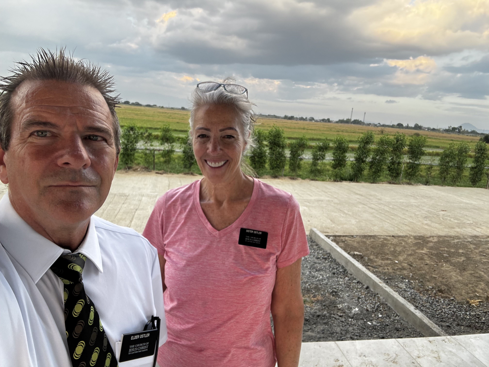
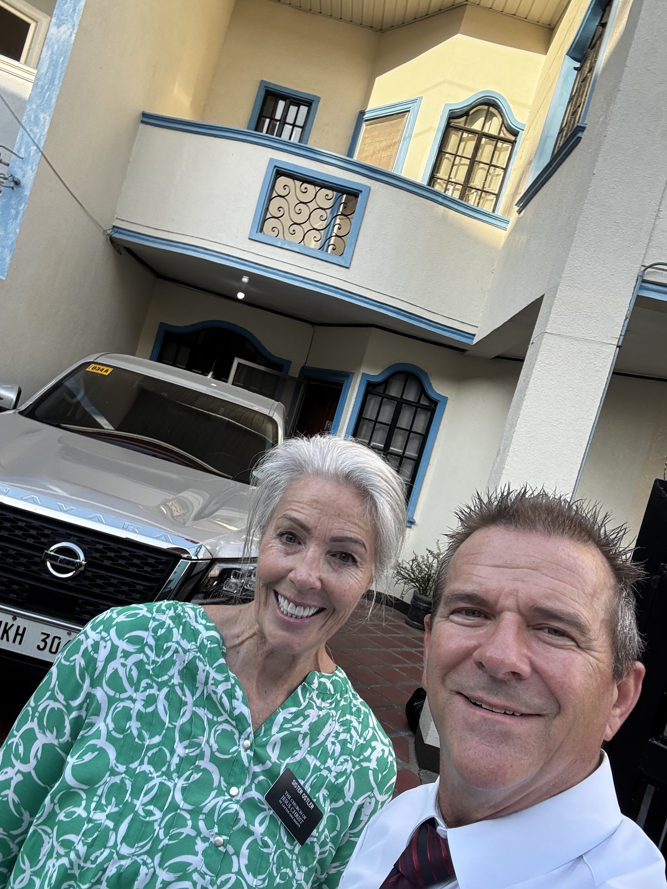

We got to the airport in Manila super early Sunday morning. Going through customs was a breeze and the Burrups were waiting outside for us. Traffic in front of the airport was crazy so Susan, I mean Sister Burrup, got out of the car when she saw us and ran up to us. She was so excited and happy to see us.

Elder Burrup eventually was able to reach us and we loaded our mountain of luggage into their car. Sister Burrup brought a Philippine flag with her and she snapped a photo of us holding it.

## Sunday in Manila

We got to their apartment and Byron made eggs and toast. Then we drove to church. And wouldn't you know it, it was mostly in Tagalog. Our mission president had told us that the church was trying to emphasize English in the meetings.

Well, all you foreign missionaries know what it's like sitting through sacrament meeting, priesthood, and Relief Society when you don't have a clue what is being said. Then this was followed with a long ward correlation meeting. Scott kept nodding off, as jet lag is real.

It was finally over and we got back to their apartment and Susan made a scrumptious lunch for us. After that we went up to our apartment that the Church rents out but was unoccupied in their building. Took a 2-3 hour nap. So needed.

We woke up and went down to the Burrups and they made us a yummy mango rice thing. Very sweet stuff. Then we crashed for the night.

## Monday Shopping and Driving North

This morning we had fried potato, eggs, tortilla, and salsa. Then we left to do some shopping. They wanted to take us to their favorite mall but it wasn't open until 11 AM, so we went to a store called S&R. It's kind of like Costco.

Then we hit the road and drove about 3 hours north to our mission. Our little town has 1 main road and it was super packed when we got here. We tried to find a bank to exchange USD for pesos, but ya had to have an account. So we still have no pesos and a pocket full of Franklins.

## Meeting President and Sister Foster

We arrived at the mission office and right next door is the mission home where President and Sister Foster live. There were a few missionaries in the office: the APs and 2 sister missionaries that are going home tomorrow.

President and Sister Foster came over and were so happy that we had arrived. We went into the President's office with them and had an interview. We told him about our family and they told us about their family.

And then he gave us our assignments. We have 3 assignments:

1. Our main mission assignment: Housing Coordinators
2. Our MLS assignment: Santa Barbara Branch 2 and Calasiao Stake. The branch will soon be created from the Santa Barbara Ward.
3. Mission zone and district assignment: Calasiao Zone / Calasiao District 2

So we thought we were only going to be MLS missionaries, but turns out we are going to do so much more.

## Our New Place

And we got our car, which is actually a new truck. We loaded it up and followed the APs to our house. It's in a nicer neighborhood, 2 stories with 3 bedrooms and 3 baths. So huge compared to what we were thinking.

We spent the first few hours cleaning the kitchen so we could eat dinner. Elder and Sister Barlow, another senior couple that goes home in 2 months, left us a big box of groceries. I guess they'd been here today getting the place ready for us. So we didn't have to find a store tonight.

We had spaghetti, and it was not good. But only because Delene didn't set a timer for the noodles and they were super gushy. But we ate it anyway.

Nobody has hot water in their kitchen here in the Philippines. So we heated water in the electric kettle so we could have hot water to do the dishes.

## Settling In

We really don't have any assignments for a few days because as housing coordinators we will be working with Sister Foster, and she will be super busy with departing missionaries and receiving new ones on Thursday. So we get to explore the town and figure out our rhythm and catch up on sleep.

Elder and Sister Ostler  

## Extra Photos
Scott eating his last burger in America

