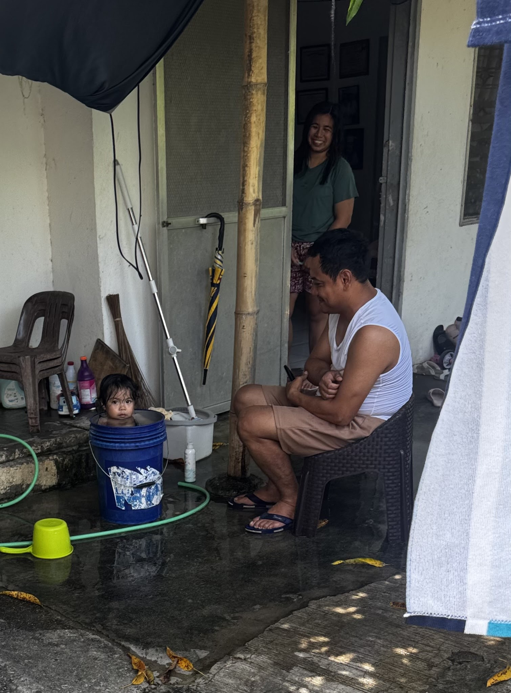
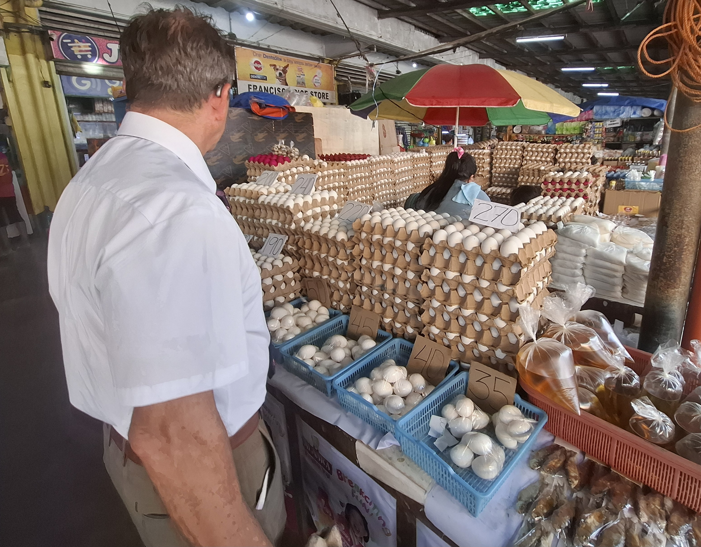
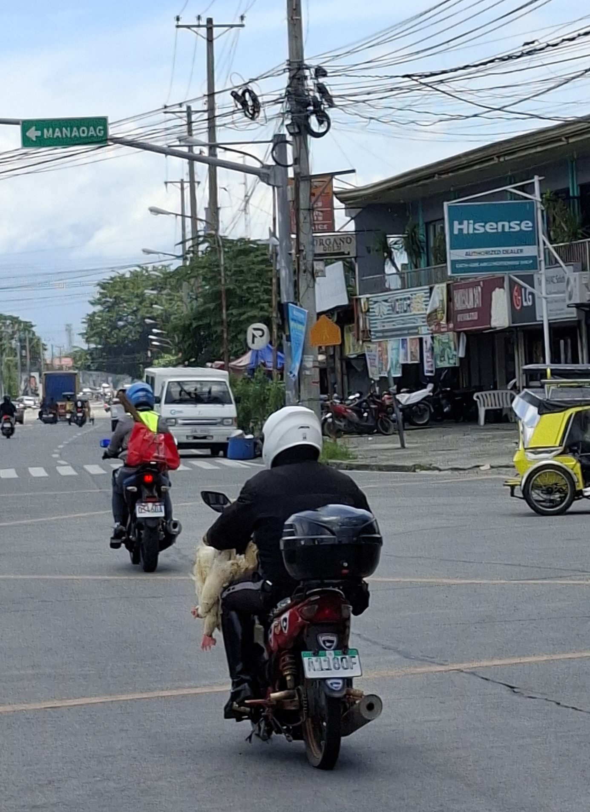
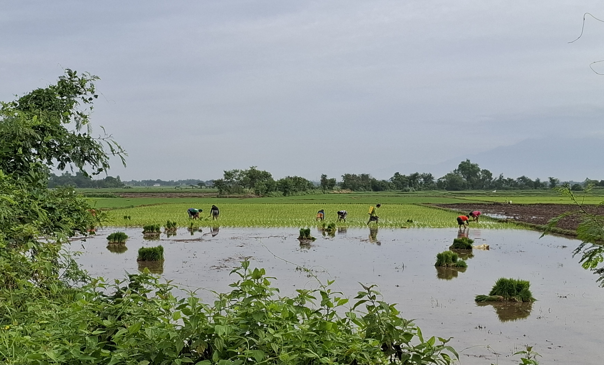

---

title: "A Rat, A Flat Tire & Lots of Miracles"

date: "2026-07-20"

description: "A weekly mission update from the Philippines."

---

Another week and another fantastic 7 days of adventure and miracles and inspiration and spending time with 150+ of the most fantastic missionaries on the planet. 

Let's start with Tuesday - July 14. What a day. This will give you a picture of what some of our days look like when we do a lot of driving.
We left our house at 8:30am to drive to Laoac. There's a missionary apartment there that has been vacant since February and it was time to empty it and move all of the contents into our storage unit. Maramba met us there to load everything into their truck. Maramba is a husband and wife team that own a small company and they are very good at moving missionary apartments from one place to another. They have a big truck and they bring workers that carry everything out, load it in their truck, take it to where you want it, unload it, put everything back together like bunk beds and washing machine hookups. This time we figured that we could just use their pickup and our pickup. When we arrived, Brother Oaing was already there taking the mini split AC out of the apartment. The mission owns the AC so it goes to storage too. I'll attach a photo of the 2 pickups loaded. The interesting thing is that we parked the 2 pickups in an active lane of traffic. And no one seems to care, the trikes and jeepneys and motorcycles just go around you.

After we were loaded we drove to Urdaneta Townhomes, where we used to live in Mannix 20. The mission uses another unit, Mannix 35, for storage. Everything was unloaded and carried upstairs in that apartment. We stopped by Mannix 20 after that to take all of the sheets off the beds because a bunch of missionaries had stayed there the night before. They had to take a trip to Manilla to do visa stuff. We also loaded 2 chairs into our truck because we were going to take them to our house. The small couch sectional we have just doesn't work with the living room. So we thought the 2 chairs would be better. 
Then we went to the store above the Bull to buy a table for a cooktop stove and a new kitchen table for the Manaoag Elders. We stopped at the office to drop off a bunch of stuff in the storage room and then we headed back to Laoac because we had to clean the apartment that we had just unloaded and give the key back to the owner. 
After that we headed to Mapandan to put a new doorknob in the sisters apartment and deliver a clothes rack to them. Then we headed to Manaoag and delivered the new kitchen table to the Elders. They were soooo happy to finally have a table that would be easy to clean. 
So by this time we had already spent time with the 4 sister missionaries in Mapandan and the 4 Elders in Manaoag. And that's the thing we love most about our mission - getting to see and talk to these young missionaries.
We headed back to our house before it started to rain and we unloaded the 2 chairs just in the nick of time! The previous night our LPG tank had gone empty (which meant a slim breakfast of toast with peanut butter and jelly on it) so we went to the LPG store and got a new tank so we could cook food. Then we headed to Mangaldan to clean an awful horrible apartment that we had previously moved elders out of. The apartment had long-standing problems and was in poor condition. We walked into the bedroom to start taking apart the bunkbed and there was a huge washing machine box on the top bunk. Scott grabbed it to pull it off and a RAT jumped out of the box! Scott gave a startled yell and I jumped up on the bottom bunk to get off of the floor.  (Scott) I looked over at Delene and her face was white as a ghost.  But it might have been from my girl scout scream.  The rat scurried away down toward the kitchen and bathroom. 

At that point I looked at Scott and said something like - we aren't going to clean this place really good, let's just get the bunk bed, sweep the floors and get out of here. And that's what we did.  (as an aside - we had a lot of junk we were going to throw away from this apartment and with rats in there and previously we had opened the cabinets and saw many large cockroaches scurrying around - well with all the wildlife in the apartment we were not keeping many items so I put them on the street by the truck and went back inside for more things - and when I went outside again with another load, a man was going thru the junk and loading it in his cart). Then we drove to the Mangaldan Elders new apartment and delivered some curtains to them. Then we were off to Dagupan to turn in keys to an apartment that we had vacated a few days earlier. After that, we drove to Pozorrubio to deliver the cooktop table that we had purchased that morning. Then to Binalonan to the sisters apartment to drop off their shoe rack. By this time we were starving. Our lunch of PBJ hours earlier was long gone. So we stopped at the Magic Mall in Urdaneta. At 5PM, all cars must leave the parking lot and the street food vendors set up shop. They feed people until 10pm. We have a few stands that we love to go to. So we bought our dinner (about $2 for both of us), headed to our truck and had Philippine street food for dinner. YUM! We had Ilocos Empanada and some cinnamon sugar donuts. Then we headed home and arrived after 9PM.

That is not a typical day. We do that maybe twice a cycle. And we love it because we get to see and talk to the missionaries. 

The next day we woke up to a flat tire.  We were ready to head to our first appointment at an Elder's apartment after spending the morning catching up on messages, contracts, office type stuff and went to get in and saw a right front flat.  The car was parked tightly in our carport and I was thinking, 'Crap, don't want to get sweaty and dirty changing a tire.'  So I contacted our office and they sent me a number for a shop they use.  Unfortunately the shop told us there were no mechanics and then they said everyone was at lunch.  Not sure we would have gotten service anyway.  And contacting these people is not a simple phone call - its done thru messenger and FB.  So we just decided to do it ourselves.  Changed out of our nice clothes and went to work.  Good thing I married a farmer's daughter.  Then off to an apartment to inspect and change a broken faucet and water filter.  Then the best part - apartment hunting.  We knew the Rosales sisters were in an unsuitable apartment and a long way from their teaching area.  So we had a good idea where they needed to be based on their Preach My Gospel app that shows where their IPs are (interested person).  With that knowledge and faith and prayer we started.  Walked neighborhoods, got almost stuck in a 90 degree turn in an alley that is barely big enough for our truck - Delene did like a 50 point turn to get us out of there.  I go from the front bumper to the back bumper to the front bumper to tell her how close she is.   I digress.  We know we were led by God.  We stopped near a commercial bldg that had for rent signs on it.  Delene texted the number on the 'for rent' sign.  We just stayed parked right there. I was looking on the other side of the road, got out and walked around at a place I thought was an apartment.  Didn't see anything promising.    So after 10 minutes of sitting in our truck while we were looking on the map to see if google maps could show us any other apartments we got a response back from the commercial bldg, went to talk to the guy who lives behind it, and turns out the top floor is an apartment.  Long story short (too late) we ended up working a deal for a beautiful fully furnished place.  Still in the process of signing everything but we know that's where God wanted us to wait on the side of the road.

We finally got to meet with the President, his wife, and the APs and discuss the overall apartment vision for the mission.  They have been promising this meeting for weeks and it finally happened.  They gave us instructions on which missionaries need moved and an idea of where (based on PMG teaching area maps). We are not privy to this info on our phones.  Only missionaries get the PMG app that shows IPs.  So we are thrilled that we have specific apartments to find.  As we were on the way to that meeting we get a video call from some sisters about 60 minutes away.  One of the sisters had half the entry doorknob in her hand and was standing outside locked out.  When they were unlocking their door, the doorknob just broke off. They got the guard to help them turn the stem and get in but as we were in the meeting we knew we had to book it up there to fix it.  Meeting gets out at 6:45.  Most hardware stores close at 7.  We get the doorknob and book it up there and get the new doorknob installed.  Two of the sisters came home while we were finishing up and I had them snap a picture of us. I'll attach it. That's just what we do. In the US, the owner would do this but here, not so much.  The tenant does it. 

Another apartment miracle:  From our new priority list we head out the next morning to Malasiqui to find a place.  We put boots on the ground, talk to everybody, sweat a ton, drive around again, talk to more people and God puts people in our path who direct us here and then we find someone who directs us there.  We were walking by a parked trike (a motorcycle with a sidecar attached) and the driver was just sitting there. As we walked by he said 'ELDER' so I knew that he knew we were missionaries. I went up to him and told him we were looking for apartments or houses to rent. He thought for a minute and pointed down the road and told us there was a subdivision far away but there was probably a house to rent there. We continued walking and looking and finally decided we needed to head to the subdivision. So we went back to our truck and started driving down the road, the way the guy had pointed.

We are finally in a little subdivision and stop in front of a vacant house.  No one is there, no sign of who to contact.  Delene says it looks like no one lives there and I think it's a community bldg.  So we move on.  Talk to another old man several blocks away. He is living in an apartment but tells us the building is really old and we shouldn't live there. We are about ready to head back to our truck and he tells us to go to the white house down the street as he thinks they own a few houses.  We 'Tao Po' which is the Philippine version of clapping and finally roust the people.  The lady says she owns several houses and walks us back to the exact same house we felt to stop at before.  It is the perfect missionary apartment.  After we are done and look back at the events that took us there we definitely see the hand of God.   Being a missionary and having the mantle is so cool.  There is a power and strength to this work.

After we had talked to the owner of that house for a bit we went back to where the guy had been parked with his trike. He was still there so we got out of our truck and told him thanks for helping us. He said that his kids go to our church every week! So we got his name and took a picture with him. We'll make sure the missionaries look up his kids and pay this guy a visit!

We hope you all feel blessings because we are here. If you don't, then ask God to show them to you.  Because we know they are coming your way.  When each of you served on missions we could feel the power of it at TBH and in our lives.  So we know that you all are being protected, blessed and helped as we serve.   

It's exit, transfer and intake week! So we'll be busy getting the returning home missionaries on airplanes, transferring all of the other missionaries to their new areas and on Thursday we have intake day - the newbies show up and we love that day.
(Can't get some of the photos to attach, I'll see what we can do about that later this week)

Some things you WILL NOT see in the States

Salted Egg Potato Chips
Eggs for sale at the market
Guy bringing dinner home on his motorcycle
Bath in a bucket

## Photos

