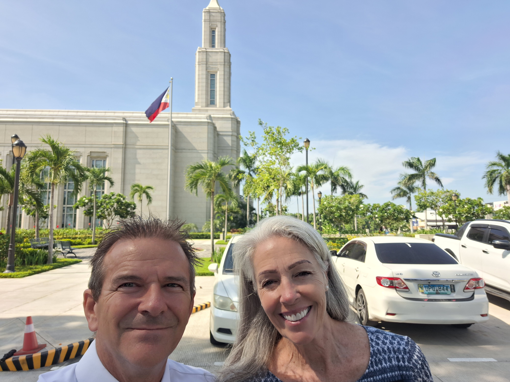
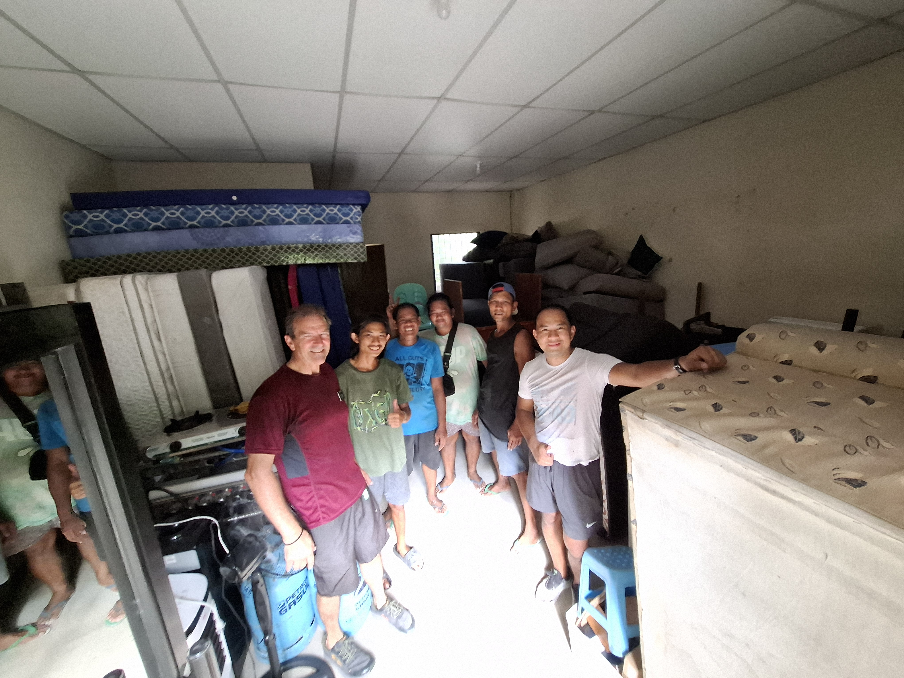
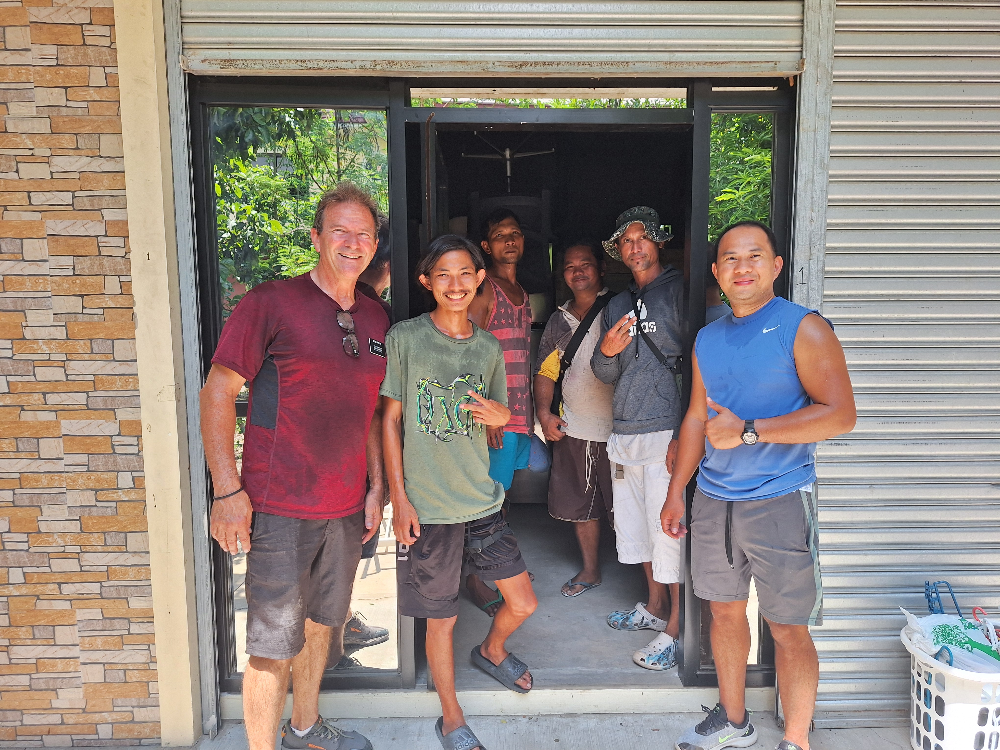
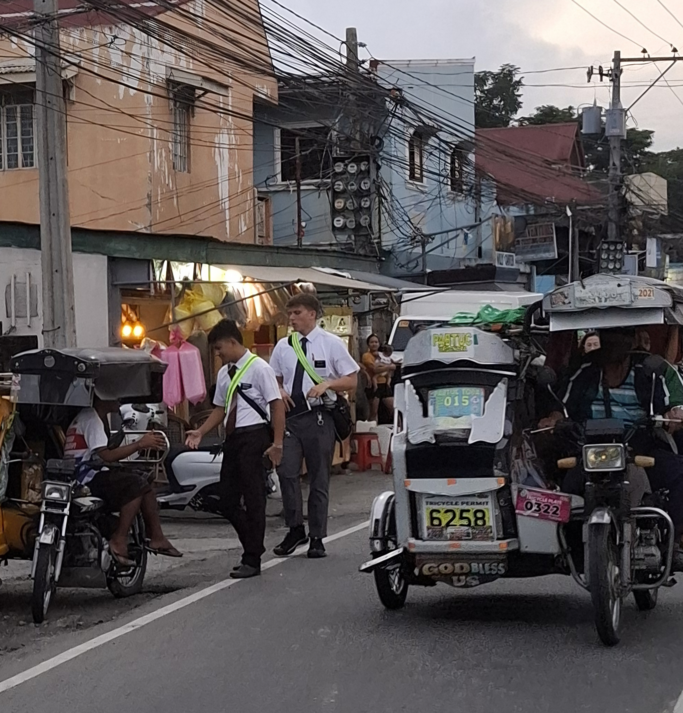
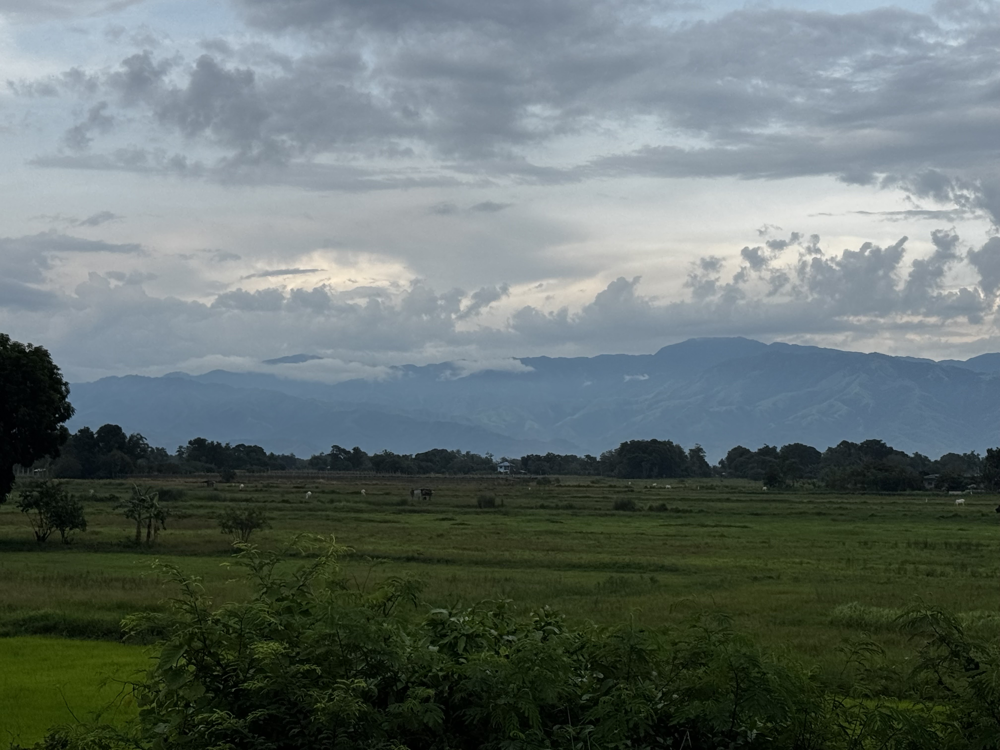

---

title: "Temple Trip, Goat Meat, New Missionaries"

date: "2026-08-03"

description: "A weekly mission update from the Philippines."

tag: "Week 11"

---

We did not send an email last week - yikes!!! We kept thinking "We'll do it tomorrow, we'll do it tomorrow." And as usual, tomorrow never comes. So - here we go - we'll update y'all on our wild crazy frustrating enjoyable ride we took over the last two weeks.

Monday July 21 was bye bye day - all missionaries returning home had to report to the Mission office in the late afternoon. They got to spend time with President & Sister Foster, have dinner together and then a testimony meeting. We've been to some of those gatherings with our kids when we've gone to pick them up from their missions. The Fosters have the senior missionaries pick up the departing missionaries from their apartments and drive them to the mission home. And since Scott and I are the only senior couple in the mission - we picked up 3 of the missionaries. Sister Bisco, Elder White and Elder Pangarotan. It was a great drive to the mission home, talking to them about their missions, where they served, their best memory, what they'll miss, if they like Balut!

After we dropped them off at the mission home we hurried over to Mannix 20 (our old house) to get it ready for the departing missionaries to stay in that night. We pretty much had it ready to go, just needed to make one more bed and sweep and mop. Six of the departing elders would be staying there. I think we neglected a couple of weeks ago to tell you about another trip we made to Mannix 20. Some of the departing missionaries had to go to Manila for some visa stuff so they had to spend the night at Mannix 20. We had asked the AP's earlier in the day if they had a key to Mannix 20 and they assured us that they did. So we're at home at 10:15PM and out phone rings. It's the office elders, they are at Mannix 20 and can't get in because they don't have a key. So we jump in our truck and book it to Urdaneta and let the elders in. Thank heavens traffic wasn't horrible and we were able to make it to them in about 20 minutes. All in a days work. 
Tuesday July 21 our ward had planned a temple day so we were going to go with them at 10:30AM. Most of the ward members were taking a jeepney to the temple but Scott and I drove there. We knew the departing missionaries were also attending the temple that morning but we didn't know what time their session was. When we got to the temple they were all there, outside, just waiting. And we found out that they were all in the 10:30AM session too. So we got to go to the temple with our Santa Barbara Ward friends AND all of the departing missionaries AND President and Sister Foster. It was a fabulous morning. 

After the temple we were back at Mannix 20 to start washing sheets. We at our usual lunch, PBJ's and then headed to Pozorrubio to pick up keys from a missionary and get a mattress. The next day was transfer day and so we had some shuffling to do of beds and keys to make sure the apartments had enough beds if there was going to be more than 2 missionaries and to make sure that all of the apartment keys got to the new companionships. It's a puzzle every 6 weeks that we love figuring out.

Then we drove to Malasiqui where we met with Helen & Nestor. They own the house that that we are going to rent for the Malasiqui 1A Elders. They signed the lease and filled out the vendor form and then Helen brings out a bar of chocolate and gives it to me. Its FIX Dubai Chocolate and OH MY GOSH - it is soooo good. So I google it. You can't buy it in the USA unless you get it on Etsy or Ebay and the ones I saw on Etsy were like $30 to $40 - for a chocolate bar!!!! WOW - Helen is my absolutely my favorite landlord!!!

We headed back to Mannix 20 and took the sheets out of the washer and spread them out to dry (we don't use dryers here in The Philippines). We also had to pick up an AC that was in storage because it's going to be installed in the new Malasiqui apartment. We dropped off a bunch of keys at the Mission Office and then headed to Binalonan to give the sisters their keys to their apartment. A few weeks ago they were unlocking their door and they key broke off. WHAT? REALLY? Yes - really, it actually happens quite a bit here. Doorknobs break all of the time and keys do to.

By the time we left their apartment it was raining alot. We got out to the main road and we missionaries walking in the downpour under umbrellas. We pull up and it's the other Binalonan Sisters. It's almost 9PM so we load them into our car and drive them to their apartment on our way home. They were oh so grateful!

Wednesday July 22 - IT'S TRANSFER DAY - - -
It's our first time to be in charge of a transfer point. And it's the first time they've had the transfer point at Santa Barbara Chapel. Here is how it works in this mission. If you're being transferred then you and your companion have to get to a transfer point at a certain time. The Santa Barbara Chapel is pretty much in the middle of the mission so it's a great spot to have the 2nd transfer point located. At 8AM, jeepnes leave the mission home loaded with everyone from the Rosales Zones and the Urdaneta Zones and they are headed to Santa Barbara where they will arrive at 9:30AM. If you're in Dagupan, Mangaldan or Calasiao Zone you'll be picked up by a pre-arranged jeepney and travel with your zone to Santa Barbara, arriving at 9:30AM. Seven Jeepneys arrive at the Santa Barbara Chapel and everyone unloads. Elder Ostler and I go to each Jeepney and put a sign on it. The sign says Calasiao or Dagupan or Urdaneta or Mangaldan. Four of the Jeepneys go back to Urdaneta to the Mission home. 

After everyone has loaded their stuff into the correct jeepney and after they've had 10-15 minutes to talk and catch up with old companions, everyone gets in the correct jeepney and off they go. It's a pretty easy operation but you do have to keep them moving otherwise they'd all just hang out all day! I'll attach some pictures of transfer day.

We like to pack our days FULL so after the transfer was complete we headed to Mannix 20. We were going to meet Maramba there and load everything from Mannix 35 (storage) and drive it to our new storage unit that we had rented in Santa Barbara. It's a 5 minute drive from our house so that will be convenient. Plus it's a huge room, not an apartment. Right now the storage stuff is in an apartment at the Mannix Townhomes and it's a real pain to get stuff up and down the stairs and around corners, plus it's just a dirty yuck place and so we're terminating that lease and moving everything to Santa Barbara. When the truck arrived at the new storage unit, they had to back it up into the tiny parking area. The truck was piled so high and the power lines were hanging quite low. I'll send a video of the guys backing up the truck and the stuff in the truck was going to hit the powerlines so the guy took his flip flop and lifted up the power lines. WHAT?  Yeah - that's what he did - watch the video. It's crazy.

The Maramba guys worked and worked and loaded EVERYTHING into their big truck. And it was a ton of stuff. There are 4 sectional couches, all left over from all of the senior couples that used to be here. There are 7 queen mattresses and beds. There are about 10 twin mattresses, lots of bunk beds, single beds, desks, tables, chairs, wardrobes, dining room sets, refrigerators, washing machines, couches and then there are the precious AC Units. The mission currently owns 2 window AC Units and 4 mini splits. We can't buy anymore for junior apartments so they are like gold to us. Have to take very good care of them. 

While they were loading up Mannix 35, I cleaned Mannix 20. The trainers would be spending the night there because tomorrow is intake day and we were expecting 8 new missionaries. That's all - just 8. The last few intakes have been over 20 each time, so 8 would be a breeze. 

We were starving by this time so thank heavens we knew what we were doing for dinner. The Anicas family had invited us over for dinner. They are in our ward. It's our 2nd time having dinner at their house. Cherry made so much food - just so much food. Philippine people really know how to have a party. They were actually celebrating her dad's birthday. He died several years ago, but the kids all get together and celebrate his birthday every year.

Cherry's sister brought goat. YES - goat meat - and YES I ate it and yes it was pretty good. I was expecting it to be really strong but it was actually quite mild and tender. I don't know if I'll be able to eat goat meat anywhere else because that was pretty good, it will be hard to beat! There was pancit and rice and fish and chicken with this heavenly yummy sauce and dragon fruit and other things that I don't remember the name of. But it was dang good and we were so appreciative and happy that we didn't have to fend for ourselves after a long day.

Thursday was missionary intake day - 8 new missionaries. I love watching them get out of the transport vans when they arrive from the Manila MTC. There is definitely some anxiety and fear of the unknown. But there is also excitement in their faces. There were 2 Elders and 6 sisters. The best part was when they were introduced to their trainers. The Fosters have all of the trainers come into the gym, then he introduces each of the newbies and says some stuff about them. Then the trainers are handed a paper with the name of their newbie and they run over to them and the magic starts! They sit across the table from each other and chat to get to know each other. Then we all have lunch which came from Insala - it was chicken and rice. Sister Foster had made a yummy green salad, everyone got a banana and then a cookie that I had made with Sister Fosters recipe. It was a heavenly yummy meal. Then the trainers and their newbies head out to their area. One thing President Foster tells the newbies is that by the end of the day, they'll be working. They'll be finding and teaching in their area with their trainer. They are definitely nervous about that but also it's what they signed up for so they are excited.

We were asked to drive 2 of the sisters to their area in Tayug, which is about a 50 minute drive from the mission home. We loaded up Sister Nieves and Sister Rampton and headed out. We got to know them pretty well on our trip. Sister Rampton looks sooooo young. I was wondering how in the world she could be 18, but she is and she was ready to get to work. Tayug and Elders living in that house until this transfer so Scott and I were a bit worried about what kind of condition the house would be in for the sisters. We walked in and I looked around, walked to all of the rooms and when I came outside Scott asked me how it was. I said that there was no way the Elders cleaned it, it was too clean, they must have paid someone to clean it! But I was wrong. The Elders had cleaned it and they did a spectacular job. I was so impressed. I think I sent a picture recently with a goat right next to a basketball court - that is right next to the Tayug house. 

Friday we moved Elder Matchitt & Elder Kuru-iakopo to their new place in Malasiqui. They were so sad to leave the kabahai but they were quite happy when they walked into their new house. There is so much room and it was nice and clean - thanks to Elder & Ostler and myself! Brother Oaing was there installing their AC and hooking up their washing machine. He had to rig a whole pipe/valve thing and repair some existing plumbing in order to hook up their washing machine. But he's a magician and can do anything!

After that we hurried home, showered and got ready to go to dinner. It was the Barlows farewell dinner so we met at a nice restaurant with Sister Warnock, The Barlows, us and The Fosters. Such yummy food. I was absolutely stuffed. We had sweet & sour pork, beef & Broccoli, fried rice, lemon chicken, a beef/noodle dish and other stuff too. So good. And then we hugged the Barlows goodbye. We are seriously going to miss those two.

We found out from the Barlows that you can have the missionaries over for dinner if you live in their teaching area. SWEET! So Sunday we had Elder Juan and Elder Singh over for dinner. Love those 2 - We've spent some quality time with Elder De Juan over the last 3 months. He is such a happy soul and he has every reason to not be. But he chooses to be happy despite the circumstances of his life. 

Monday we moved the Rosales Sisters into their new apartment. It's probably the nicest apartment in the mission. It was an airbnb but we convinced them to make it a long term rental. And the landlords/owners are super nice. There are now 4 sisters living in that apartment and it is inside their teaching area which is President & Sister Fosters goal. They had to travel so dang far every day to get to their teaching area. But we fixed that! And their old place was so yucky. The landlord of their old place is quite upset with us because we didn't tell them the girls were moving. They are actually mad at us. They both chewed me out while Scott and Maramba unloaded the last few items from that frog/rat/mice/cockroach infested/flooded/drain backing up disgusting place. And I just stood there and took it. I didn't want to fight with them. The main reason was because I'm wearing a tag that says The Church of Jesus Christ of Latter-day Saints. I'm wearing His name so why would I want to act like a tyrant. I knew we had done nothing wrong. I had no idea that they would be so upset. We have paid rent through the end of August but for some reason, they were mad that we didn't tell them we were leaving. Sheesh. That took way longer than we though - and that's why we didn't have a pday last week.

Tuesday July 28 we met Maramba at the Barlows house. Those guys loaded everything up and we headed to the storage unit. That's about the only thing that went as planned that day. We eventually ended up in Malasiqui that night picking up Elder Gull and his companion. He had to make a trip to Manila the next morning so we dropped his companion off in Malimpec and headed to the mission home. We had a great conversation with him. We learned alot about what the mission was like when the Fosters arrived, how they changed things, what the missionaries thought about all of it and how the mission is so different now. Every mission president does it different. We just really like how President and Sister Foster lead this mission, and so do the majority of the missionaries.

Before we went home we made a trip to Pozorrubio to deliver a pillow. One of the missionaries had lost his and we had told him earlier that morning that we would deliver it today. That was before everything about the day got shuffled around and changed. But we didn't want to let him down so we drove 30 minutes to deliver it and they were just arriving home at 9PM when we arrived so we got to talk to them for a few minutes. Then we headed home and were in our house at 10PM. 

Scott has been sick for 2 days. Like in bed sick. I barley saw him yesterday. We were supposed to be in Santo Tomas at 8AM yesterday to unlock the apartment for the owner so they could clean it. But he was dead so I went by myself. The road between here and Santo Tomas is an awesome drive. It's through tiny Barangays and fields and fields and fields of rice and produce. It's gorgous. You've heard us talk about getting Pandesal at the little pandesal places - well there are also pandesal trikes. I'll see if I have a picture of one. On my way back as I'm meandering down this country road, I see a pandesal trike coming toward me. I stop in the road, he stops right next to me and I buy 5 little buns. Hot and Fresh. And oh my gosh - soooo good. It cost me 25 pesos (41 cents in the USA).

It's Sunday right now. Scott has been in bed all day for the 2nd day in a row. He's feeling a bit better now. He's pretty sure he got heat stroke from our apartment searching in Dagupan on Friday. Our original plan was to go to Binalonan to look for an apartment for the Sisters but the sky was pretty black that way so we headed west and went to Dagupan to find an apartment for some Elders. It was so hot, just so hot outside. And we were walking and walking and we found one pretty quickly. We saw a small apartment building, it had 4 apartments. That's what most of them are like here in Pangasinan. So we walk by all of them and see if it looks like anyone lives there. And the one on the end was definitely vacant. But there is no sign, no phone number, no FOR RENT sign, so we ask the lady right across the street that has a tiny store and she tells us to ask one of the other tenants in the apartment building. After some back and forth, we got the contact information of the owner. The lady that had the little store asked us how we found the apartment and we told her we were just out looking for apartments and she told us that the guy that was living there had just moved out the day before. WHAT? Another miracle - we just hope that we can make contact with her so we can rent that apartment. 

Anyway, we kept walking and looking and talking to people after we found that one and we were soaked - just sweating up a storm. And we weren't drinking anything cause our cooler was back in our truck. And that's how Scott got heat stroke. Plus he's old, so he can't recoop as fast as he could when he was 40. 

I was reading about belief and prayer this week. 
Jeffrey R Holland said "We are to employ prayer as a shield against temptation, and if there be any time we feel not to pray, we can be sure that hesitancy does not come from God, who yearns to communicate with His children at any and all times. Indeed, some efforts to keep us from praying come directly from the adversary"

Are you all saying prayers? If you've let this amazing form of communication with God slip from your daily life, I strongly encourage you to start now. It doesn't have to be a big formal prayer. Just talk to God. Tell Him what is going on, ask for comfort, ask for guidance - and then listen. I've had months of my life where I wasn't praying regularly and I can look back on those times now and see that I was miserable. So put down the phone, turn off the podcast and talk to God this week more than you did last week. I promise you that you will feel different and you will have a different result than you're getting now. It took me taking a 14 hour flight from San Francisco to Manila and living in Urdaneta City for about 3 weeks to realize that I wasn't talking to God enough. make sure you're talking to God, He really wants to hear from y'all - - - just like we do.

Love you all,

## Extra Photos

