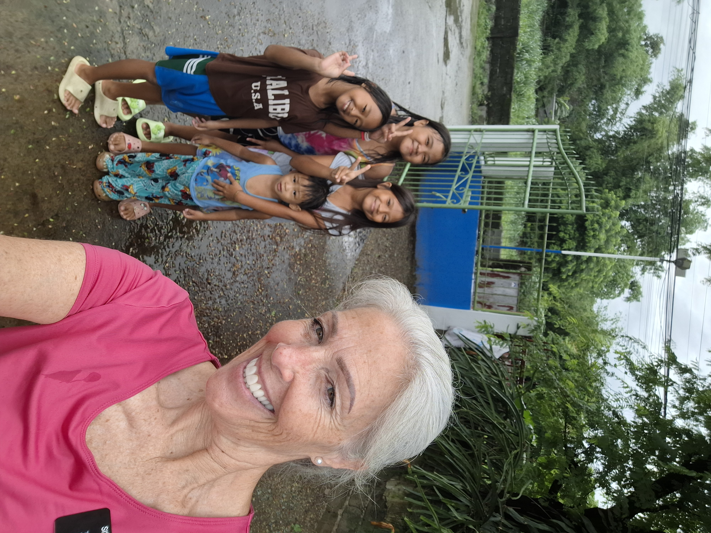
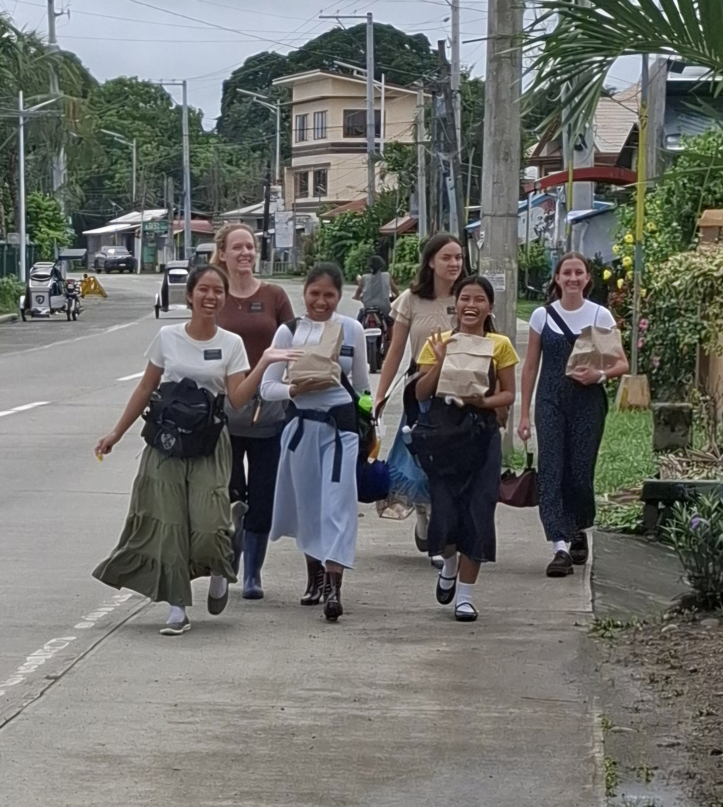
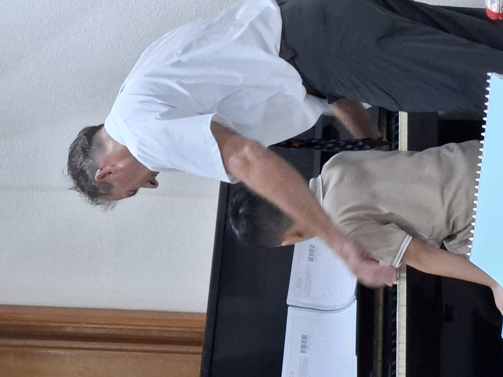
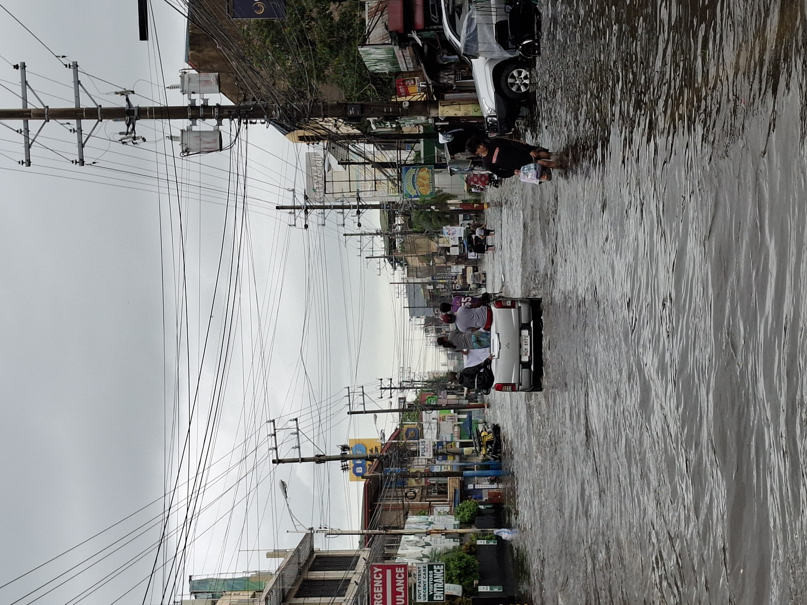
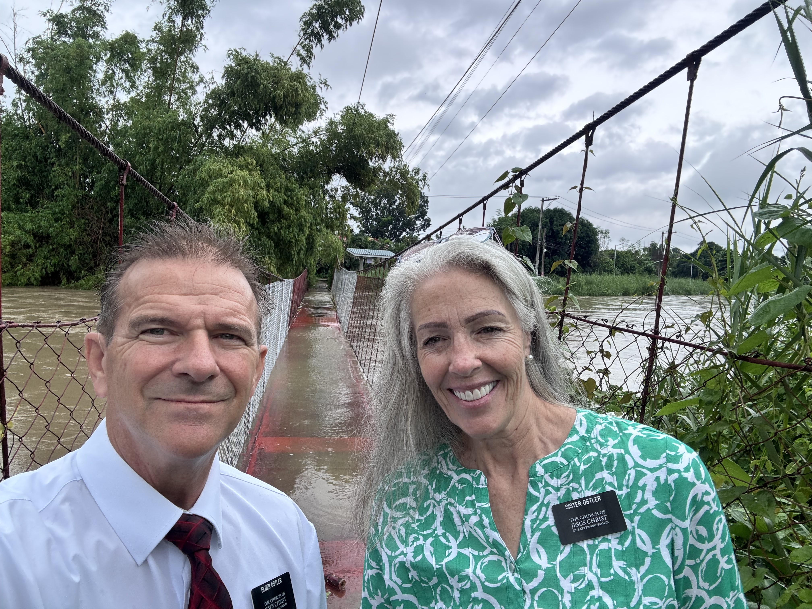

---

title: "The Usual Is Not What We Expected"

date: "2026-08-10"

description: "A weekly mission update from the Philippines."

---

As usual it's been a week for us.  And as usual we are happy to be here in the Philippines and serving on a mission.  It's really not what I (Scott) thought a mission would be.  I imagined having gospel discussions all the time, converting people, being instrumental in their journey back to Christ.  But I obviously didn't do my research on Sr. missions.  In our mission that is what the young missionaries do all the time and they are amazing at it.  Just today in Priesthood the teacher asked one of our young Elders, Elder De Juan, what salvation was.  Now to set the stage:  first off the whole lesson is 99% Tagalog of which I know nothing,  the 1% is when they read a sentence in English from the conference talk we are studying.  Then someone will discuss the sentence for about 2-5 minutes - and these people can extemporaneously talk forever - they love to talk - so all discussions and answers go on forever.  Then the teacher asked the question about salvation to one of our young missionaries.  He gave a brief 'Preach My Gospel' anwer - like 2 sentences and was done.  The teacher was astonished that his answer was so short.  But that is how the missionaries teach, short, simple, sweet and with power.  So that is not my mission.  We leave that to the younger teaching missionaries.  Delene and I are now immersed in the housing world of the mission as you know.  And the behind the scenes things we do are so vital to keeping the missionaries focused on their purpose as missionaries.  I am beginning to understand that for the gospel to be preached, churches to be filled with members and programs to go forward there is a boatload of volunteer time, a lot of expense and miracles that happen that most people are not aware of.  And I am part of that volunteer army of behind the scenes people.  

Housing:  We think we found 2 new houses this week.  The elders in our district currently live in a house that leaks in the kitchen like a sieve.  The water constantly runs down the wall in the kitchen and the floor is constantly wet (and dirty). We have been in contact with the landlord for 2 weeks now trying to get some action going to fix the problem - but what we hear from all the landlords is 'we can't come fix the leaks because it is raining'.  Across the board!  No one will fix their leaky apartments because they won't work in the rain.  Well, we are in the rainy season so not a lot of fixing is being done.  So Delene and I went to that apartment and saw the state of affairs and decided the Elders need out.  The apartment also has no external windows and is very dark (that's how I describe it). Most of the apartments and houses in this area don't have large external windows, or if they do there are heavy curtains and bars on them.  So most places don't have a light airy feeling to them.  So we get permission from the Fosters after describing the Elder's living conditions - oh did I mention they also have rats running around in the ceiling and coming into the apartment.  Chew marks on the garbage, rat droppings on the floor - and so Sister Ostler and I go looking.  Here's how it works.  We know the area we need to put the missionaries in based on their teaching maps, church location, and where most of their IPs (interested persons) are.  So we study the google map of the area, looking for buildings on the satellite view that look promising, looking for subdivisions, looking to see they have easy access to main roads.  Once we get a feel for the area we say an earnest prayer and hit the ground and start asking people.  We have told you before of the miracles of finding a place.  This time is no different.  Except it is raining pretty heavily and so we creep through neighborhoods in our car.  No one is outside so we don't talk to a lot of people.  But the Lord provides.  We 'happened' upon a nice building, found a good place -2nd floor with high ceilings and a couple of windows. Long story short - we will be moving them in this week.  Again, our work isn't teaching Jesus but we are so happy to make sure the Elders/Sisters have decent places to live and are clean.  Yeah, we are the especially focused on keeping apartments clean.  We think the level of clean apartments has improved as we are now on our 3rd cycle of inspections.  This time around we are telling them to specifically get the bathrooms and cooktops clean and degreased - and wow, its been amazing seeing the missionaries respond.    Oh, we are also becoming professional doorknob replacers.  Equipment here in the Philippines is just not functional for very long (let's say it that way).  Doorknobs - internal and external just don't last long here.  So we always carry spares with us and change them often.  One set of Elders accidentally locked their bedroom door and didn't have the key (all internal doors here have separate keys).  So we had to pry the old knob off with a hammer and screwdriver, and then put a new one one.  Didn't damage the door too much in the process.

And it rained!!  Its rainy season here.  We have lived in Seattle for 6 years and thought we knew rain - but tropical rainy season is something else.  It is not uncomfortable even when we get wet because it is still warm.  But boy, it can pour a lot of water out of the sky in a heartbeat.  And school has been canceled all week due to rain.  And traffic is lighter when it rains so that's a benefit - we can get places more quickly - and we have been all over the mission and back this week.  Inspections, emergency transfers, doorknobs, leaks we need to help with, shopping etc.

And with the rain has come a number of apartments with leaks.  We contact the landlords and everyone of them say they can't come fix the leak until the rain stops.  Crazy thinking by American standards but I guess that is how it is here.  So we tell one set of sisters to move the bed away from the area that was leaking onto it, tell another companionship to not use the bathroom light that has water leaking through it and pops when they turn it on.  Tell another set of sisters we need to move them out as several rooms have leaks and mold is now growing on the ceiling areas that are constantly damp.

Saturday is the day we teach piano at 5pm at the church.  Because of rain we were debating whether to cancel or not.  Since there was an 8 yr old baptism at 3 pm and it hadn't been too rainy that morning we decided to go ahead with the class - assuming a bunch of people would already be there.  It started to rain heavily again at 3:30.  We show up at 4:45.  A lot of the ward was there for the baptism and when we walked in we saw they were having an 8 yr old birthday party for the boy being baptised.  A birthday party here is something else - more adults than kids, full on meal, balloons etc.  So right before I was going to start class in the chapel the members invited us to the food part of the party.  so my piano class got hijacked by a 8 yr old birthday party.  Too much!  We started class at 5:30 and went to 6pm at which time I told them Sister Ostler and I had to leave to travel an hour to finish some housing fixes and things we had planned for earlier in the day (but due to special assignments from the Fosters we didn't get to do it).  When I told them we were finishing on time they were kind of shocked.  On Sunday, we told the Elders of the situation and the party, delayed piano class, members assuming we would just move our schedule back etc and they said that was totally a Filipino culture thing.  That is just how it rolls here. We are so used to schedules and timeframes but those things don't exist here.

I just asked Delene what else to include in our letter:  she said, 'that you were dead to the world'.  yeah, been pretty out of it.  That heat exhaustion just took it out of me.  Energy was just sapped.  But the last few days have been a little better.  so that's good.

We ate out a couple of times this week - on purpose.  Having been sick this last week from heat exhaustion I have had a hard time recovering my strength, interest in the work, and overall feeling exhausted all the time.  I have no appetite for anything.  To tell you how bad it is - I haven't had a Diet coke all week.  That never happens.  Anyway, there is a hotel in Urdaneta that has a nice restaurant.  And that is about the only thing that sounded decent to eat.  so we ate there twice.  And with the portions it feeds us another full meal off the leftovers. Delene keeps trying to get me to eat calories but I just don't have interest in food a lot of the time this week.

We had a few apartments vacated this last transfer.  We try to visit those apartments to make sure the fridge is empty, unplugged, not food laying around etc.  We checked on  one apartment right after transfers and it was OK, but not ready for new missionaries.  It needed a good cleaning.  So we went back one day this week after our noon inspection route and spent a good hour doing initial cleaning.  There was a bunch of stuff that we determined the mission didn't want (old shoes, old books, mismatched tupperware, old clothing rack held together with string etc). And like we mentioned before - this old junk is someone's treasure.  The neighbors were out and we asked them if they wanted this stuff.  YUP!  for sure.  so we were saved a trip of hauling several bags of what we thought was junk away.  Then we vacuumed cobwebs, Delene organized the kitchen area, we moved shelving around to make more sense, emptied water buckets that were in the bathroom etc. took out 3 bags of garbage and called it good.  We knew before Elders moved in again that it would need to be cleaned.  sure enough - this apartment may see missionaries moving in sooner than we thought.  I know we were prompted to visit that place to clean it.  We had 6 weeks to get it in shape but were prompted to get the cleaning process started.  And it's not like a recognizable thought from the Holy Ghost, 'go clean the apartment'.  It is just something we know we needed to do, we moved it ahead on the schedule for no apparent reason and it turns out there was a reason.  I think we are learning to just do things when we think about them.  Because it is not our feeble minds thinking about these things. So now with that apartment, we contacted the RP in that ward and told her we would pay 1500Php for a couple to come finish the cleaning.  And she found someone to come do it so then that apartment will be fully ready.  (OK, here's the issue with cleaning here in the Philippines.  There is no hot water.  No one has water heaters.  To get hot water one either has to heat it on the cooktop or use a kettle (an electric water pot).  So we are pretty sure cleaning that the missionaries do and cleaning that we hire out isn't done with hot water.  And we also find that missionaries dilute their dish soap to save $ so cleaning is done with cold water and diluted soap.  So the grease is probably just getting smeared around the kitchen counters.  Like Delene preaches -Hot Water - People - use Hot Water!)

We are so busy we don't think of home that much but we do read the various texts groups from back in the states.  We love to see what is going on.  The camping trip, the mud pits, how the babies are growing so fast (please keep sending pics) - we video chatted with Wilson/Emily this week and saw that Elsie is walking!  What?  We sure miss all of you and are glad you are doing well.  I thought I might say I wish I was there but I am glad to be here representing Jesus Christ.  There is just a special bubble we are in being missionaries.  We are given extra help which we feel daily.  Two old white people in the Philippines shouldn't be able to do what we do daily without the Lord's help.  We recognize His hand in all this that we do - and even if we are not preaching Jesus directly we are on His errand and doing His work.  The biggest beneficiaries of our work here is going to end up being ourselves first, then all our family back in the states - I don't know why that is but I think it is true - and then the missionaries we help here.  And then because we are helping the missionaries then the Filipinos will benefit.  Although - Sister Ostler is having a nice impact on the RS here.  We recently got a new RP that loves Sister Ostler.  And the sisters in the ward need Sister Ostler's wisdom for sure.

We drove to Calasiao and Dagupan today. The place is underwater. They've declared a state of calamity. It's bad. Water is just running like a river through peoples houses. Roads are impassable. We'll send videos. The trikes can't usually make it through and there are no jeepneys running. but there are rice field vehicle think called a kuliglig. They can go through water. So everyone that owns one has been making money today. They take people down the flooded streets to get where they want to go. We stood and watched a very flooded area for awhile and there were sooooo many of these kuligligs hauling people from one flooded area, through the unpassable road to the next little community. There are thousands of people forced out of their homes because of the flood. The street we drove down, the little sari sari stores are open and they are flooded, but the people are still carrying on business as usual. You'll see one of those little stores in the video we send on things you won't see in the states.

Lots of love from the Philippines

## Photos

