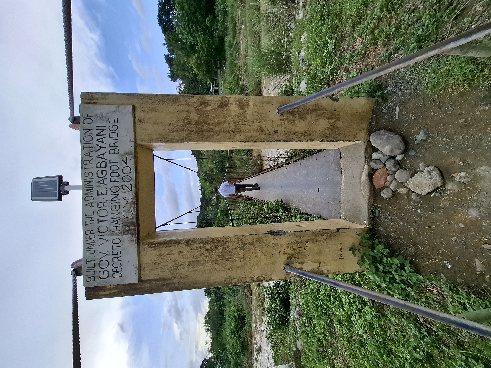
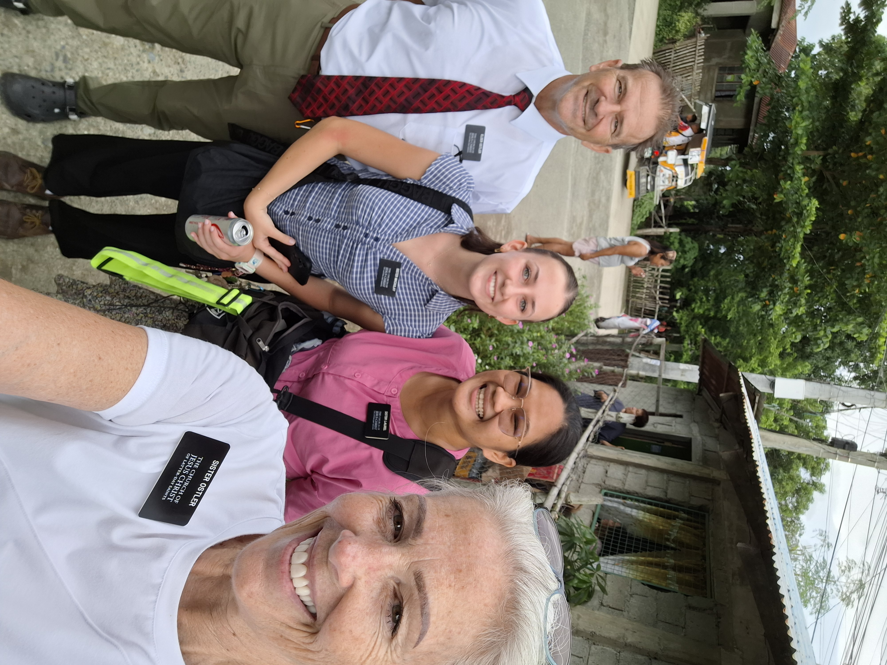
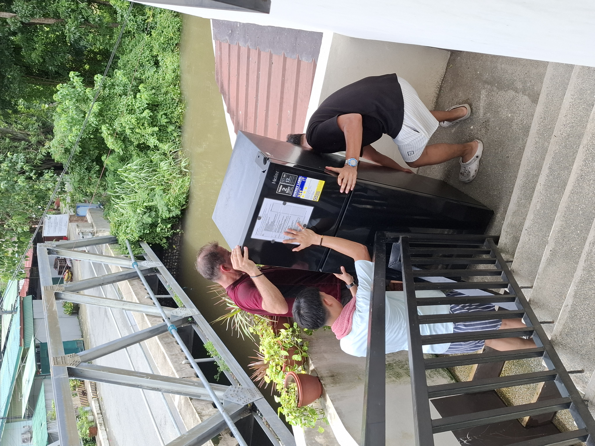
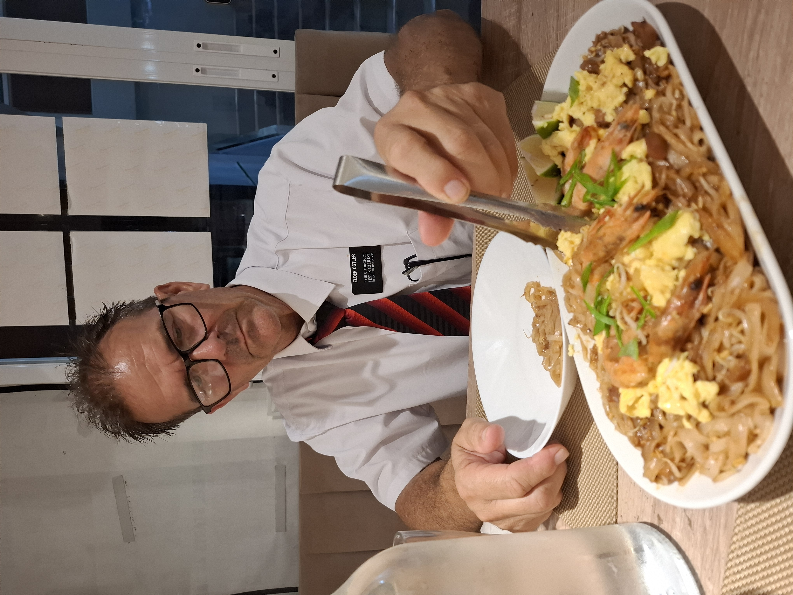
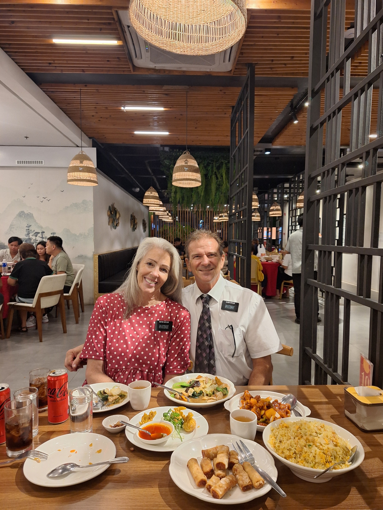

---

title: "Talks, Trikes & Testimony"

date: "2026-08-17"

description: "A weekly mission update from the Philippines."

---

I have to say, there is always something new in the mission experience for us.  This week we had a special assignment from President and Sister Foster.  Friday morning we get a message from President Foster that says, hey, we might need you to help out with something for us, and we will call in a bit.  Well, we went about our day and you guessed it....after inspections we ended up in Dagupan looking for an apartment.  This is the area we looked at about 2 weeks ago when I got heat exhaustion.  But this time it was raining buckets, then it would stop for 10 minutes then it would rain buckets again.  So no heat exhaustion, just mostly hopping out of the truck to get under a shop canopy to talk to someone.  We were having no luck finding a place.  Then at 4ish the phone rings and its President Foster.  He asked us to speak at a mini zone conference the next morning in Mangaldan for YSA aged people that were contemplating going on missions.  He gave us 30 minutes each to speak.  And our topic was Preach My Gospel Chapter 6 -Christlike attributes.  So we finish our business  with no luck on an apartment and head home.  Then we spend the rest of the evening getting our thoughts together.  Delene kept telling me to be prepared as she would likely not even take up 20 minutes.  We didn't coordinate talks but just went to work.

The next morning we show up 30 minutes before the meeting and stand around with about 10 youth from Manaoag ward waiting for someone to come unlock the church parking lot and building.  The building got opened about 10 minutes before the conference was to begin.  That is just how things roll here.  But it was great.  We spoke the last hour of the meeting.  Probably had about 40-50 YSA there .  Some had already received a mission call.  One girl was called to Manaus.  Small small world.  And yup - Delene took all her time.  It was pretty good if I say so myself.  Afterward a girl came up to us and asked us if we were therapists because we sounded like therapists.  She just graduated from college with a degree in psychology so she was tuned into the 'thoughts and choices' part of our talks. 

Afterward they catered in food.  Indeed.  McDonalds.  Chicken and rice.  with a coke.  It was actually pretty good rice and the chicken wasn't bad.  We sat at a table with about 8 women/girls (college age) and had a fun time.  We finally got to ask questions about the Philippines and things we have seen and they explained a lot to us.  They all spoke English pretty well.  It's just their accent that makes it difficult to understand at times. 

Saturday night we got a messenger message while we were eating at a Thai restaurant.  The restaurant was recommended to us but it was not very good at all.  We left most of our plates untouched.  Luckily it only cost 490 pesos ($8) so it wasn't too bad.  Well, the message is from some Elders in Urdaneta that informed us their door was real sticky getting opened or closed.  The damp weather will cause the doors to swell and this is not an uncommon problem to have.  I asked if they could open and close it albeit with difficulty and they said they could.  Then I messaged the landlord and told him of the issue and that he should check it out on Monday.    Sunday morning at 8am I check my messages and see an SOS from the Elders with a picture of the stuck door with the doorknob broken off such that they couldn't open it.  They were stuck inside and going to be late for church.  So Delene and I switched plans of heading to our ward building and headed 25 minutes in the opposite direction.  On this same group chat were some Elders that were passing by and they went to the apartment and pushed the door open from the outside.  We finally get there and the guard shows us the door still partially open and tells us the Elders have left.  Except - the other set of Elders that live there and had afternoon church were upstairs studying.  They came downstairs to find us in their apartment ready to work on the door.  I had packed my grinder and a doorknob as I thought I would have to do some grinding and for sure put in a new doorknob.  Yes, the mission owns a grinder.  When we first got here and found out how many tools the mission owned, including a grinder, I was dumbfounded.  Why on earth would I ever need or use a grinder.  Well, some hot August Sunday morning in the middle of the Philippine rainy seaon I find myself, grinder in hand, dust flying everywhere, grinding the whole edge of the door.  Grind, Grind, Grind.  Top to bottom.  Luckily I had 2 batteries because I burned through one.  Delene positioned the fans to blow past me and out the door.  We finally get it so it could close without sticking - I did a nice smooth grinding job (the orthodontist in me - just with bigger tools) and Delene and the Elder got the knob installed.  By now we are 1 hour into our own church time and I'm covered in sawdust - my hair, clothes, tie, the whole 9 yards.  We head back home and I completely change and shower and get to church just as it is over.

And when it rains here it pours.  Saturday night at 10:15pm I get a video text from a sister with her 'under the sink J pipe' in hand.  It broke and now their sink just drains to the floor.  I was hoping it was a simple task to put together but I'm not about to ask a sister to get under that sink to do it.  So Sunday afternoon we head to Carmen (about an hour away) and get the sink put back together.  If it was Elders I probably would have told them to use a bucket to catch the water in until the repair guy could come but not for sisters.  I just wanted to get their kitchen put back together sooner than later.  We also grabbed a rain coat an Elder left in an apartment that was vacated last transfer.  What?  He left a raincoat during rainy season.  So it was close by so we went there and grabbed it and then drove it across the mission to deliver it to him.  That is just how we roll here.  We try to make their lives easier so they can concentrate on the work.

One day last week we were in San Leon looking for an apartment for the sisters. The place they currently live is leaking so bad. The walls are just wet on the inside of their apartment. Mold is growing pretty fast on the ceilings and lots of other stuff. It was in poor condition. So we're out hunting for a new apartment or house. Scott gets out of the truck to talk to a guy, the guy takes him to a lady, the lady says her cousin has a house to rent. Yip - that is how we find houses in the Philippines. No way in the world would we ever have found this house by ourselves - someone is most definitely leading us to talk to the right guy, who knows a lady down the street, and that lady's cousin has a house to rent.

Scott and I had split up by this time, he was walking with the guy to look at an apartment and I went with the lady to find her cousin. We found her cousin and they were all so excited to go show me the house. But they said we needed to ride there because it was too far to walk. Soooooo, I had my first trike ride! Judy Ann (owner of the house) goes and gets another cousin that has a trike. I get on the back of the motorcycle with the cousin driving, Judy Ann and her little kid and the other cousin are in the side car and off we go! There's a picture of me getting on the motorcycle in the other email of things you won't see in the states. 

We get to the house - and it's blue. Everything is blue. No one had lived there for a long time, everything was covered in dust. But it was a great house. We will probably end up renting it this week for the San Leon Sisters. Our goal was to find a house that is in their teaching area. We have a map the AP's gave us and they drew a purple circle around the area we are supposed to look. And this house is smack dab in the middle of that circle. So we were thinking it was a great find. After I looked through the house we decided to go find Scott. It didn't take long because he was walking down the road to find us. We all go back to the blue house, take some pictures of it to show Sister Foster, we walk around the area for a bit and then we decide it is time to head back to the truck. So we jump in the sidecar of the trike and the cousin drives us back to the truck. We hadn't gone very far when I hear Scott say "Hey - Missionaries!"  I'm thinking 'What, you see missionaries?' It's very difficult to see out of the side car so I couldn't see much. The cousin pulls the trike over, we get out and guess who we see - The San Leon Sister missionaries!!! They were absolutely SHOCKED to see us climb out of that trike. They could not quit saying 'Oh my gosh, what are you doing here? We never expected to see the two of you get out of a trike in our area!!!' They just couldn't believe it. And we were as shocked to see them. We most definitely were in their teaching area. It was a pretty cool experience. 

Our visas finally arrived! Which means we could finally get our drivers licenses. Today is PDay so we went to the drivers license place where we had previously gone at the end of April to get our license. That's when we found out that you had to have your visa first. But since it took so long to get our visa, our health test document had expired. It only lasts for 60 days. So we had to walk across the street, pay another 800 pesos to get another health test. They take your blood pressure, make you read letters on a chart, weigh you, ask your blood type, take your money & print your results of your health test. Sooooo amazingly crazy.

With our new health certificate in hand, we cross the road to get the drivers license. That entails giving copies of your WA State drivers license, passport & visa. Fill out a form that has your name and address on it, pay 785 pesos, get your picture taken and they give you a drivers license. Again - sooooooo amazingly crazy!!!

You remember the apartment in Dagupan - the one where I got heat exhaustion 2 weeks ago looking for it?  Well, I gave my number that day to the Sari Sari store owner across from the apartment and she was going to give it to the apartment owner.  2 days later I get a random text that says, Hello po, ito po yung sa apartment (This is the one for the apartment).  We assume it is the Dagupan apartment landlord.  I  text back asking if it's available.  no response.  Several days later I text again,  no response.  I send a third text a few days later...No response.  2 weeks go by and while we were looking again in Dagupan Delene asks if I've heard from the lady.  I say no.  She says, send another text.  I do.  And an hour later she responds. What?  turns out she is/was trying to get some repairs done on it due to the last renters breaking a few things.  She sent us pictures and it will be a nice apartment right in an area that we were asked to put the Elders in.  And the owner told us she doesn't rent to foreigners but when she learned we were LDS she was at ease.  One of her Godparents is LDS.  Another example of putting in the work and seeing results.  God blesses us when we put boots on the ground and go forth with faith and work to do our missionary work.

And school is cancelled this week due to rain.  go figure. But when we drive by the schools often times the courtyard and areas around the buildings are just massive puddles/lakes.  There is no way you could do school.  But we went to the mall to get a few things and I'll tell you - they close school and everyone goes to the mall.  Kind of like a snow day at home.  Schools close because of bad roads and everyone ends up going skiing in the mountains or sledding on the school property.

We love all of you and miss you everyday.  Say your prayers and hug someone that needs it.

Love

## Photos

