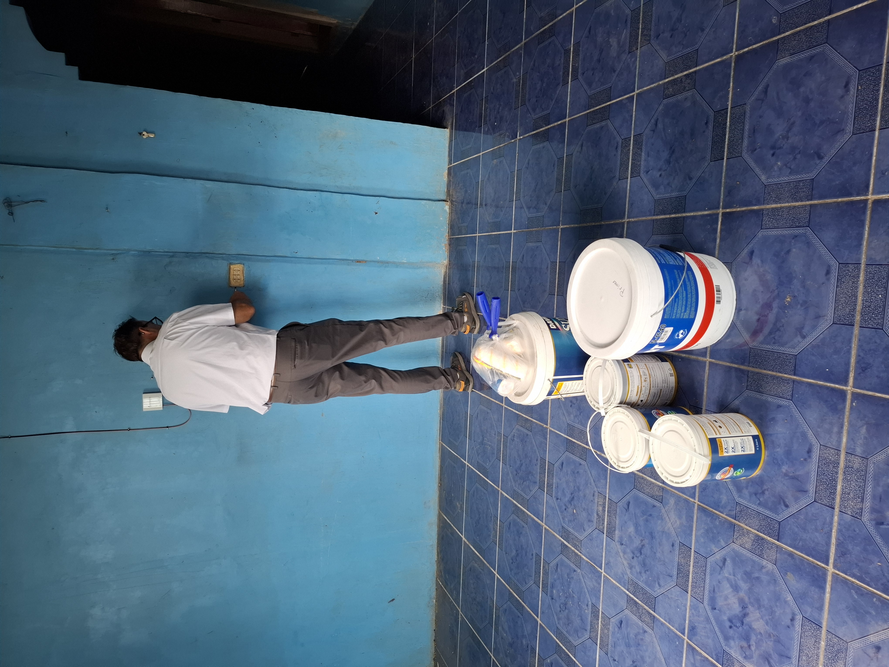
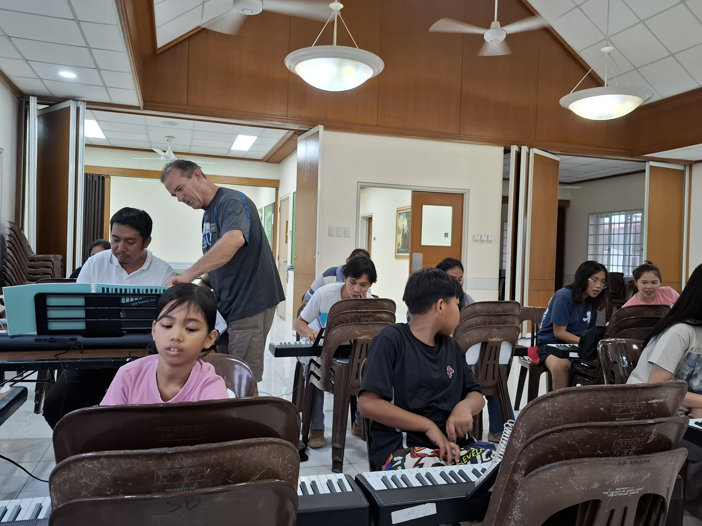
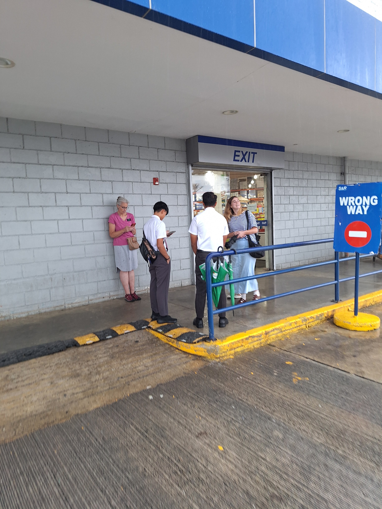
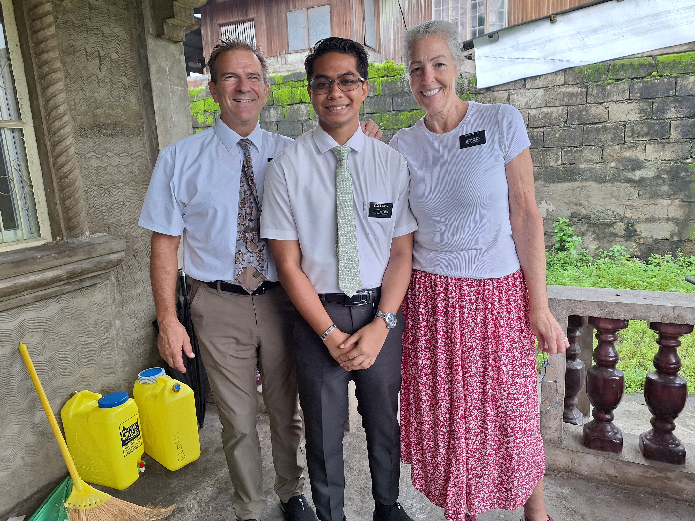
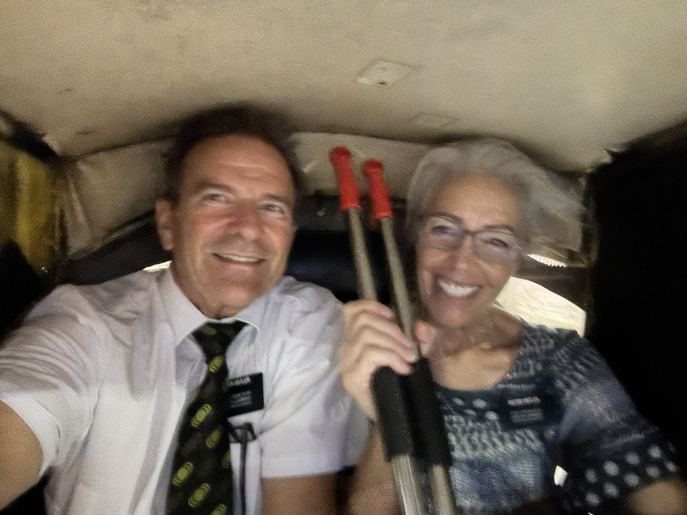

---

title: "Frogs, Faith and Fun!"

date: "2026-08-24"

description: "A weekly mission update from the Philippines."

---

Here is a fun faith building experience:  Saturday after piano class I start randomly driving home only to realize that we had planned to stop at the Santa Barbara markets to get veggies for our next few meals.  It is always an experience getting veggies. At this market we only go at night because the night market is in full swing and we don’t have to go back into the covered area where the smells are horrific - meat, day old meat, maybe week old meat, fish, day old fish, rotten who knows what from who knows how long all combine to permeate the inner reachings of the market - so we tend to stay on the street side where the vendors set up on the ground next to the road - more air circulation that way for us.  Anyway, they have pop up tents over the veggies and Sister Ostler inevitably hits her head on the frames of these tents every time.  We are walking around looking down at the veggies/fruit and ‘wham’ she knocks her lovely head into the frame.  The hazards of being a tall white chick in Southeast Asia.  And we usually get a few bug bites as well if it is not raining.  If it is raining we usually get some big plops of water on us as it rolls off the pop up tents.  Tonight we get both - bites and plops of water.  Not like shopping at Fred Meyers or Walmart, but I digress from the story.  So we have our wares and are driving home and I see our missionaries that are in our district walking down the side of the road.  I pull over, jump out, dash across traffic and chat with them for less than 30 seconds. During that time I invite them to dinner for Sunday afternoon.  We have been helping one of these Elders with lite counseling/coaching as per Pres. Foster so we try to interact with them as much as possible while at the same time try to not take away from their teaching/study times.  Then we head on to home without thinking much about seeing the missionaries.  That night we text them and ask if they want a ride to church as we go right by their place on the way.  Sunday morning we pick them up.  And after a bit of chit chat one of the Elders tells the other one to tell the story.  So he proceeds to tell us that right before we saw them on the road Saturday night they had just been teaching a family.  It was the 3rd lesson and about the restoration of the gospel and the family, a catholic family, had decided that they didn’t want to proceed listening to the missionaries.  And they even handed the Book of Mormon back to the missionaries which was given several weeks ago.  So the Elders were dejected and depressed in Spirit walking down the road having just been rejected.  And we showed up! They said it really lifted their spirits and that we were sent to them as an answer to prayers they were saying right then.  It helped them go on with the rest of their night.  It was so awesome to hear that.  Sister Ostler and I had no idea.  We didn’t feel led by the Spirit but for some reason when we saw the Elders we just pulled over.  We often see Elders/Sisters but rarely pull over.  We are so glad we did.  Like President Foster says to us when we tell him these stories - ‘there are no coincidences in the mission.  It's all orchestrated from on High’.  We are just happy to be part of it.

And we had our 39th anniversary, celebrated in the Philippines.  We ate at the Levo hotel restaurant - shout out to the Barlows - they know all about it.  Who would have thought that after 39 years we would end up in the Philippines on a mission.  Wouldn’t want it any other way.   We are so blessed.  

Frog season:  This week somewhere near our house a boatload of frogs hatched.  We have little tiny frogs everywhere.  They are the size of your thumbnail and everywhere.  We open our front screen and they are just hopping around.  Occasionally we see some in the house.  We catch them and throw them out.  If they stay in overnight we find the body the next day all dried out.  We also have several cocoons from caterpillars around our washing machine area outside.

Walls of rain:  We have never experienced this in the states - we are driving along and see dark clouds ahead and it is raining lightly.  And then we can literally see like 20 yards in front of the car a wall of rain coming down.  When we hit it and enter the rain the noise on the car roof is loud and it is like driving under a waterfall. (I guess it’s like that as I’ve never really driven under a waterfall.)  And it's coming down in buckets.  So cool.

Saturday we had a bunch of plans to go out and work. There was a scheduled power outage for the area we were going to which we weren’t aware of.  We get to the storage shed to grab some items and this is when we find out about the outage at the shed and in the place we were going to. So we knew we weren’t going to do all our errands that day.  The landlord we were meeting was not responding (later we found out it was ‘because there was no current’ as she put it). So we stayed at the shed and worked in the semi-dark.  And yes, we sweated up a storm.  While we were there we experienced a huge downpour.  The rain just hit the corrugated roof and was so loud.  So we stopped working and stood under the patio roof and enjoyed the rain just coming down for about 5 minutes.  We’ve done this a few times when we are around locals and comment on the rain and they look at us like we have rocks for brains.  They are so used to it they don’t even notice - but we find joy in the sound of the Philippine rainy season.  We tried to organize the storage unit a bit better - we are constantly going there dropping off beds/wardrobes/stoves/mattresses or picking them up and it gets a bit crowded in the front.

Speaking of mattresses - we had a fun experience helping a sister missionary.  We get a text from Sister Foster on Wednesday asking for our help.  She tells us a sister, a brand new missionary,  is suffering daily and badly from getting bites all over.  Bites in bed, bites while studying, bites while in the shower.  And from the description we were given we do a little research and determine she has bed bugs.  It’s at about 3pm that we get the message.  I didn’t really want to drive all the way to Tayug - it was an hour away. So in discussing when we are going to help this sister we think, ‘what if this were our kid on a mission, would we want someone to help them right now? Or wait and help them tomorrow?’ Obviously - we are helping right now!! (Actually, Sister Ostler asked me that question to help me put it in perspective).  This sister is serving about an hour drive from where we are at.  We actually get this message while we are parked at a stake center parking lot eating our PB&J lunch after inspections.  We had an extra long lunch in the car because it was pouring rain and we didn’t want to get soaked as we did our errands.   So we were sitting in the car planning when we got the text.  So our solution for this sister:  Bring her a new mattress from storage, new bed sheets which we will treat with Permethrin today, and a new pillow.  So we gather these items, go back home, prep the bedsheets, get cleaning supplies, bug spray etc. and plan our trip.  We want to show up at her apartment an hour before they get home for the evening.  So we show up at 8pm.  We tape a plastic sheet over an open window (for mosquitos), sweep around the base of the walls, spray permethrin on the bases.  We went into their bedroom which has 2 bunkbeds and several suitcases.  We wanted to move the beds away from the walls and boy was it a tight squeeze.  After much work - like tetris - we finally get the beds moved.  They were so wobbly so we tightened up the screws, and then swept the floor and sprayed.  We switched out her mattress, gave her the new sheets and put the bedroom back together.  And we changed their front door knob.  All this took about an hour and a half.  Sister Ostler also gave this sister bottles of bug spray and benadryl cream.  We loaded up the old mattress and headed home at about 10 pm.  We checked in with the sister the next day and found that her bug bites went away and she didn’t have new ones.  Yeah!!

As an aside we also delivered some permethrin and bug spray to another new sister missionary this week that was having mosquito bite issues.  So here is the interesting part.  We came to the Philippines with so so many spray bottles of mosquito repellent.  Sister Ostler did not want to be without her favorite trusted spray from Walmart. And we brought plenty of deet and another kind of bug repellent from the states. When I unpacked these bottles months ago I thought - I bet we won’t use all of these and I’ll be giving them away at the end or bringing them back to the states.  So here is the thought - maybe we brought the repellent not for us but God orchestrated us bringing so much for His missionaries.  It's so fun to be an instrument in His hands.  And we are not taking the credit for all these cool things.  We just happen to be here doing His work and He puts us in places or puts us in front of the right people at the right time.  It is not us.  We are not that smart.  

It’s definitely rainy season. Sooooo much rain. We didn’t know that much water could pour from the sky. And it’s not cold. The kids and teenagers are out playing in the downpours. We never wear our rain jackets that we brought. It would be unbearably hot wearing a raincoat while it’s raining. 

Sunday night we had the Santa Barbara B Elders over for dinner. They are so fun and such great missionaries. We often talk about how lucky we are to be in charge of housing for the entire mission. We get to interact with every missionary in this mission several times every transfer. These missionaries are so focused on finding and teaching and reactivating. The Fosters are such excellent mission leaders because they truly love these junior missionaries.

It’s mind blowing that we’ve been on our mission for 4 months. We are definitely looking forward to the adventures that we know are coming our way during the next 8 months.

Our testimony this week is that redemption is real, God is more than real, and Jesus knows us better than we know ourselves and still he truly loves us.

Love

## Photos

