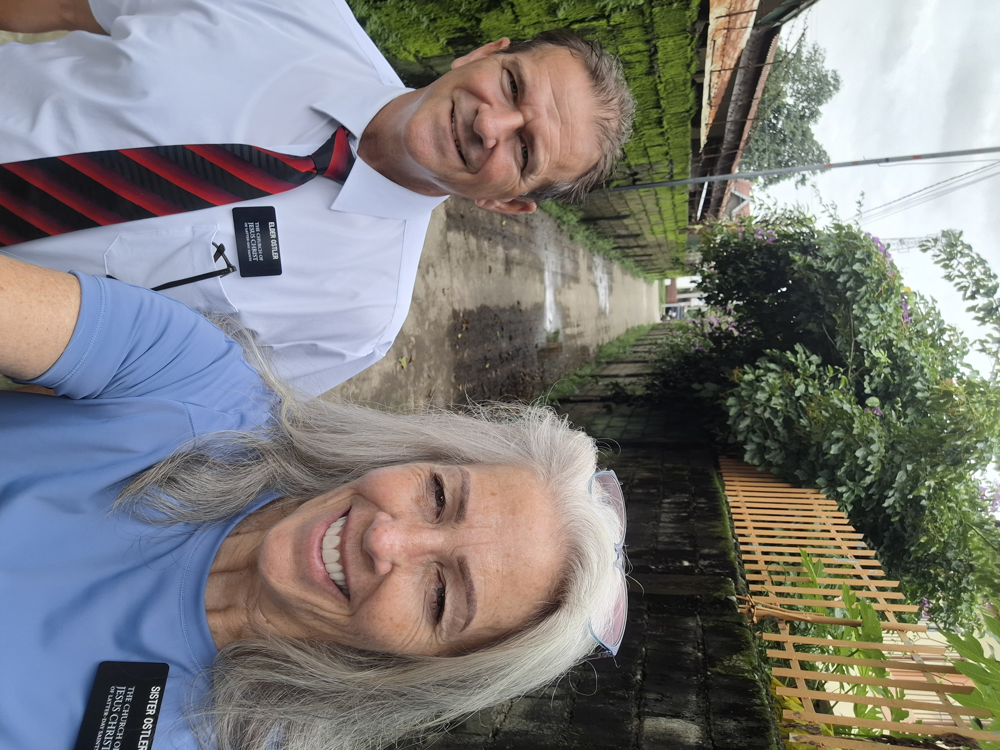
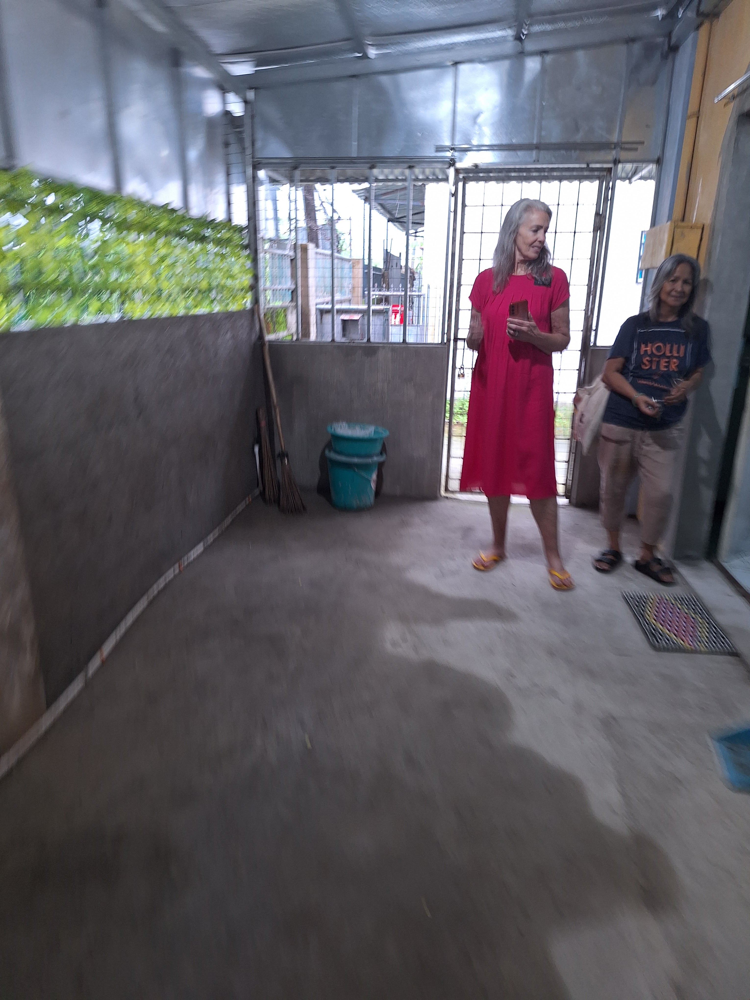
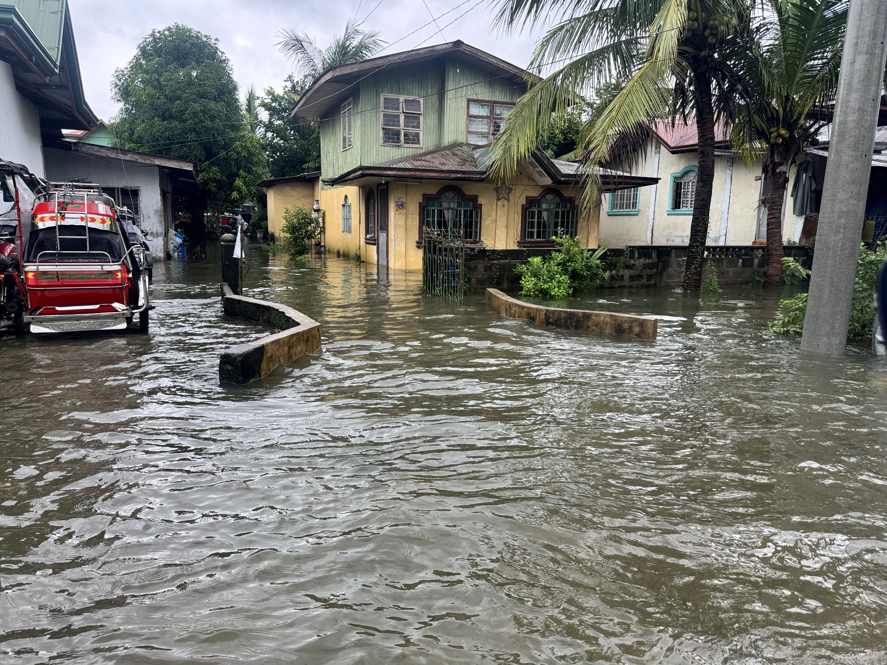
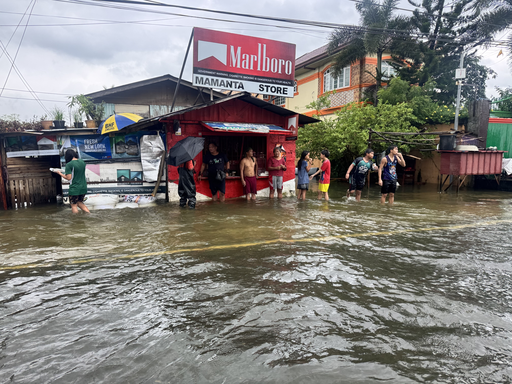
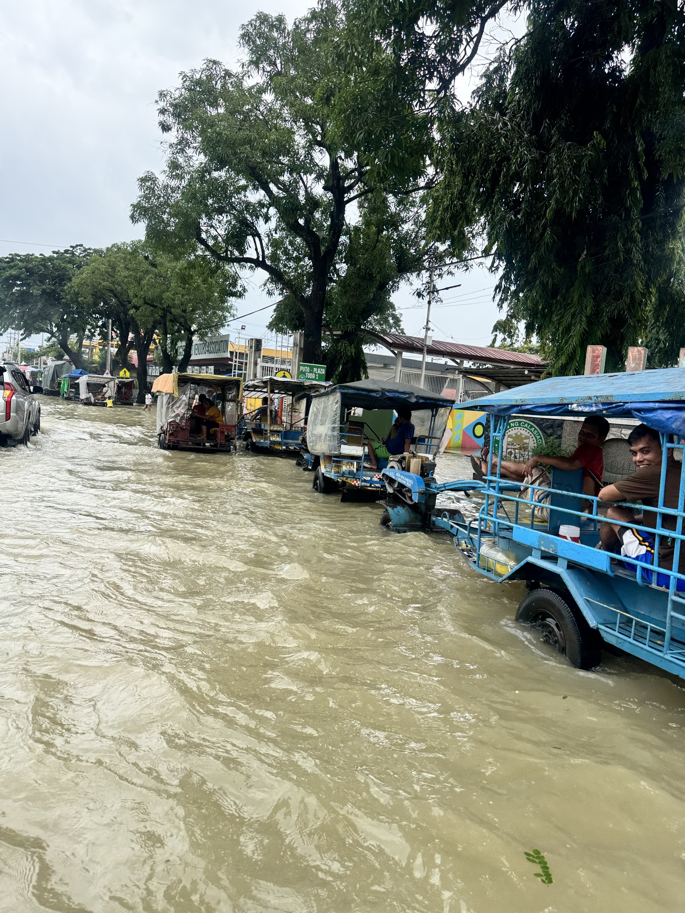

---

title: "Getting Ready to Build an Ark!!"

date: "2026-08-31"

description: "A weekly mission update from the Philippines."

tag: "Week 15"

---

Joseph - it was great to talk to you this week and hear about all of the things. And Lilly with the nails. I really need a manicure and wish you were here to make my nails beautiful. 
Way to go AMBER with the half marathon. That is so impressive.Wow!
Emily - thanks for the photos. Love seeing what is going on in Wyoming. 
Wilson - you’re work is amazing!!

Another week!  Just can’t believe how fast time is flying by.  And thinking about the states and all you non-missionaries - all the kids have/will start school soon.  Just crazy.  And wow!  College football is starting.  Boys - watch a bunch of games for me!!.  I will miss the fall smell, freshly cut grass in the Autumn and Saturday watching football!

But who has time for that thought when there is a whole mission that needs taken care of.  And boy howdy - is it crazy here!  It has been raining literally every day all month.  Evidently the amount of rain we are getting is record setting.  And that is evidenced by all the flooding.  A few weeks ago we sent videos of us driving around on flooded roads and we thought that was a one and done.  But no.  Some of the roads still haven’t drained off.  And then the last few days we have experienced significant rains and flooding.  Sunday, all of the Dagupan zone had no church because of flooding, along with a couple of other stakes/buildings.  Members are displaced from their homes and living in the Calasiao stk center.  The ground is so saturated that instead of the rain soaking in it is running into the rivers/canal/houses/roads etc.

Here are a few of our experiences this week.

Wednesday - we are informed while we were in Pozzorubio looking for an apartment that 2 sisters will be transferred that afternoon to an apartment in Mangaldan that was recently vacated by Elders.  We know the apartment well as we found this one and by Philippine standards it is beautiful and clean.  Since Elders have lived there for 12 weeks now we thought that we might want to check it out before the sisters arrived.  So after finishing up trying to find an apartment in Pozzorubio (with no luck) we hustle to Mangaldan.  By the time we get there we have about 1 hour before the APs arrive with the sisters..  Upon entering we know we have some cleaning we want/need to do.  Because we were not expecting to do this, we didn't have any cleaning supplies with us and the Elders didn’t have many supplies at the apartment.   Sister Ostler looks in the microwave and sees that it is on its last leg.  In this humid climate the microwaves tend to rust out around the door and the seal is broken.  So when this happens they are not fit for apartments and we replace them.  So we decide we need to run to the store to get a microwave and supplies.  Run is not the right word.  It is a crawl in Mangaldan traffic - and it is also a downpour.  So this takes way too long (I know, Jefferson, the Lord has time) Interrupt this story to give that some background - I would always tell all the kids on their missions to ‘stop and smell the roses’ because I knew they were too much like us and always working so hard.  So I wanted them to also enjoy the countries, enjoy the culture, take time to look around and not always be 1000% focused on the work.  So when I was leaving on my mission Jefferson said to me, ‘stop and smell the roses, because the Lord always has time.  There is no rush in his time frame’.  Well, we got sisters coming to an apartment that needs cleaning and we were running out of time.  I tackle the shower, Sister Ostler works on the kitchen.  About 30 minutes later the Sisters show up.  We are not close to being done.  One of the APs asks what he can do so we give him a broom and we quickly finish up (the other AP was bringing up all the luggage for the sister (2nd floor).  I was, you guessed it, covered in sweat and I’m sure Sister Ostler was as well.

Thursday morning at 2am our phone rings.  It's the APs telling us the sisters in Mangaldan who we just moved in were having an issue.  Their CO/fire alarm was going off - but it wasn’t consistent with how it should be going off.  We figured out it was a false alarm and we had them disable it.  But we were concerned ‘what if it really was a CO issue?’  ‘What if something is wrong’?.  So we decided we had to go up there, put in a new alarm, see if it would go off, and make sure they were safe.  So we told them we were on our way up there and to open the windows and doors and turn off their gas on their stove.  We jumped in the car and drove like crazy.  We got up to 100KPH (60MPH)!  We can never drive that fast any other time due to traffic, pedestrians, dogs, narrow roads, etc.  But at 2am we can.  We get there, install a new alarm, waited a while and it didn’t alarm, reassure the sisters all is well, and book it back home.

But no rest for the wicked, or the old people.  We get up the next morning and get to work.  We found 2 apartments on Thursday!  What?  I think we had help from on high because we alone aren’t that good.  

Friday - highlights - had a wonderful meeting with Sister Foster regarding upcoming Christmas program, new missionary intake, apartment finding and needs, etc.  A much needed meeting to touch base, get her perspective and get answers to questions we have been piling up.  We were also told at the end, in talking to the APs, that there will be Mangaldan Elders again.  Last cycle Elders were taken out of Mangaldan 1 due to lack of numbers of missionaries.  So this apartment was vacant. And we determined that if Elders were going to be put back in Mangaldan that they must have a new apartment.  Remember the rat jumping out of a big box on the bunk bed while Elder Ostler was moving the box?  And then Elder Ostler screaming like a girl scout and Sister Ostler jumping on the rail of the bottom bunk while the rat scurried around our feet?  Well, that was the downstairs apartment in Mangaldan and we vowed that missionaries would not be moving back into that building.  So Friday we were told Elders were going to be in Mangaldan again.  So we had to find, rent, sign the contract and set up an apartment by Wednesday.  So right after our meeting we booked it up to Mangaldan.  And all in a downpour we scoured the area they needed to be in.  No luck.  We talked to everybody.  We looked at so many apartments that we could see or were told about but no luck.  Finally, we were on the outskirts of where we wanted to put the Elders and we stop and as usual ask at a sari sari store.  They hum and haw (sometimes they pretend like they don’t understand or just tell us to go down the road somewhere and that there will be an apartment - I think to just get rid of us).  Finally they take us to the lady down and across the street and lo and behold - she owns a set of apartments right behind her house.  Super unique, but didn’t have any mold/mildew smell.  We think it will work.  On the way out, sister Ostler runs her pretty little head right into a crossbar on the gate which is at about 65 inches off the ground and she’s 70 inches off the ground.  Luckily I was right behind her as she whacked it so hard she fell backward off balance.  I caught her and kept her up off her butt.  She was hurting so bad.  Took a good couple of hours to get the pain to subside.  Can you say, ‘concussion?’  Its the 2nd time she has whacked her head on the bars across the tops of gates.  The iron gates are a little door in the big double gate cars go through.  And to get through the door you have to step over the bottom bar of the gate.  So while you are looking down at the step out of nowhere looms the top cross bar at about eye level for tall white chicks.  And Wham!.  Right on top of the noggin!.   So we get in the car and while she was suffering I saw a message from Pres. Foster from an hour ago that said to call him.  So we pulled over and called.  He is trying to work out where sisters can live, how to get Elders in Mangaldan again and just how to get all the missionaries in the right places.  He knows we don’t want them back in the old Mangaldan apartment so he’s trying to figure it out.  We stop him mid-sentence and say, ‘President, we think we just found an apartment that will work for the Elders’.  Yeah.  If we had called him an hour earlier we wouldn’t have been looking anymore as he didn’t think Mangaldan Elders would have been an option.  But the Lord, once again, pulled through for the mission.  So we have until Wednesday morning to get 2 new apartments furnished and open.  Luckily, we are going to move all the stuff from the vacated Elders apartment right into the new one.  And the sisters' apartment already has a fridge and stove.  We contacted a family (2 brothers) from Urdaneta that have been cleaning for us and offered them $$ to come to Mangaldan to be the muscle for the move.  So Tuesday will be a big day - moving into and prepping 2 apartments.  Luckily they are within about 3 miles of each other.  My goal is to not lift anything.  I get too caught up in the moves and inevitably lift too much, climb too many stairs, try to do it all and by the end of the move I’m toast.  Delene keeps reminding me to not do it all but I’m a terrible listener.  

Fast forward to Sunday.  We get a text from Sister Foster telling us to go to Mangaldan to move the sisters out and bring them to Urdaneta.  Reason:  The street in front of the apartment is knee deep in water and rising.  And at their location they would be stranded as there is no other way in or out of that apartment building.  There is a canal alongside that street and it is overflowing and the street is mid-calf deep for about ½ mile long.  So after some discussion the mission decides to move the sisters to Dagupan 8 which was recently vacated by Elders a week ago.  So after church we head up to get the sisters.  Delene’s boots only go up to her ankles and the parking lot of the apartment is mid-calf so I maneuver the truck so she can hop out on to the sidewalk area which is only about 3 inches underwater.  We load the sisters, the same ones we had just cleaned for on Wednesday and head to Dagupan.  The road was so deep underwater that a couple of men that were just standing in the deep water warned us not to go down any farther it as it would be past the bottom of our doors.  We saw some kids literally swimming in the street down where it was deeper.    We finally get to the apartment and well, as you would guess, the apartment is needing some cleaning.  So we all spend a good hour removing old Elder’s junk, emptying out cupboards of kitchen items that are not useful, dirty, or just gross.  Move the fridge, clean that mess under it, bring the cooktop in from the outside kitchen to the inside kitchen (Delene had to clean the greasy cooktop which is a challenge as we didn’t have many rags, no running hot water, and no Dawn), sweep all the floors, and clean the bathroom.  We gathered so many bags of junk, shoes, empty jugs of whey protein, etc etc.  And again, in a downpour load them into the truck.  I was soaked after 1 trip to the truck because I forgot the umbrella.  Then with the umbrella in one hand I took load after load - even with an umbrella when it was raining this hard I inevitably got soaked more.  

So with all these experiences what did we learn? Missions are hard!  Missions are fun!  Having a good companionship (speaking of us) takes a lot of work and communication.  Dedicated missionaries are the best.  A highlight is that we had the great opportunity to be in the car for an hour with 3 departing missionaries.  We transported them from their last area of work back to the mission home on the day they left the mission.  Such great men!  After 2 years of service they have such a great spirit about them.  This last group that left are all champions.  Just great Elders.  I don’t think that if this work was not guided and directed by Jesus through the Spirit that these 20 year old young men would have such a dedicated and sweet spirit about them.  It is not normal (natural man stuff) to have that kind of spirit after living with other 20yr old boys/men for 2 years.  But these missionaries have that awesomeness.  

Sister Foster gave us 2 cinnamon rolls this week. Definitely one of the best cinnamon rolls I’ve ever had in my life. No one bakes here, so to get a yummy home made cinnamon roll was absolute heaven. 

Welp - we’d better get some sleep. Moving all of the things and setting up 2 new missionary apartments in one day is going to be awesome, hard, fun, frustrating and we’re going to love every minute of the work. I wish I could take a time lapse of our day tomorrow, there is just no way we can explain in words what we do. You’d have to see it to believe it.

Love ya all.

## Extra Photos

