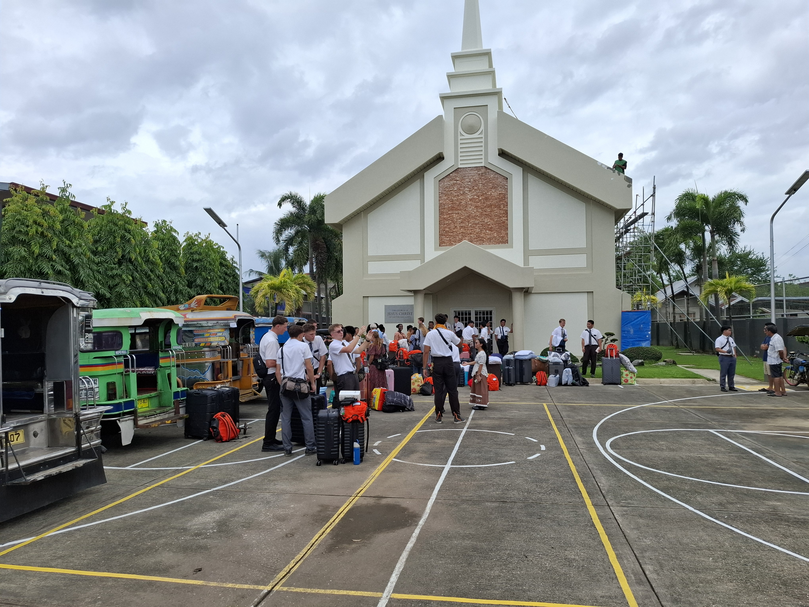
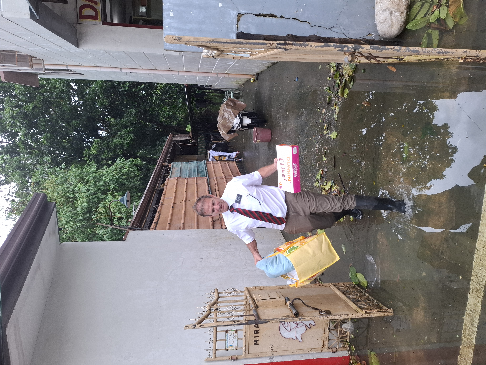
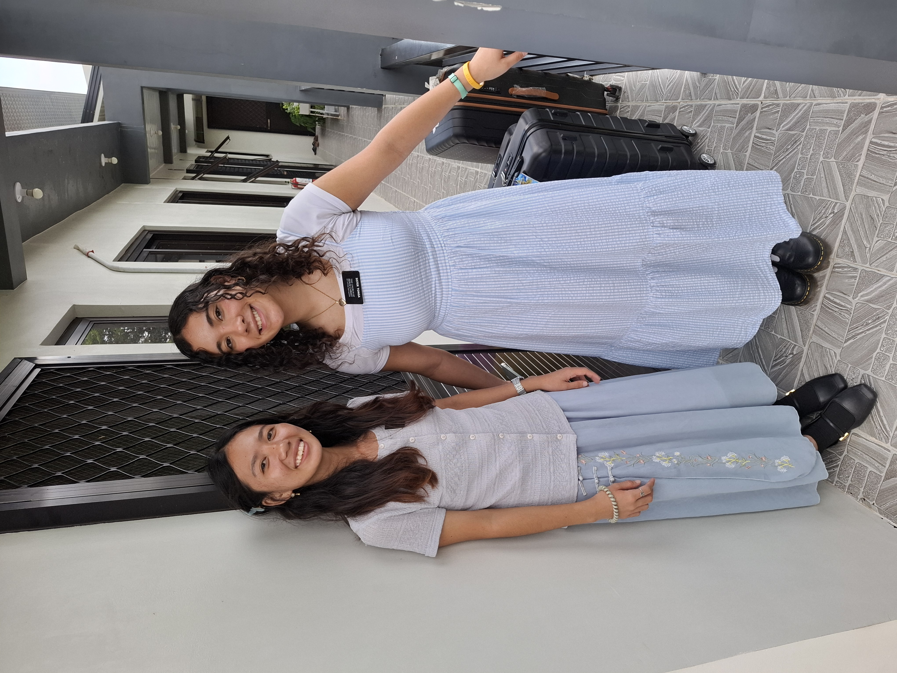
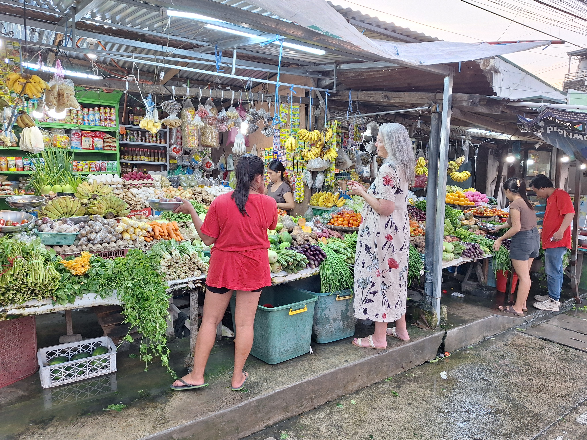
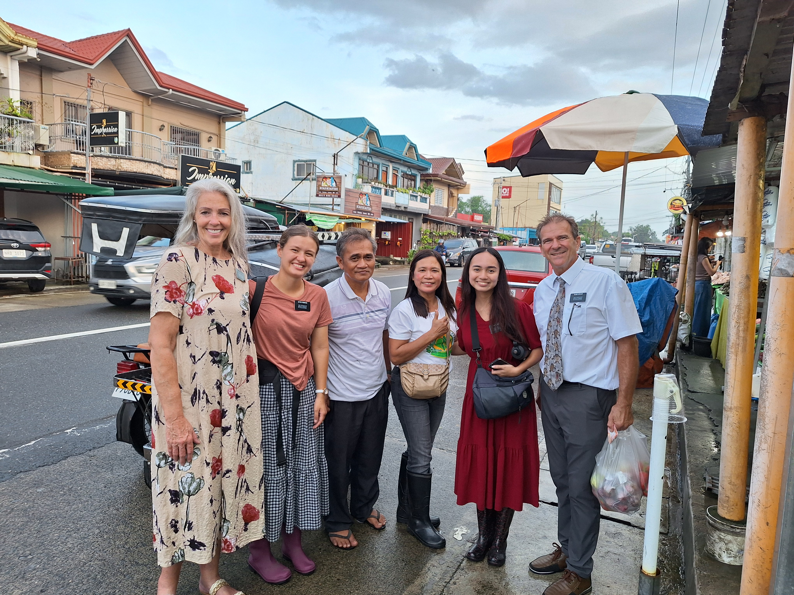

---

title: "New Apartments, New Missionaries, New Flooding"

date: "2026-09-07"

description: "A weekly mission update from the Philippines."

---

What a week!  But anymore it is always ‘a week’.  A week of driving, being with missionaries, transfers, new missionaries, flooding, moving apartments, finding apartments, coming home late every night dead tired, forgetting to get veggies at the market and settling for leftovers of whatever we have, putting out fires in apartments with supply runs, fixing leaks, and purchasing things they can’t find in stores.
This week started as usual with a P-Day not taken.  Instead, as we mentioned last week we found a Mangaldan Elders apartment, emergency moved sisters from a flooded area, and discovered mold growing in our old house.  We won’t rehash all that stuff. 
 
So we have 2 apartments we have told President Foster and Sister Foster that we would have ready for Wednesday transfers.  We started a 2 move day on Tuesday.  The first one was getting a sister’s apartment ready.  This is an apartment that we found a week ago.  We had a truck full of stuff, beds, mattresses, kitchen stuff, etc.  We met 2 brothers that we use to help us.  We unload our truck which we had previously loaded from the storage unit and began to take it into the apartment.  And to our chagrin - as we looked closely in that apartment we saw that it was dirty, messy, greasy etc.  UGH.  We had told the owner to clean it but alas, they hadn’t done it.  So we move in on top of having to clean it - and we didn’t bring our cleaning supplies as we didn’t anticipate this.  So we break into the new cleaning supplies we bought the sisters for their apartment.  Luckily the moving brothers are the same ones we hire to clean and they are great - get right to work, no complaints etc.  We finish this move in less than 2 hours (covered in sweat again) and head to the Elder’s old apartment and begin moving those items into the truck.  It needed a great deal of cleaning.  This is the related apartment to the one we found a rat and cockroaches in.  We opened the kitchen cupboards and find all sorts of old pans/pots/gloves/utensils just covered in grease, gunk, etc.  Meanwhile the brothers are loading the truck with the heavy stuff.  We get the truck overloaded and tie it all down with rope - and it all fits in one load.  Then we head to the new Elder’s place to unload.  We actually finish earlier than I predicted.  Yeah!!  Then of course, we aren’t done for the day.  We go buy a bunch of stuff, fridge, washer, cooktops, microwaves at a nearby appliance store. And now with a back seat full of those items we continue our day.

Transfer Day - oh what a busy day.  We had 15 different stops at apartments - most of them unscheduled - putting out fires kind of stops.  We are in charge of the 2nd of 2 transfer points in the mission.  4 zones gather at the mission office and whoever is coming up our way all get in jeepneys, usually 4 jeepneys, and journey up to Santa Barbara chapel.  The missionaries in the upper 3 zones meet these missionaries at Santa Barbara and then they split to go back to wherever they are being transferred to.  It is very well orchestrated and organized.  Our goal is to have missionaries at our transfer point from 9-10ish and then send the jeepneys back out.

Well, with apartments being whitewashed and newly opening the key issue can be critical.  Who has the keys to the apartments.  As we were the ones opening the apartments we had 2 sets of keys and the APs had another 2 sets of keys.  Well, the APs, at the Urdaneta transfer point, forgot to give the keys to the missionaries - so we first have to ascertain who didn’t get keys and then give our only set to the missionaries so they could get it.  As we are not privy to who is being transferred and where they are going we spend some time wading through all the 60 or so missionaries at the transfer point to try to find who we are supposed to give keys to.  So much fun.  Then we find out that the Binalonan sisters don’t even know which apartment they are going to - the old one or the one we opened for them.  Long story short - after everyone leaves the transferpoint we hop in the truck and start booking it to apartments that need our help.

We end up meeting the Binalonan sisters at their old apartment and get all their bags and food and take them to their new apartment.  One of the sisters that was not transferred wasn’t told she was going to move to a new apartment until about 2 hours before we showed up.  Surprise!!  Then in the midst of this we get a call from the Calasiao Elders telling us that there is a layer of water on the floor of their second story apartment, the entry is barely navigable, they had to crawl over the railing on chairs to get to their stairs to avoid being waist deep in water, and to top it off - there is no power in the apartment.  At this time we are seriously questioning why they were put back in the apartment as someone at the mission office had to know it was still possibly flooded - as we had told them it would be iffy on transfer day.  So as we are driving to Binalonan we have the Calasiao Elders on the phone telling us this story.  We start texting the owner - a young kid- who goes over and discovers the breaker has tripped.  He flips it.  The light bulbs start popping and on one outlet sparks come out and the outlet blackens.  And the breaker trips.

After some back and forth texts with President Foster we determine the Elders can’t stay in the apartment and we will move them to the ZLs apartment in Santa Barbara.  This will mean they will have to have a 40 minute ride to their teaching area.  So we tell the Elders the plan, pick up mattresses among other things and head to their flooded apartment.  And while we drive it downpours on the mattresses in the back.  They are covered in a vinyl zip up cover but we still are a bit worried.  We drop the mattresses off at the ZLs and proceed to the Calasiao Elders.  We get there, have them load all their luggage/bags in the truck and then tell them to get to work in their area.  As an aside - President Foster is so huge on getting to work in your new area on transfer day.  He views this as a work day and not a day to screw around with your new companion.  And all the missionaries have bought into this culture of dedicated work because they know and live their missionary purpose - to invite all to come unto Christ.  It is such an obedient mission culture that the Fosters have worked so hard to create.

We take all the luggage back to the ZLs place and put it inside.  It is going to be cramped in that apartment.  There will be 4 Elders in a small 2 bedroom apartment - 1 is a big boy of Polynesian descent  from Utah, 2 others are big boys from New Zealand and Australia, and one is a small Filipino that has the biggest smile and personality ever.  I know President Foster doesn’t like to have 4 missionaries in one place but this is an emergency and it's going to be a party!!  Luckily they all are great and diligent Elders so it won’t be like a real party - just a fun atmosphere.  After that we had 5 other stops to make and we didn’t get home that night until late.

We got the opportunity to take 2 companion sets to their new areas on intake day.  We got 9 new missionaries and we were assigned to take 2 sets of sisters to their apartments.  Since our truck only holds 5 we had to take them separately.  So fun riding with missionaries and going to their new places.  Both Greenies were from the states and it was fun seeing the new mission experience through their eyes.

Then we went to Calasiao to look for an apartment for the Elders as they needed to be in their area as soon as possible.  We had no luck.  And it was raining on us.  At one point we started driving down a narrow side road toward an apartment building.  There were walls on both sides and only wide enough for our truck.  After 200 yards in and several pull overs into a small driveway area to let a trike through we started getting flood waters. They were about a foot deep.  And at a tight intersection all the directions were underwater.  Having never been on this road we became a bit nervous about continuing on as it was dusk, the water was very mucky and you couldn’t see the road under the water.  This means we had no idea where the road really was or where a deep drainage ditch was - we did a very tight 20 point turn around and headed back.

Well, that night we were unsuccessful and Delene sent a message to the Elders telling them to be on the lookout for a new apartment in their area.  And what??  Later that evening they sent a picture and a pin location of an apartment.  We went there the next day and it turns out that this apartment will be amazing for them. Just 700M down the road from the flooded apartment and in great condition. We are moving them into it on Wednesday.  Truly a miracle.    

Well, we could write so much more but it's late here, and we are beyond tired and we have a big day tomorrow with a move to a new apartment.

Love to all

## Photos

