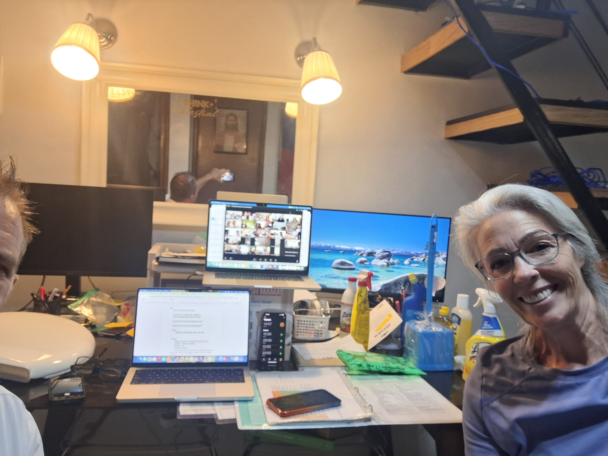
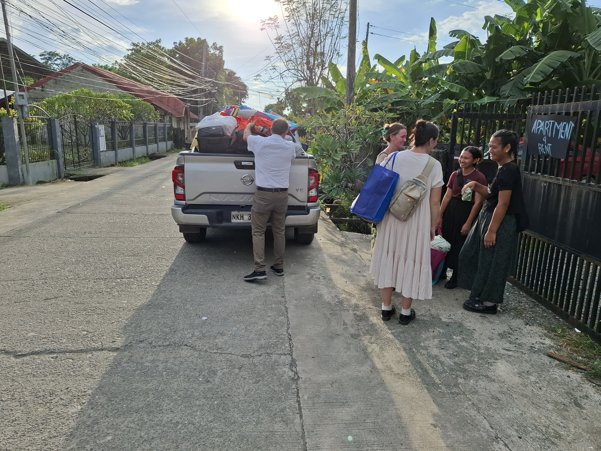
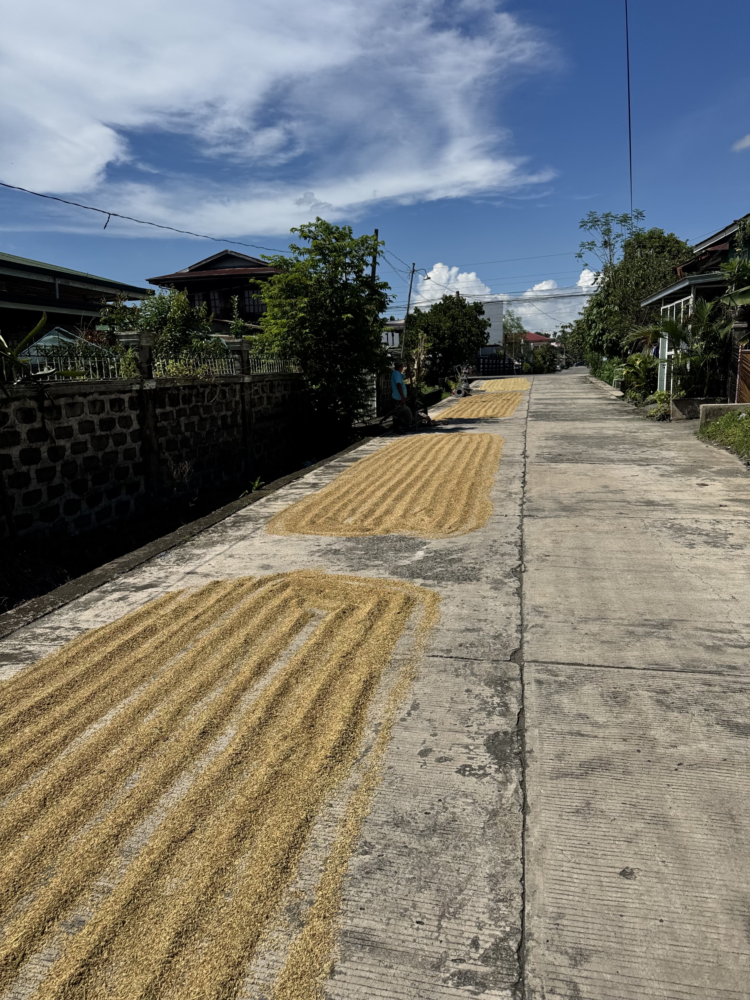
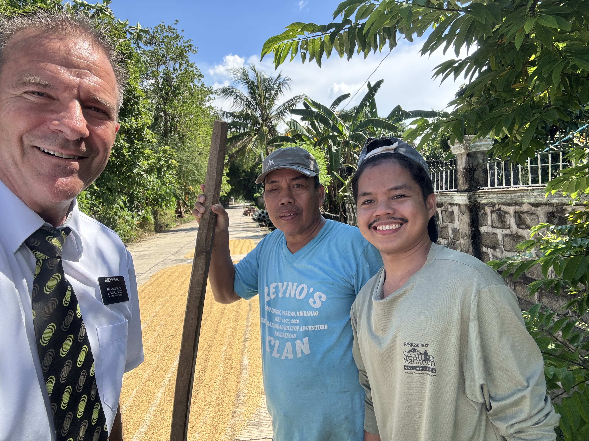
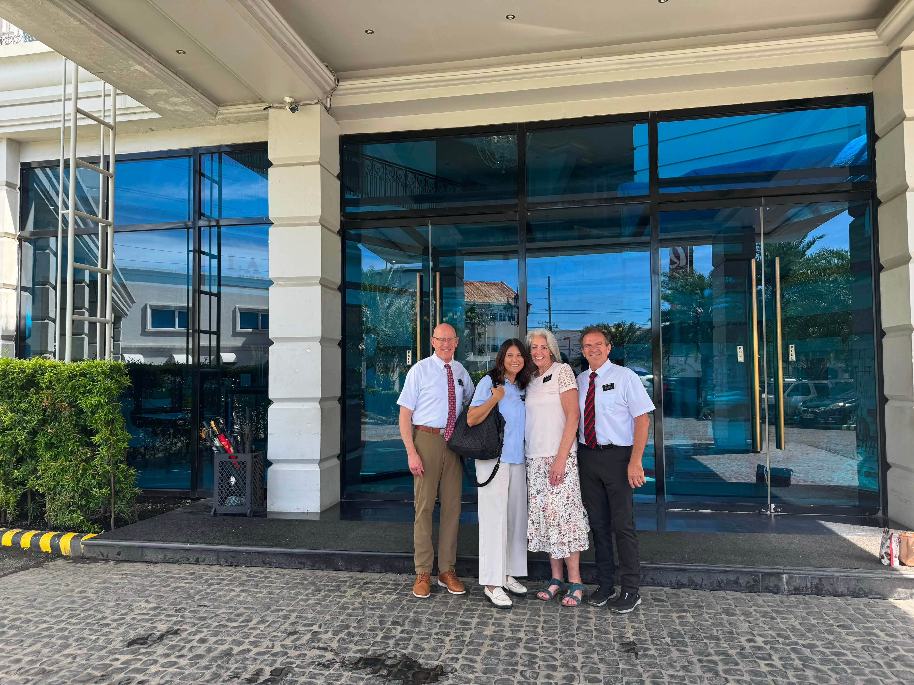

---

title: "Missions are a BLAST"

date: "2026-09-21"

description: "A weekly mission update from the Philippines."

---

So this happened:  Thursday night, 9:08pm, we get a text from the Alcala sisters with a video saying, ‘Hi Ostlers, this is what it looks like when we came home tonight’.  And the video shows men/boys drinking and smoking with loud music playing in the shared parking space/courtyard.  The apartment is a 2 unit building that shares a common parking area inside the gates and right outside the door to the apartment.  And to get to their unit the sisters have to walk right past the party.  They were a bit shook up.  So Delene called the Fosters and described the situation and gave it over to them (that stuff is above our pay grade).  Here is the tender mercy part:  Just 2 days prior we had randomly gone to their apartment to exchange 2 wooden desks for 2 plastic tables they wanted.  The desks, according to the sisters, ‘smelled bad and were old’.  Yes, they were moldy, had broken drawers and had missionary signatures penned on the surfaces dating back 5 or so years.  We had just had a set of Elders that had requested wooden desks as they had plastic tables so we made the switch.  And the fact that we were just at their apartment and had seen the recently arrived neighbors and their recent additions to the outside gave us unique knowledge when the sisters sent the video that night.  About 2 weeks before this the sisters were complaining of construction noise next door that was disturbing them.  In talking to the landlord he told us that the new tenants were building an outside kitchen - and when we exchanged desks we saw it - and boy did they build something.  It was like a fenced in party place.  And the night we exchanged desks we saw motorcycles, a big truck and they had taken over the common area.  So we were able to confirm with the Fosters the state of affairs the sisters were complaining about.  The Lord continues to put us in places where we need to be to help the mission.  Nothing is coincidental on a mission.  We needed to see this change in the environment so we could help inform the Fosters and give an adult perspective of what was happening.  

One of the sisters said people were trying to get in their apartment that night and she didn’t sleep much that night.  So the next morning at the end of our scripture study time we get a call from the Fosters.  Yup, you guessed it - a decision had been made to transfer the sisters out that day.  All 4 of them.  One of the transfers involved moving one of the sisters to a completely new area and bringing in a different sister.  Companionships were changed.  Evidently there were already some dynamics going on in that apartment that were not the best (hence the switching of assignments).  And where to put them?  Well, the mission so happens to have an empty apartment 15 minutes down the road in Santo Tomas.  Elders had been there until 2 transfers ago but with the dwindling number of Elders in the mission (happens in the summer - based on US college start/end dates) the apartment was vacant.  So in true Sister Ostler fashion you can’t move missionaries into an apartment without first making sure it is clean (and I’m not throwing shade as I totally agree - but it's just that she is more thorough than me).  
But before all of this we drove over to Alcala that morning after the phone call with the President to start looking for an apartment - finding the sisters a new apartment just became priority number 1 for us.  But, no luck.  We had about 2 hours to look before we had to drive  up to Urdaneta for inspections.  Alcala is about an hour drive from where we live and our inspections are an hour back to Urdaneta. You could do those drives at 2am in about 30 minutes, we have found!!  

After inspections we had just under an hour to spare to check the Santo Tomas apartment out and make sure it was ready.  The beautiful thing about the Santo Tomas apartment is that during the last cycle we contacted the landlord and told him his apartment in Santo Tomas would be empty for a few months.  And surprisingly he is a good landlord and sent his people over to clean it.  So we know it had been somewhat cleaned .  But since the rainy season has been so long and humid we knew there would be mold on the wood and mattresses at a minimum.  So we go there (this time we took cleaning supplies and a hose as we had peeked in that apartment in the morning) and start cleaning.   Sweated, cleaned, but didn’t mind it.  We only had about 45 minutes to work and then we began the transfer of missionaries.  We went to their apartment in Alcala and as we enter the common area a young man is sitting right by the door on the sister’s side of the porch smoking away.  Their cars and motorcycles were sprawled about.  But the sisters were all smiles.  Such a happy group.  Since we had 4 sisters, 2 of us and 5 seats - yup - yours truly got to ride in the bed of a loaded pickup on top of all the luggage.  We had all their luggage, all the food, everything they would need for an unforeseeable timeframe.  Once on the ride over Delene yells back, ‘watch your head on the wires’.  Sometimes there are low hanging wires across the road and I’m riding kind of high on top of the luggage.  Gotta love it. After we dropped them off it is now about 5:30 and it's still light so we go back to Alcala and start looking again.  No luck.  It is dark by now and we are not being very effective so we go back to the old apartment to get mattresses, desks, water, the cooktop etc.  And with threatening rain we book it back and drop it all off.  No sooner did we get the truck unloaded than the sky began to unload on us.  What a day.  We were pretty tired after this one. 

We did find 3 other apartments this week.  We have been busy little beavers - from our priority list that President Foster gave us we have been looking in all our spare time.  We are trying to get apartments ready for an influx of numbers as over the next 2 cycles we will go up in numbers by about 20-30 missionaries.  So we were busy doing that when the Alcala thing happened.  But it is all good.  I often think about Jefferson’s statement to me, ‘The Lord has time’.  

We have actually had a few sunny days in a row now.  So awesome to have that sunshine.  And in the midst of that we have had some doozy rain showers in the late afternoon and evening.  Like it is perfectly blue skies and we see to the east some dark clouds.  Then an hour later buckets of water come down, the streets become massive puddles - like 4-6 inch deep puddles filling the lanes - and life goes on as usual.  Thunder and lightning and then an hour later it stops and the streets drain and the motorcycles that were all taking shelter come out in full force again.

This week we finally started exercising better.  Well, Delene has been pretty faithful at walking and doing yoga already for several weeks.  We originally set up a schedule where we would exercise right at 6:30am.  But I blew that off.  I’m just not motivated to lift heavy things that early.  So in her wisdom (and probably because she is tired of seeing my fat gut -Cue up the Monster’s Inc scene where Mike Wazowski yells at Sulley to ‘work out that flab that’s hanging over the bed’) she was the instigator in switching our schedule up.  We now try to be home by 8pm to exercise.  It doesn’t always happen - sometimes we are exercising at 9:30pm or later.  And our 6:30am time slot became an hour of individual study.  It's a lot better that way - it seems like it prioritizes the individual study.  Before, we had it scheduled for 8-9am but as you can see - we sometimes are racing out the door to meet a landlord, do an emergency transfer, or some such other stuff- so our study time would get missed too often. 

To continue the Alcala apartment search story.  After we moved the sisters they told us that there is a ‘pink house’ that they were told by a member was available.  So we got the contact number, contacted the member, and the member gave us the caretaker’s number.  We wanted to meet her on Saturday but she was gone so we made an appointment for a Sunday meeting.  We drove down after church and we toured the house.  It is big - Delene was immediately thinking - too big.  But I just wanted to find them a place so I was determined to stick a square peg in a round hole.  Well, on Monday, when we gave the Fosters the info on the house we were told it was too big - the sisters tend to get a bit scared when their place is too big.  Dang it!  And Delene was right.  So - Back to looking.  We head back to Alcala Monday morning- on our P-Day- after paying for and signing a contract on another apartment in Urdaneta.  Just renting places right and left this week!  With a prayer said we start driving up and down the streets of Alcala.  We go down a certain street and notice a group of townhouses. I hop out of the truck as I noticed one looked vacant - no shoes in front of the door, no plants, weeds in the gutter in front of the house.  After asking all around we finally see a young man go into the house right next door.  He had been down the street.  And in my snooping before he got there I noticed garments hanging in the porch so I knew the neighbor was a member.  And sure enough - he was a recently returned missionary.  But he didn’t know who owned the place next door.  No one did.  Bummer.  It looked so promising.  So we continued on. And an hour later we drive by a house with a ‘for rent' sign.  Super unusual to see those here.  No one advertises their places.  We call the number, Raymund answers, he’s right next door at his sari sari store and just like that we are looking at his apartment.   It is perfect - needs a little TLC but very doable.  Available right away.  We know the Fosters will approve this one.  And it is 2 doors down from the massive pink house.  We saw this sign on Sunday but didn’t think it was more than a studio as the sign said ‘apartment/transient for rent’.  This usually means they have a room for a boarder.  God put us close to this place on Sunday but we just didn’t see it (remember how I was determined to rent the pink house so I wasn’t looking where God was nudging me to look).  Now He put us here again.  We actually drove right past it and then backed up the street 40 feet as we saw it behind us. We had a bit of extra time in Alcala after this find and so we started looking for another place - President Foster likes to have only one companion set per apartment so we had 2 more sisters to find a house for.   We went back to their teaching area and began talking to people.  We just couldn’t get the townhouse out of mind that we saw a few hours previously so Delene drove back to it.  This time we see a car in front of the neighbors house on the other side and I see the water drainage from the washer in his porch going down the road so I knew someone was home.  And it turns out the neighbor, Joel, knew who owned the house and confirmed it was vacant and thought it could be rented.  He told us in English that the owner lived across town, and across the bridge.  We pull out ‘maps’ and together we kind of figure out maybe where the owner, Jennifer, lives.  We drive a few kilometers to the other side of town, across the bridge and park next to a large gate where Joel said she lived.  We walk into a massive cement covered commercial yard.  It's a business where local farmers bring corn and rice to sale to Jennifer who resales it to the local markets.  She is not there but her roommates confirm the house is available and for rent and call Jennifer.  She shows up 5 minutes later and we follow her back to the townhouse.  And it’s another find!  In a bit rougher shape and she is renting it for 5,000Php/month.  That’s $80US.  So we figure the mission/church can afford to spend a few pesos to fix the bathrooms, repaint, clean and get it liveable and still come out ahead.  So after this find, Delene pulls the car over and we offer a prayer of thanks to God.  Just wow!  I know we aren’t baptizing people but we are still being guided daily in our efforts to help the missionaries be as effective as they can be.  

Oh, and the place the sisters left?  We sent the owner a termination letter and he immediately messages back and asks what can be done so that we still rent from him.  I’m thinking, ‘that ship has already sailed my man’ but we just say that the environment has changed with the new tenants and we need to move the sisters.  He messages back that he can go tell the tenants to be quieter (he doesn’t understand they have created a little party place - which is probably just part of the culture - living outside your house and using the street or common area as your living space).  I respond and tell him we have already moved the sisters out.  If I was that owner, I would rather have sisters living in my rental than the group that just moved in.  But I’m old and trying to find peace and quiet in my old age.  Speaking of quiet - we have a tiny dog living in a cage outside across the street that has a very piercing bark.  And he barks all the time - especially in what used to be quiet hours of the night.  I yell at him to be quiet but he doesn’t speak English.  He will be the death of us here.

Sunday there was a stake event because our Stake Presidency is being released next month. So we went to the Calasiao Stake Center Sunday afternoon. Our ward had been asked to have our choir sing at the event. They had been practicing and practicing and practicing. Scott was the pianist. We sang Consider The Lilies. When a choir sings in the Philippines, it’s not like in the states. Here, they all coordinate and get matching dresses or wear a similar color. It is quite a production. They put a lot of time and energy and effort into making it a wonderful experience. They practice walking up to the stand, they practice exactly where each person will stand and how they will hold their music. It was a great experience and our choir sounded fantastic.

Morning Scripture study has been awesome. I’ve definitely studied and read more scriptures and words of prophets in the last two weeks than when we were trying to do our study at 8AM. It just didn’t work. But now, it’s the first thing we do - we turn to The Lord first thing in the morning. And for the rest of the day things are just better. I know that it is because I have Him in my mind. And since your thoughts create your feelings - if you’re thinking about Jesus most of the day, you are going to feel peace and joy rather than stress and frustration. 

The missionaries in this mission are top notch. Our assignment as housing coordinators has put us in THE BEST situation to be able to interact and see the missionaries on a daily basis. I was concerned that being an MLS missionary we would rarely see the missionaries. But the Housing Coordinator assignment has put us directly in every single missionaries path in this mission. Yesterday I think we saw 6 companionships walking through their teaching area as we were driving around the mission. To be 18, 19, 20+ years old and to dedicate 2 years or 18 months of your life to spread the gospel is amazing to see - the sacrifice that these young adults have made is beautiful and we are loving being a part of their journey. And they make our journey through this mission life extremely rich.

## Photos

