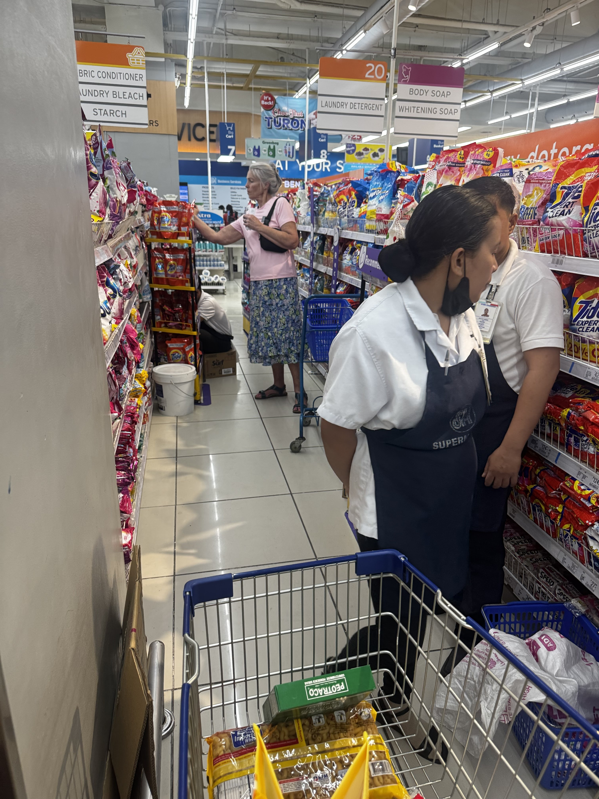
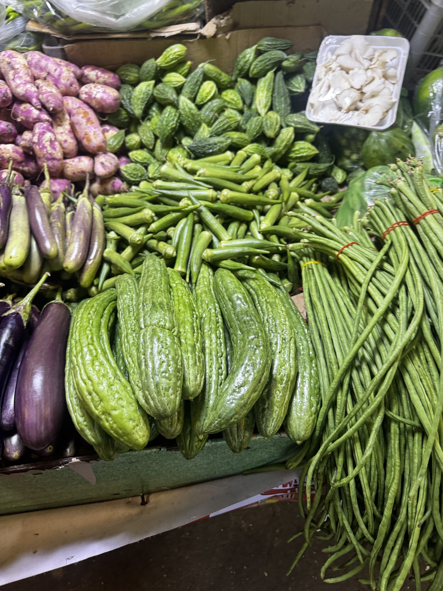
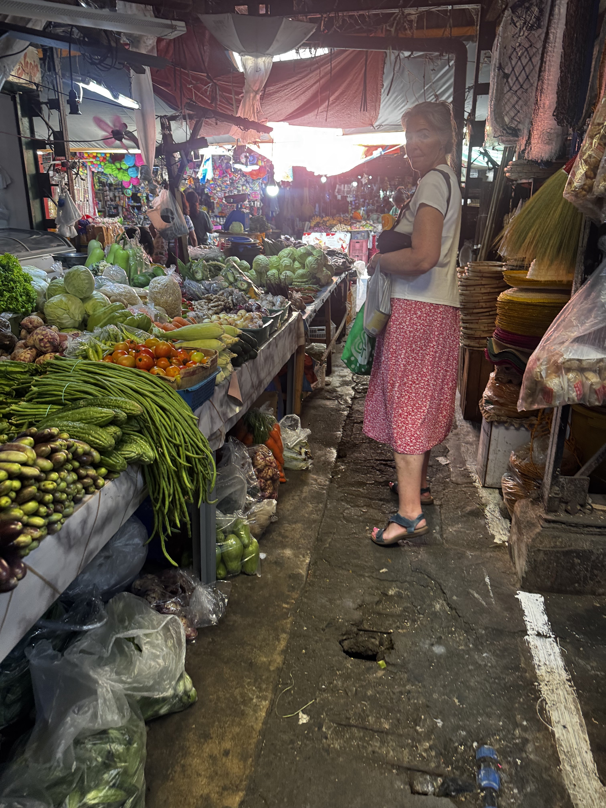
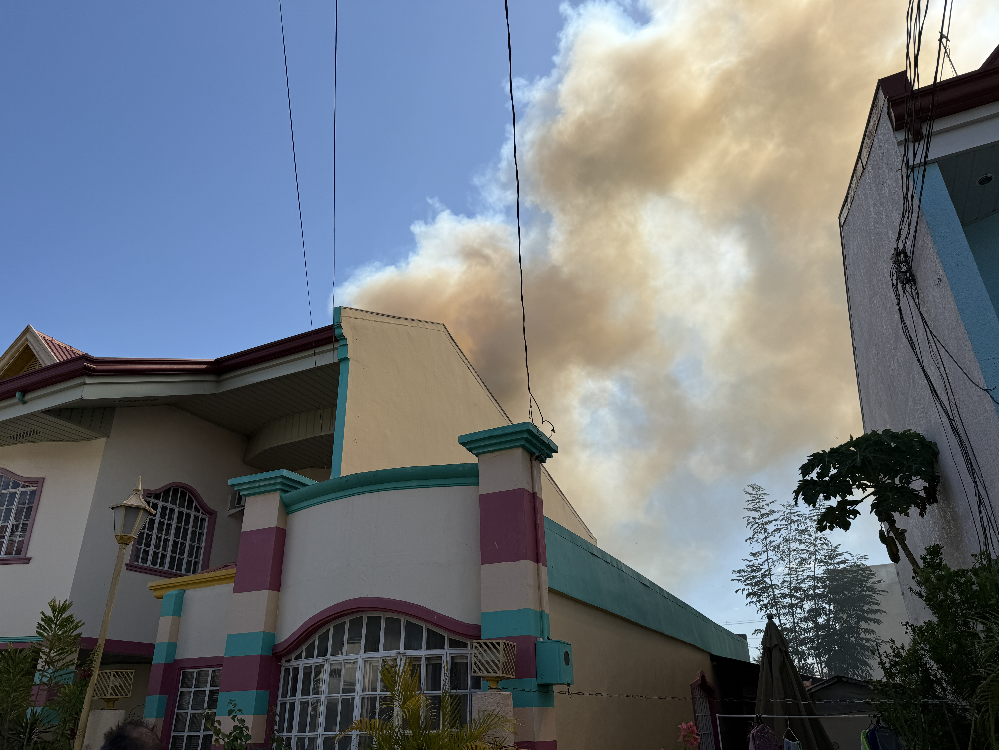
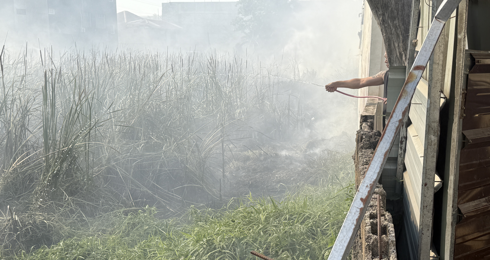
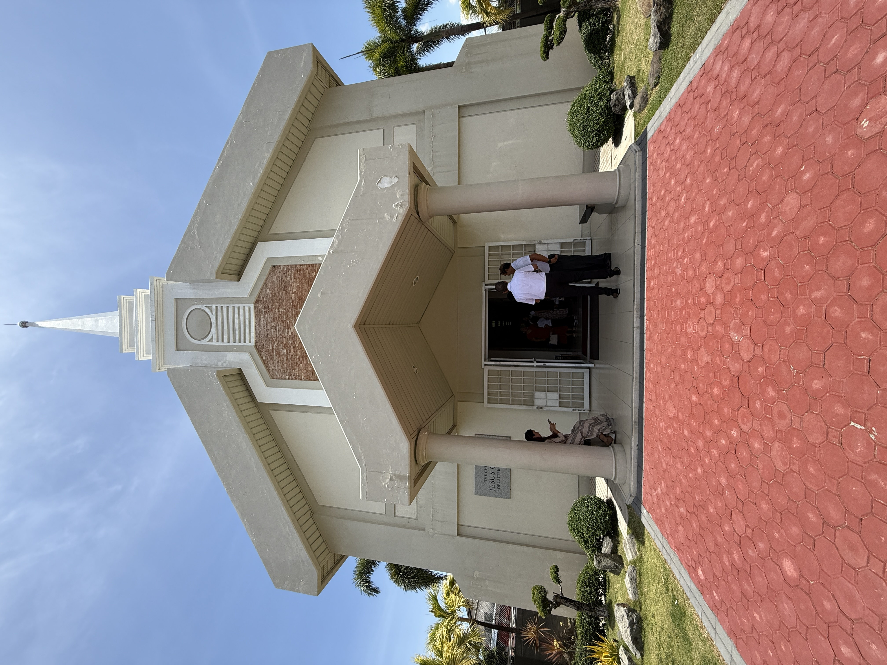

We've been in the Philippines 1 week, and what a week it's been!

So much to tell. Tuesday started out with a great breakfast. Scott made hashbrown patties and eggs. My hashbrown had plenty of butter and salt and I loved it. Then we worked on some things that needed taken care of at home before we set off for the LTO, the Land Transportation Office, in Binalonan to get our Philippine drivers licenses.

## Transfer Day and the LTO

We stopped at the office to pick up our mission phone. While we were there we saw a jeepney with a whole bunch of missionaries standing around it. We went in the office and got our phone then went out to the missionaries. It's transfer day and everyone was heading back to their apartment with their new companion.

Most of them got into the jeepney but two of them started walking down the road. Scott asked the AP if they were walking home and could we give them a ride. So we picked up the two elders and took them home. One of them was from England and the other was from North Carolina. They were pretty thankful that they didn't have to walk and then pay for a tricycle to take them home.

We then headed for Binalonan. Not much traffic so it was a pleasant drive. Yesterday was a different story.

## Miracle Number One Yesterday

I was driving home and traffic was thick. The light turned red and Scott told me to keep going but I said I wasn't going to run a red light. Two other vehicles that were in the other lane kept going and ran the red light. So I stopped and waited for 90 seconds until the light turned green.

As soon as I got through the intersection a guy that looked like he might be a policeman was waving for me to pull to the right. I had no idea what was going on so I kept going. At the next intersection the policeman was more forceful and came right up to our truck and I pulled over to the right.

I could not understand him, but evidently I had done something wrong. He kept talking about the light and I said several times that I had stopped at the red light. What I think he was trying to say was that I was too far into the intersection.

Another policeman joined him and they were trying to tell me something that I didn't understand. The second policeman got his little book out and his pen and was going to write me a ticket. Then he looked at my name badge. I heard him say to the other policeman the word "missionary." He looked at me and put his book and pen away and said that he wasn't going to give me a ticket this time, but to be careful. And we left.

As I think back on that experience I think that's a pretty powerful little piece of black plastic with white letters. That was miracle #1 yesterday.

## Miracle Number One Today

We arrived in Binalonan and pulled into the parking lot of the LTO. We got out of the truck, walked into the building and had no idea what to do. It was kind of like a DMV back in the states. There were about 50 people waiting in chairs for one of the 4 or 5 people seated at the front of the room behind desks to help them.

We looked around and had absolutely no idea what to do. Then a man said something to us. I think he said, "Hi Elders." We acknowledged him and then he told us that he was a member! Really? Really? A member, in the LTO, who spoke perfect English and knew what was going on. That was miracle #1 today.

He went and talked to the lady to figure out what we needed to do. The first thing we needed before we could get our license was a physical. We had to fill out a very long form and submit it to the doctor along with a copy of our passport and drivers license.

So we went next door where a guy made the photocopies and charged us 30 pesos. Then we walked over to the medical building where there was a doctor. The guy inside told our member friend that the doctor had left for the day. He would be back tomorrow.

Welp, that's what happens in a foreign country. It reminded me of you guys, our kids' emails, when you were on your missions and how you would get somewhere that took awhile to get to, only to find out you needed another form or the person that needed to handle whatever was not there today. So we'll go back Monday.

Our new friend, Brother Mejia, is a branch president in the Urdaneta Stake. He said there are only 8 Melchizedek Priesthood holders in his branch. He said they don't have missionaries but really want them in their branch. We'll definitely be putting in a request to President Foster for his ward to have missionaries.

## The Market and the Good Grocery Store

We headed back to Urdaneta City and knew that we had to find the market where all of the vegetable stands were located. We knew it was somewhere by the big bull statue. But we had no idea how we were going to park because there is absolutely no parking in that area.

We saw the big bull statue and decided to pass straight by it and eventually make a right hand turn and try to find parking on a side street. We drove slowly by the market and right before we would have had to make that turn, a car started backing out. Miracle #2 today.

We parked right in front of the market! What a blessing. We eventually located the vegetable market and we bought onions, garlic, mango, honeydew, mandarin oranges, and nashi pears.

We also found a fantastic grocery store. The one we went to yesterday was the most awful smelling place I've been in so far in the Philippines. Just absolutely repulsive. But this new place we found today was super clean and had everything, even Skippy crunchy peanut butter from the states and Mountain Dew Zero!

We bought pancake mix because we're almost out and we bought a can of coconut milk so that we can make mango rice for dessert tonight.

## New Missionary Intake Day

Thursday was new missionary intake day. 21 new missionaries arrived in the mission, 23 including us. The senior missionaries are part of intake day, mostly in the background helping greet, move luggage, set up lunch, help the APs, and being smiling faces.

We met the other senior missionaries in the mission, 2 couples. One couple we hit it off with very well. Elder Shane Barlow is a former BYU QB. Don't know if he started but you boys can research that. Sister Barlow played BYU volleyball and is very musical. So we had lots in common.

The outgoing housing coordinator is a piece of work, a lawyer who likes to talk but gets sidetracked. We are trying to learn everything from him and it is painful to get straight precise answers. He has all the housing info stored in his head, but that doesn't do us much good.

It was so fun for us to see the excitement of 42 missionaries, greenies and trainers. We tried to imagine how it was for all you kids on your missions so that was fun.

## Somos Bomberos

Saturday was HOT, probably because there was a fire next door.

We were doing laundry that day and putting things away. Scott went upstairs to hang up some shirts and he yells down the stairs that there is a fire. I bolt upstairs and he tells me to look out the window facing west. At first, I couldn't see anything, and then I see some smoke coming from behind the houses right across the street from our house.

This is not a US street. It's only about 12 feet wide. So the houses are very close. There was a lot of white smoke. Scott was getting a t-shirt on and I put on capris. As we ran down the stairs I told him to put his nametag on.

When we got outside it was a bit chaotic. The women had come out from their houses and were a bit upset and they were standing around. There were a few men running around, not doing much. Scott and I went straight across the street and went down a walkway between two houses. The smoke was soooo thick.

The wind changed direction and we peered over the back fence and could see the flames. We had brought our hose with us. We hooked it up to the spigot there but it barely shot water 10 feet. And it was a tiny trickle. It wasn't going to do anything.

I saw 3 big 5 gallon buckets sitting by the spigot and so I turned off the hose, unscrewed it, and put a bucket under the spigot. This was going to get more water to the fire. The bucket filled, Scott jumped the fence and took the bucket and ran toward the fire. He threw the bucket on the flames.

I was already looking for more spigots to fill the other buckets. I could see that the smoke was going to make it difficult for Scott to make any progress so I ran home and grabbed a kitchen towel and soaked it with water. I ran back and gave it to Scott so he could breathe through the wet towel.

It was HOT and SMOKEY and so much ash was falling on us, we really looked great. Scott worked really hard throwing bucket after bucket of water on the flames that were approaching our neighbor's home.

Pretty soon we heard some sirens and a few policemen showed up on motorcycles. A few minutes later, a fire truck arrived and some firemen pulled out a firehose and started dowsing the fire where Scott had been doing his best to contain.

Now this is not America, but oh my gosh, don't ya think it would be important no matter what country you live in, to have firehoses that are in decent shape? The firehose they were using had holes in it and water was shooting out in several places. It was almost comical.

We took lots of pictures and some video as we helped out with the bucket brigade as much as we could. In talking with the guy that was the caretaker of that property, he told us that a couple of days before, he had mowed down the tall tall weeds behind that house. What a miracle. It probably saved that house.

The house itself wouldn't have burned to the ground because it was mostly cement, but if the fire had caught a curtain or the roof on fire, everything inside would have burned.

There was a lady walking up and down our little street that was clearly upset. I tried to comfort her and she kept saying that she felt so bad that we were all working. I told her that we loved to help and not to worry because that's what neighbors do.

Later, we found out that a guy had been welding down the street. Someone had told him to get a spotter to watch for sparks that were jumping into the weeds but he said no. And that's what started the fire, sparks from the welder. I later wondered if that lady was the welder's wife and that's why she was so upset.

## Dinner With the Barlows

Went to the Barlows' house for dinner Saturday night. So awesome. She gave me a piano. Two octaves short of a full piano but it's a piano.

She explained her teaching regimen as she has about 80 students and tries to get them to a point they can play simply in church. They were a wealth of info on being senior missionaries. They are young, early 50s, and I'm sure we will do a few excursions with them before they return home in 3 months.

## Church in Santa Barbara

Church! We drove 30 minutes to our ward in Santa Barbara. Delene forgot to wear her plaque. Oh, she felt so bad and as her companion I didn't do my duty to remind her.

It was fast Sunday and the Bishop asked us to get up to share our testimonies. So fun to testify of Jesus as a missionary. And once again, the whole meeting was 95% Tagalog.

In Sunday School we followed along in Come, Follow Me. They read those passages and scriptures in English then teach in Tagalog. Occasionally the teacher will string a few sentences in English and we catch the gist.

Delene and I commented several times and boy, you would think we are general authorities. They seem to weight our comments very heavily and think we are something special. We were told in the MTC to be aware that the locals would view us as representing the Church from SLC, and now I see that.

## P-Day and Housing Training

Today is P-day! We were supposed to get up at 6:30, but we're slackers and didn't get up until a little after 7.

We met with the Carlsons at a missionary apartment. He and Scott were figuring out how to get a hose from a spigot to the washing machine. Cause they fill up the washing machine with the hose. And the end of the hose that starts at the spigot doesn't screw onto the spigot, it just kinda sits there. So strange.

And Sister Carlson was putting up a curtain. She had a strip of velcro and the curtain. She wanted a measuring tape, so the curtain would hang straight. After about 8 minutes I suggested that we just stick one end of the curtain to the wall with the velcro and then eyeball the other end. She thought that was genius.

Holllllyyyyy smokes, what is going on. This is not rocket science people.

After that we went to their house for some training. We were there for about 2.5 hours. The training could have been done in 20 minutes. This guy can talk. He's a lawyer, so he can talk.

We received keys to every apartment in the mission for 3 zones. And now we're responsible for those 3 zones' housing needs. We already had our first request. The sisters that live 5 doors down from us want another shoe rack. I think we can handle this one.

## S&R and Mango Rice

We left the Carlsons' house and went to Philippines Costco. It's actually called S&R. We bought stuff to make cookies cause I'm making cookies for our zone meeting next week. We bought a rotisserie chicken and had it for dinner.

We are currently eating mango rice that I made. OH MY GOSH, soooooooooo good.

## Our Purpose For Coming

And the main reason is that we're missionaries and our focus right now is the Philippines Urdaneta Mission: the missionaries and leaders in this mission, the members in this mission, and the souls that are waiting to hear about the gospel in this mission.

Elder and Sister Ostler
