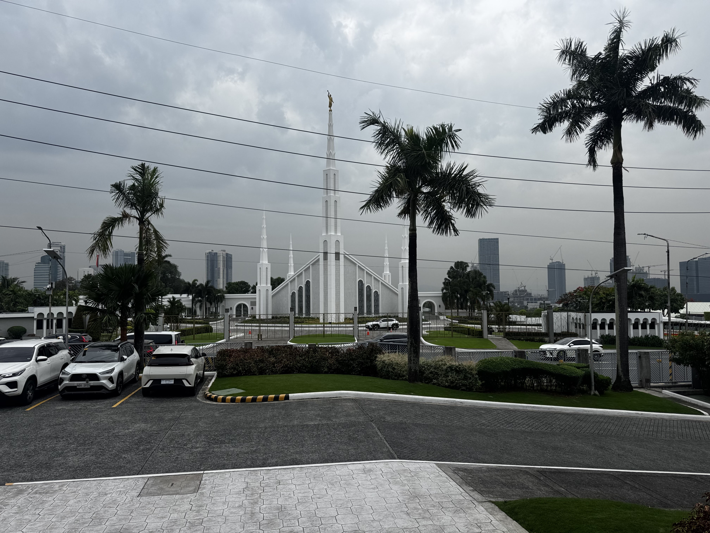
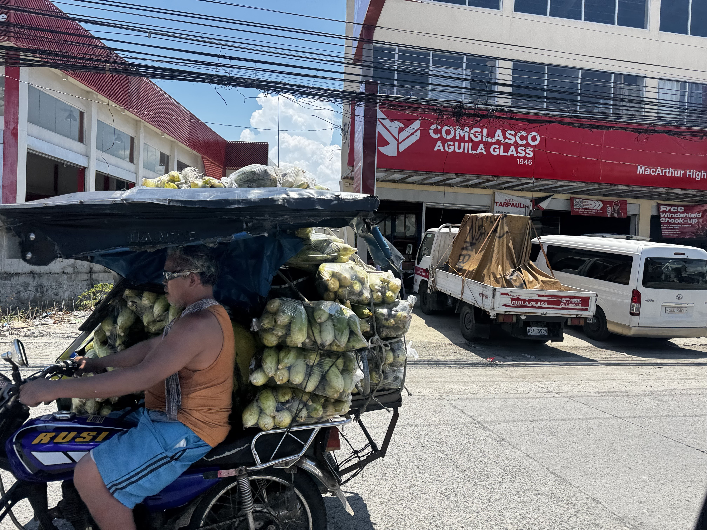
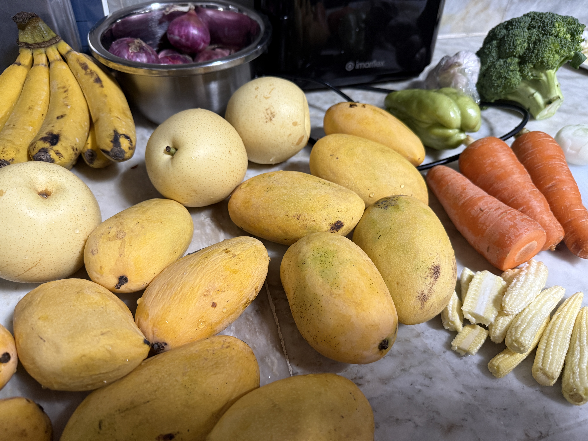
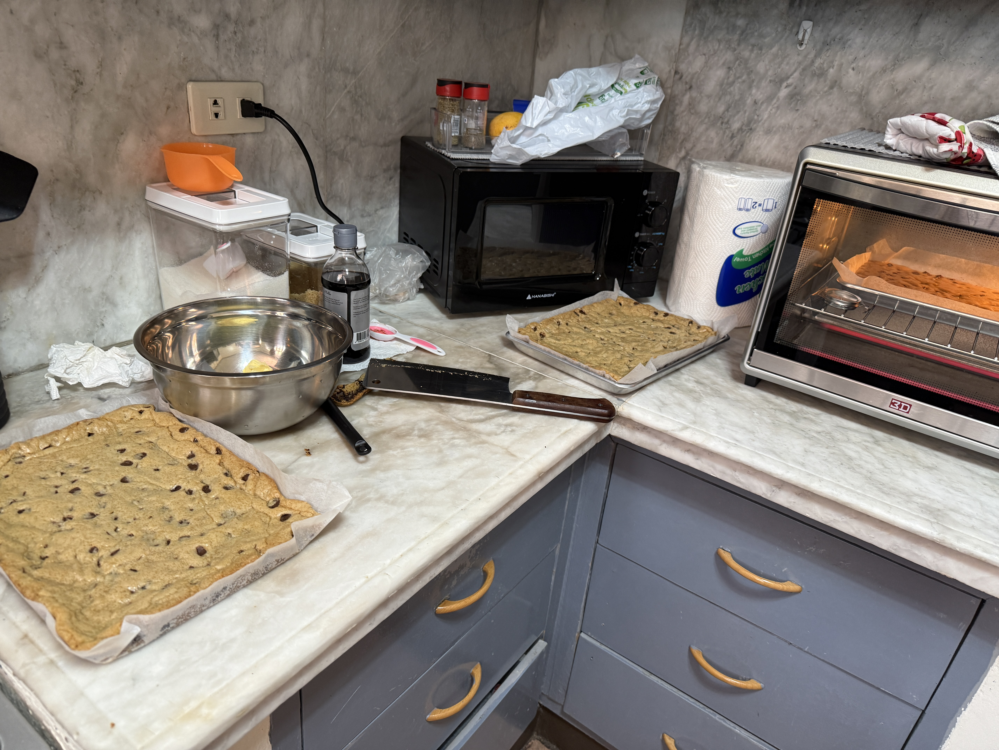

It’s hot here! So hot. But we rarely spend any time outside. We still sweat like crazy when we’re inside because most places don’t have AC. Our church building doesn’t have AC either. During sacrament meeting, all of the ceiling fans are turned on high and the windows are open. There are about 20 fans up there, but you still sit and sweat — gotta love it. And while we sweat, we sit in stupor because we can’t understand a blessed thing since it’s all in Tagalog. Even the sacrament prayers. Luckily, we know where to find them and can follow along.

Last Monday we left our house before noon and headed to Dagupan. We met with some other missionaries for lunch. One of the vendors the mission uses took us out to eat because we are helping coordinate missionary housing. The mission purchases refrigerators, washing machines, dressers, beds, and other supplies from this business.

We were late because we thought the restaurant was near Dagupan, but it was actually farther away in San Fabian. Of course, after already being in the car for over an hour, we had to stop at a 7-Eleven and get a Coke Zero. A 2-liter bottle costs about $1.50 here.

Filipino food is... OK. Not a lot of flavor really. And the cuts of meat are sometimes suspect. Bones show up where you least expect them.

After lunch we met with a family-owned transport business that helps move missionary apartments. When apartments close, they transport beds, dressers, refrigerators, air conditioners, and everything else. The business also manufactures water pressure tanks and services a huge portion of the Philippines.

We took a different road home and wound through tiny towns and villages. America is so different than other countries. We are so spoiled and have so much. These people live very different lives than we have lived.

We stopped in one village and bought mangos from a roadside vendor. About $3 bought us five huge, perfect, super sweet mangos. The mangos here are unreal. They may become my new favorite fruit, though I know I’ll never get one this good back in Richland.

The difference is that they pick them ripe and ready to eat. In the States, mangos are picked early and shipped long distances. They don’t even come close to tasting like these.

# Baking in Our "Oven"

Wednesday I made 80 cookies to take to zone conference on Thursday. Doesn’t sound like too big of a deal, right? Well — it’s a big deal here.

In the Philippines, you don’t really get baked goods like homemade cookies or brownies. Good flour is difficult to find, and even if you do find it, the biggest bag available is only 2 kilos. We’re used to Costco-sized bags back home.

Then there’s the egg situation. Eggs are sold at roadside stands and aren’t cleaned like they are in the United States, so you wash them before cracking them into your bowl.

And then there’s the oven.

My oven only holds a quarter-sheet pan. The cookie sheets most of us use at home are half-sheet pans, so this oven is tiny by comparison. Making 80 cookies took about four hours. Totally worth it though because the missionaries LOVE homemade cookies.

We also ran out of chocolate chips and had to drive to a baking supply store in the mall. The store opened later than we expected, and dozens of people were already lined up outside before the mall opened.

The produce here is so different.

The onions are tiny — tiny tiny tiny — but incredibly flavorful. The red onions are my favorite. Potatoes are about the same size.

Watermelons are the size of cantaloupes back home. Oranges are terrible here, so we stopped buying them. Bananas are everywhere, and they’re much smaller and sweeter than bananas in the States. The pineapple is amazing too.

And then there are the mangos. There are no words. To say they are delicious or out of this world doesn’t really do them justice. There is simply no mango in the United States like a mango picked fresh from a tree in the Philippines.

# Piano Lessons & Apartments

One evening we drove an hour to Tayug to help with piano lessons. There were many students there, each with their own keyboard, all working hard to learn.

The chapel had no AC, just open windows and ceiling fans pushing around hot air. Smoke drifted in from nearby fields being burned, making the air smell like fire and stinging our eyes. Yet no one complained because it’s simply part of daily life here.

Zone conference on Thursday brought together about 70 missionaries. The mission leaders have intentionally created a wonderful mission culture. It was inspiring to watch the missionaries learn and grow.

These missionaries are solid. The Church is in good hands if this is what the rising generation looks like.

We are trying to get a handle on where everyone is living, what condition the apartments are in, and what needs to be fixed, replaced, or improved.

We recently signed our first lease for a sisters’ apartment. Before signing, we asked the landlord to make several upgrades like repairing faucets, improving water pressure, and fixing the shower.

Now we need to furnish the apartment with beds, appliances, dishes, air conditioners, and everything else before the missionaries move in.

There is a lot of behind-the-scenes work involved in missionary housing — contracts, repairs, logistics, inventory, and constant communication. Our goal is to make missionary apartments as comfortable and efficient as possible so the missionaries can focus on teaching and studying.

# Soaked

Then it rained. And rained. Thunder, lightning, and streets filling with water.

One evening our street turned into a slow-moving river. While watching the storm from our balcony, we saw missionaries walking down the flooded street under umbrellas and in rain boots, heading out to work despite the weather.

It was such a beautiful sight.

Their devotion is inspiring. This truly is a great cause to be part of. We feel blessed to serve here in the Philippines and witness the faith and dedication of these missionaries every day.

Part of our work involves contacting every missionary apartment in the mission, scheduling visits, checking inventories, and coordinating repairs.

Most communication happens through Facebook Messenger, which has been quite the learning experience. Coordinating maps, apartment assignments, and missionary transfers can get complicated quickly.

It’s amazing how much technology has changed — and how much there still is to learn.

Life in the Philippines is hot, humid, chaotic, exhausting, beautiful, and inspiring all at the same time.

Every day brings something unexpected. We are grateful for the opportunity to serve here and to witness the faith, resilience, and goodness of the people around us.

Elder and Sister Ostler in the Philippines