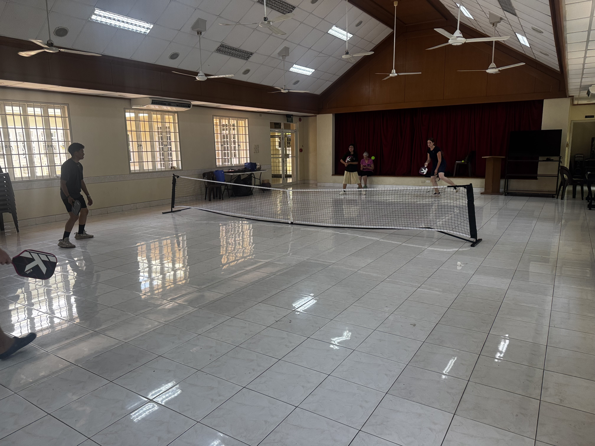
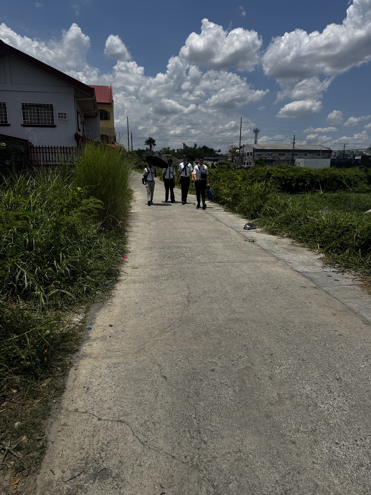
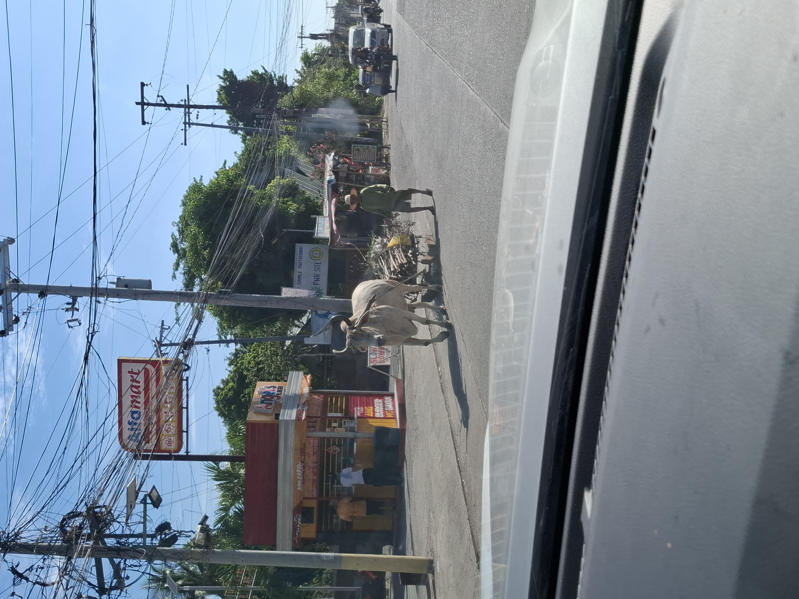
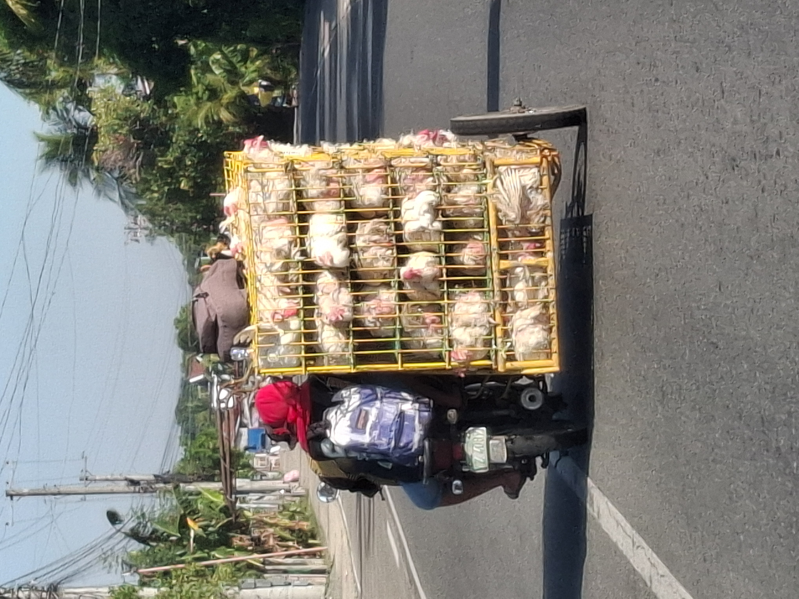
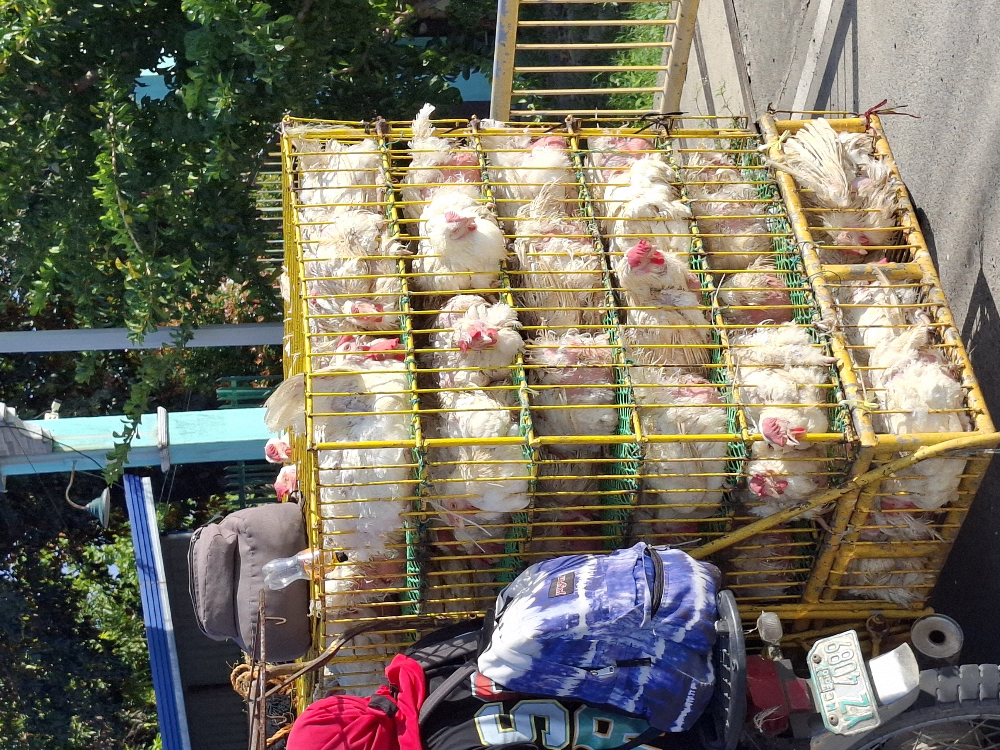
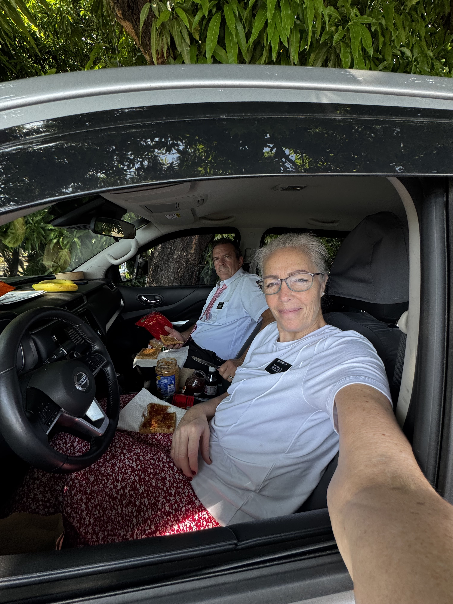
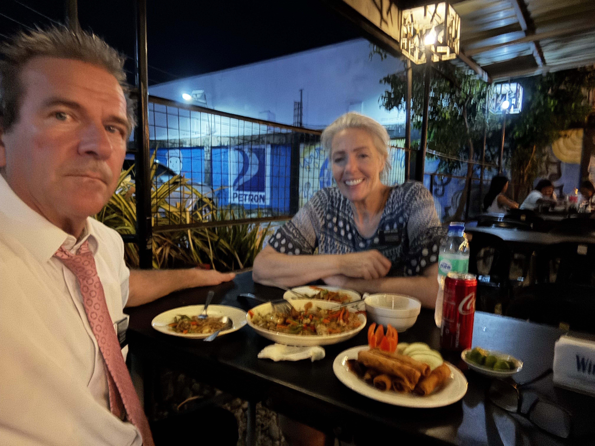
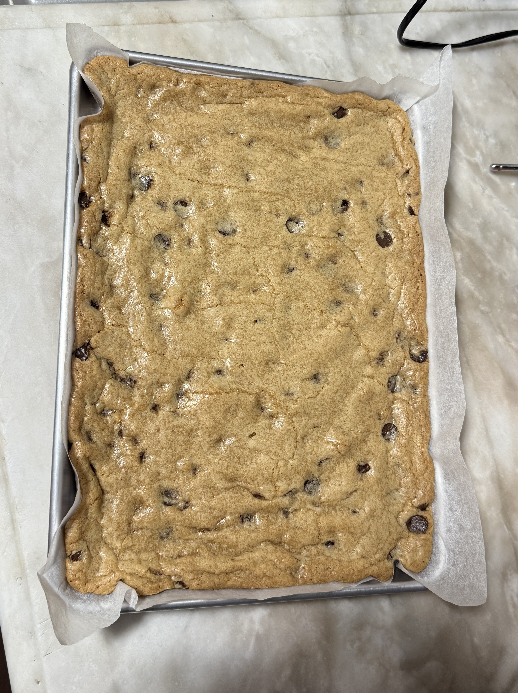

Hey Fam - here's the deal. When y'all were on your mission, your parents sent you an email letting you know what was happening at home. On Pday - you read that email. You looked forward to that email. And after you read that email you sent an email back to the parents.

I'd like to point out that we have received ONE email from ONE of our children. And I am calling y'all to repentance. We would love to hear from all of you, we'd love to know that you're going to bless your baby or that you went swimming at the pool or that you're on a vacation or that your kid did something hilarious - do you all get the picture???? I know you're all busy, but we really would love a paragraph, sent to delene.ostler@missionary.org & merlin.ostler@missionary.org at least once a month, but preferably once a week!!!! You'll need to send by Sunday night before you go to bed because that way we'll get it before our Pday ends.

## P-Day Pickleball and a Manila Visa Trip

We did our P-Day last week with the district. It was pickleball at the Calasiao stake center. It is about 45 minutes away. Granny made peanut butter kiss cookies without the kiss. The Filipinos are not that good at pickleball. Well, one Elder is but the rest really aren't. But it was fun and since it was inside we didn't sweat too much. We brought pop for everyone but they really went for the Gatorade.

Later that day we stopped in at a wholesale store and it was loaded. Just aisles and aisles of goods, pots, pans, notebook paper, large plastic bags (like 55 gallons size) of 100s of Crocs, flip flops, just everything piled so high and deep. And of course no AC. So blazing hot and stifling in there.

Then Tuesday morning we got up bright and early to get to the mission office to catch a shuttle to Manila to get fingerprinted and scanned for our visas. Most missionaries do this the day they arrive in country but since we bought our own tickets here and arrived on Sunday we missed this step. So the mission shipped us back to Manila which is about a 3 hour one-way trip.

It was really cool going to the Manila MTC and seeing the Manila Temple just across the road. We saw some missionaries that we remembered from the Provo MTC as they were there getting fingerprinted. Then we got right back in the car and were driven back to Urdaneta.

## Apartment Inspections and Missionary Life

Then on Wednesday the fun began. We started our housing evaluations and inspections.

Here's how it works. We only want to be at the apartments between 12–1:30 PM. This is the missionaries' lunch and power nap time. They don't arrive until 12 and after 1:30 they spend time in comp study and language study. So we want to be out of there by 1:30.

We planned out a route to minimize our drive time between places and allow us to see the most apartments in that time. We planned to spend only 15 minutes at each place and drive 15–20 minutes to the next place.

The challenge is that addresses don't work here and we are only going off of Google Map pins. So we can get pretty close then we text the Elders/Sisters and tell them we are on their street but don't know exactly which house/apartment they are in. Sometimes we have to go down a narrow alley or into another house to get to their place. So they come out and wave.

If they need a water filter replaced we try to get that done during this visit. Usually Grandpa does that while Granny is checking to see if everything else is in working order and the place is fairly clean and put together.

During our week of checking we found things that were not working or never worked. One set of sisters didn't have a shower head. It is common for people here to take a bath/shower with a scoop and a bucket. They fill the bucket with water and pour it on themselves.

So when we told one set of sisters that we would get their shower working, one of the American sisters said incredulously, “Is that possible? You mean we can have a shower?”

Another set of Elders had two bathrooms but only one working toilet. We found leaking pipes under sinks, drains backing up, broken cabinet fronts, only one fry pan for four Elders, one apartment key shared between four missionaries, and sisters lighting their cooktop with a candle because they didn't have a lighter.

Some of these things seem minor, but why not fix them and make life a little easier for the missionaries?

The best part of inspections is being with the missionaries. Such a great spirit in their apartments. Such faith and devotion to work so hard in hot sweaty conditions.

A few times this week, the Elders came walking down the road toward us when we arrived a little early. That sight just warms my heart. It makes me think of all 7 of our kids when they served missions.

## Pigs & Chickens

One day we saw 2 pigs in a side-car. These side-cars are attached to small 50cc motorcycles. They call them trikes. Well, 2 big pigs, a driver, a guy on top of the side-car and a passenger behind the driver.

The pig trike was coming toward us and as we passed each other Granny said to Grandpa, “We have to get a picture of that.” So we did a U-turn, stopped traffic in both directions, and chased them down.

It was a sight to see.

Sometimes we see these side-cars loaded impossibly high with produce, lumber, baskets, rebar sticking out 10 feet in the front and 10 feet in the back, chickens in cages, or a family of six.

After inspections it's usually about 1:45 PM and we are starving. So we grab our cooler and make PB&Js. Yup, we pull into a shady spot somewhere on an impossibly narrow road and make sandwiches. Usually after stopping at 7-Eleven for a Coke Zero.

One day we found American type bananas that were so good.

On Saturday after inspections we spent until 9:30 PM delivering replacement items to apartments. One stop required us to assemble a Filipino fan on the side of the road at dusk while sweating profusely and trying to decipher the strange design.

It took over 30 minutes for something that should have taken 2 minutes. But eventually we got it working.

We're only doing this for the first two transfers. We just want to make sure every apartment in the mission is functional and the missionaries have what they need.

We'd much rather the missionaries spend their time finding and teaching instead of dealing with broken toilets, washing machines that won't drain, or trying to figure out how to dry clothes without hangers.

## Loving the Philippines and the Missionaries

We did find by chance a good restaurant one night after Google Maps took us to a place that no longer existed. Next door was an outdoor restaurant with only one other group eating there, so we took a chance.

It was very good. Pancit and fried egg roll type things. During the meal we had to shoo away stray cats from around our feet and a couple of begging girls stood nearby for quite a while. Hard to ignore. But the food was great and we will definitely go back.

We also finally decided on a place to live near our assigned ward. It's smaller than most senior couples would probably want, but we are totally fine with it. The big plus is that the landlord is a member of the Church in our ward.

It's really been tiring some days and we've not stopped moving all week. We are exhausted at the end of the day. And yet we absolutely love it. We don't wake up wishing we didn't have to “go to work.” We look forward to each day and serving the missionaries and the members in the Philippines Urdaneta Mission.

OH — and did we mention cookie bars?

Every time we show up at an apartment we bring each missionary a gigantic cookie bar. Sometimes the process of cutting and packaging them on the side of the road is absolutely comical. The missionaries don't care what they look like. They just love the cookie bars.

We love our ward. Before we left Washington, everyone told us, “You will love the people.” And they were right. Everyone is kind and welcoming. Before church, after church, between meetings — everyone comes and shakes your hand and welcomes you.

President and Sister Foster ROCK. They called us one night just to check in. We have close to 200 missionaries in this mission and somehow they still take the time to care personally for everyone.

This mission experience so far is nothing like we imagined. In our wildest dreams we didn't think we'd be doing any of this stuff on a mission. Luckily, crazy drivers, crazy traffic, hot weather, PB&Js on the side of the road, and packed schedules don't bother us at all.

We vacation like this.

So maybe all those warm water vacations over the years were actually preparing us to serve the Lord Jesus Christ. Who knew?

We love all of you so much. We miss you Lilly, Joseph, Leo, Indy, Madalyn, Hayes, Molly, Lucy, Peter, Levi, Myla, Lydia, Brynn, Beckham, Paxton & Elsie.

We want you all to know that it's important to go to church every week. And it's important to read your scriptures with your mom and dad every day. Remember to pray to your Heavenly Father and thank Him for what He has given you.

We miss you all and we know that you miss us too. It might seem like a long time that we're gone, but Heavenly Father needs us here in the Philippines right now and we know that you'll be okay without us living at TheBigHouse right now.

Remember to draw us a picture or write us a letter.

Welp — we've yacked and yacked and yacked.

Feel free to email us at delene.ostler@missionary.org or merlin.ostler@missionary.org. We'd love to know what's happening back home.

Until Next Week —

Elder & Sister Ostler  
Scott & Delene  
Mom & Dad  
Granny & Grandpa
