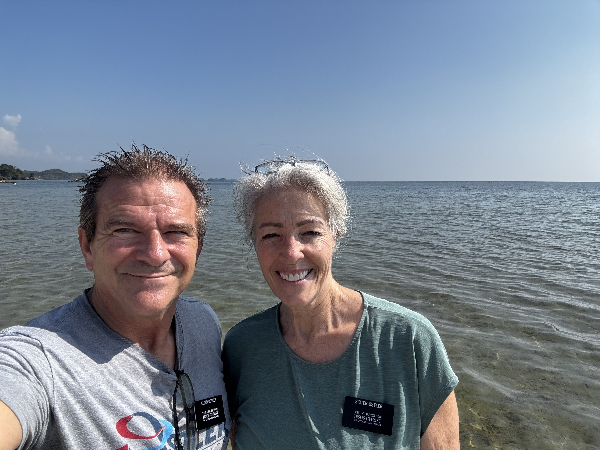
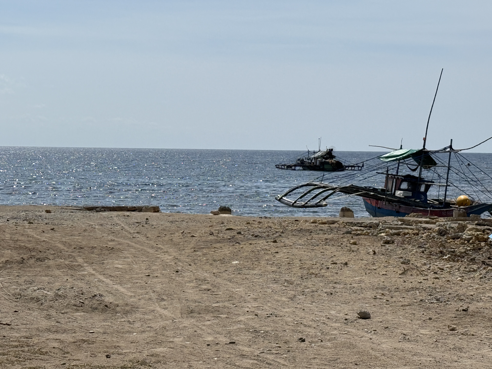
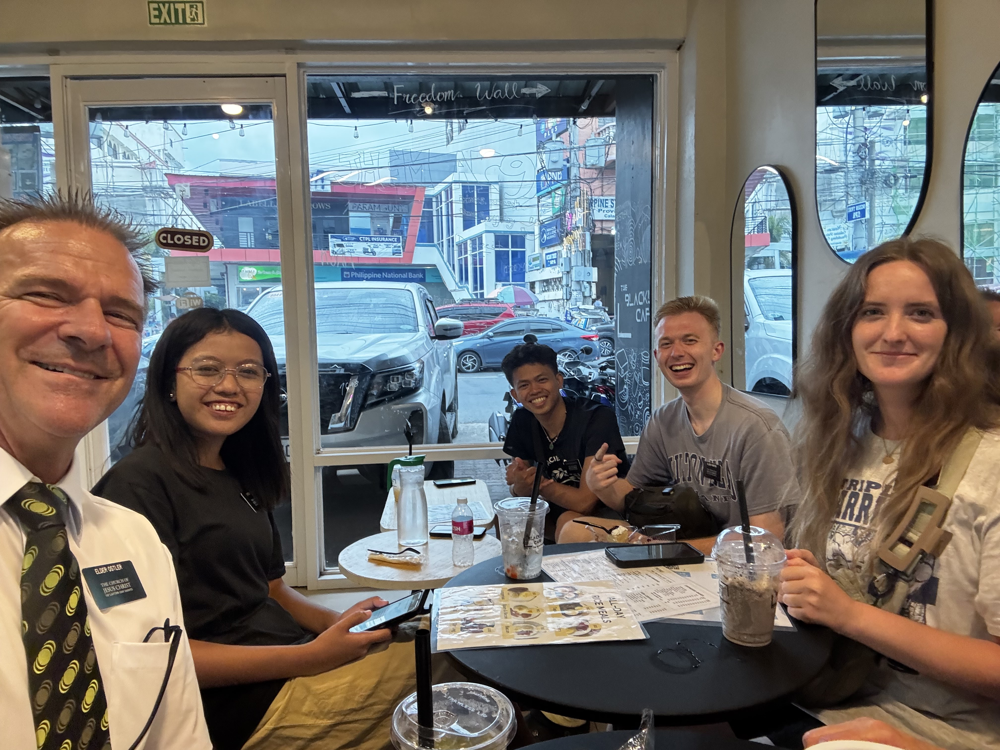
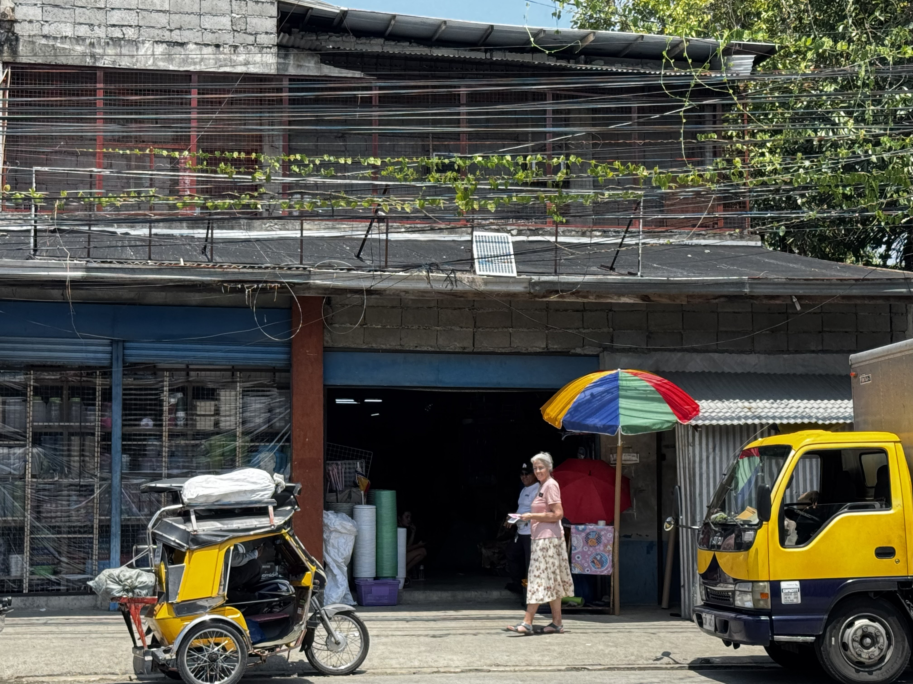
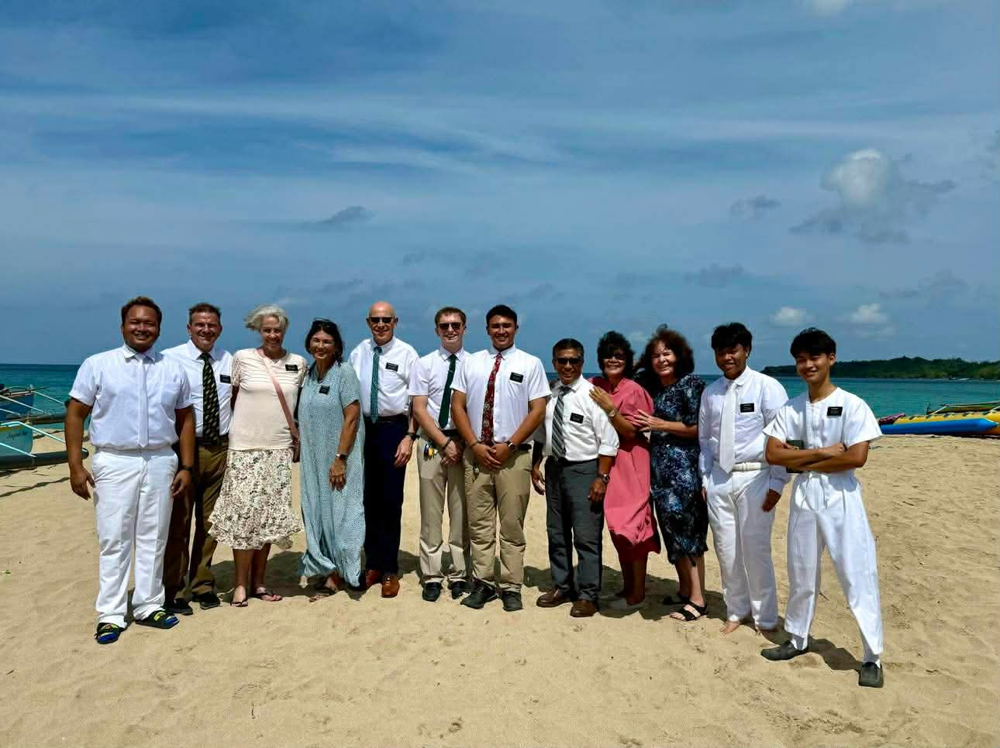
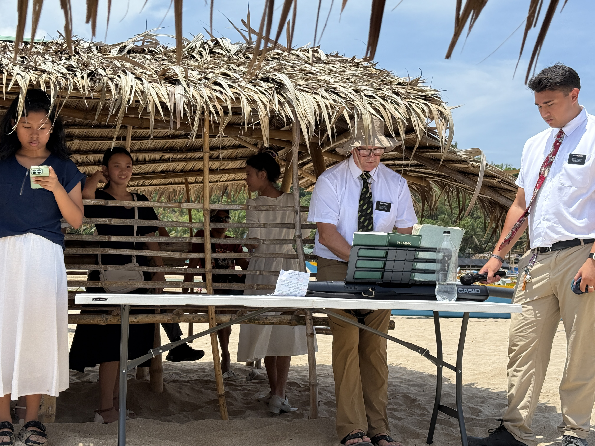
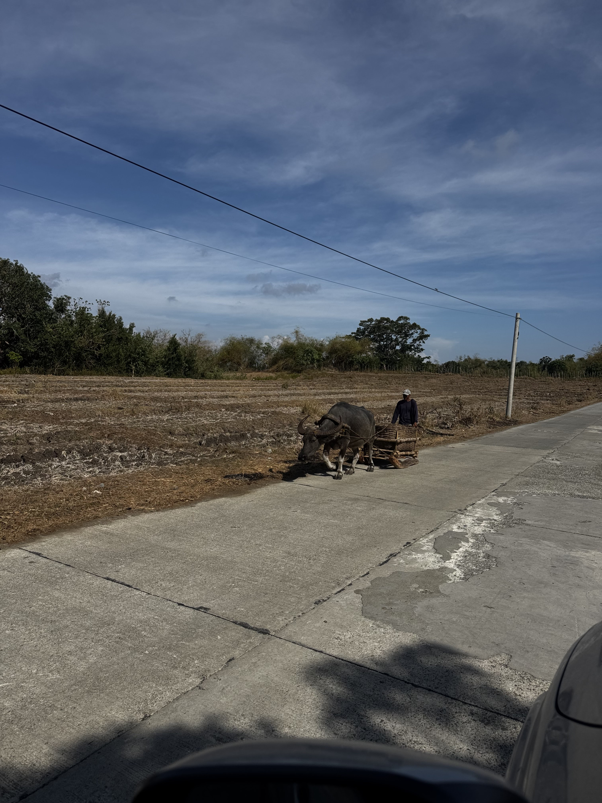
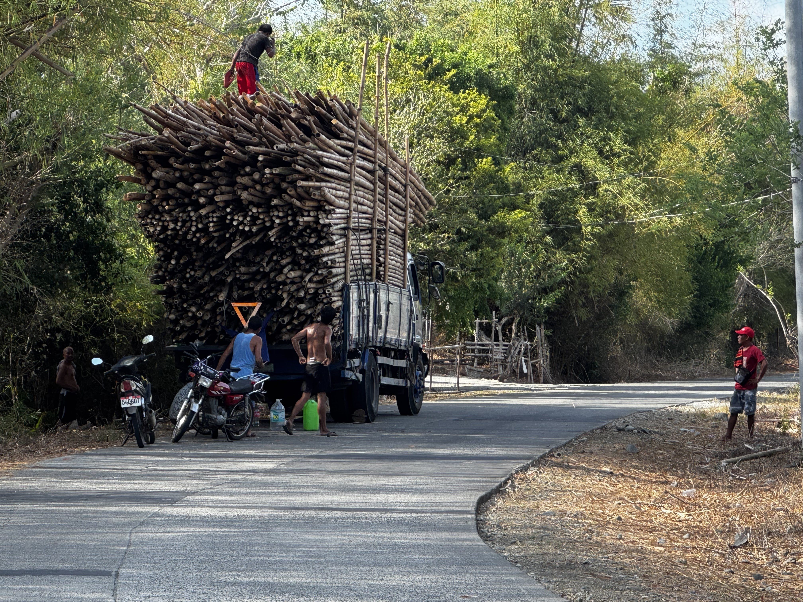
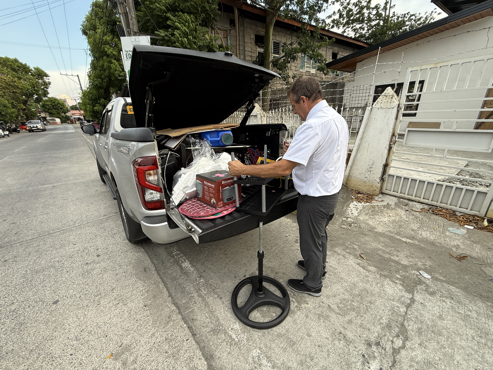

It has been a week like no other.

## Alaminos City

Tuesday we drove to Alaminos City and met President and Sister Dela Cruz. President Dela Cruz is a counselor in the mission presidency. Alaminos is about 82 kilometers away, but it takes about 2 hours to get there. Since we were headed toward the coast, we gave ourselves some extra time to go to the ocean.

The drive was great. We reached the ocean just outside Alaminos City and parked our truck in the sand near a fishing outrigger boat. We walked down the beach, picked up a couple of tiny shells, and then headed into the city to meet President and Sister Dela Cruz.

We met at a Shell gas station that had a little deli and cafe inside. We sat down and immediately started talking about everything. They are fascinating people. She was born near Agno, and he came from the area around Alaminos City. They met in Saudi Arabia, and during their MLS mission they were called into the mission presidency.

The only reason there is a Church building in the Agno area is because of them. Their story is amazing.

## A Conversation at Lunch

There were some people at the table next to us who saw our name tags and asked if we were members of the Church. That started a great conversation. We found out that the man was actually a member who had not been to church since he was a young boy.

Scott and President Dela Cruz talked with him for quite a while, bore testimony of the gospel, and invited him to return to church. It was an awesome experience. It was Scott's first time doing that kind of missionary work since arriving here, and President Dela Cruz was a wonderful companion in the conversation. He was bold and gentle at the same time.

On our way back we stopped to do apartment inspections for some of the Calasiao Zone apartments, and then we headed back to Urdaneta.

## On the Road

Wednesday, Thursday, and Friday we spent our days doing inspections, finding and purchasing items the missionaries needed, sweating profusely, eating PB&Js on the side of the road, stopping to buy mangos so we never run out, and enjoying the amazing beauty of this place.

A couple of nights we did not get home until after 9 PM. We even stopped at an elder's apartment at 10 PM to do a quick dental exam.

We put 2,600 kilometers on our truck in one month and averaged 26 kilometers per hour. We love the work, we do not mind the extreme heat, we wish we were better cooks, and we are very concerned about what we will do when mango season ends.

## Ocean Baptism

Saturday there was a baptism in Agno, which is about 3 hours away. Six people were baptized in the ocean, and we were there. That was a once-in-a-lifetime experience.

Scott took his portable piano and played for the baptism. It was so cool seeing those people baptized. After the baptism, each person bore testimony. The youngest girl, maybe 9 or 10 years old, gave a powerful testimony. I could not understand a word she said, but she spoke with so much fire and conviction. It was something I will never forget.

The baptism happened right on a public beach, with beachgoers nearby, banana boats being pulled through the water, and the sounds of the beach all around us. The youngest girl had a bit of a time getting baptized in the surf. The first spot had waves that were knocking her around, so everyone moved about 20 yards down the beach where it was a little gentler.

Even then, waves would come in and rise up to her chest. It took multiple tries for some of the people being baptized to be fully immersed. There were six people being baptized and six different baptizers. Our mission president and his wife were there, along with many others.

The Church there is currently a group. The Dela Cruzes have been very influential in helping it grow. They donated the building the Church is using, and they are working toward the group becoming a branch. The gospel is being accepted in a powerful way there.

## Piano on the Beach

One cool thing: as Scott was playing the piano on the beach, he kept thinking about his grandmother, who taught piano. He wondered if she ever imagined that one of her piano students would someday serve a mission and play the piano for a baptism on a beach in the Philippines.

It was a tender thought. We sang about 10 songs while people were changing, including every verse of every song. Even after everyone was done changing, we kept singing the songs in the program.

## Coastal Roads

After the baptism we drove to see a few other beaches. The countryside and scenery were beautiful. We drove on very narrow roads where one car had to pull off for another to pass. Some stretches were bumpy, and some were dirt roads for a while.

We wound our way through fishing villages, farmland, and little coastal communities. For lunch, we pulled off to the side of the road and had our usual PB&J and Diet Coke. During lunch we saw a man walking down the road next to a sled being pulled by a carabao, which looks like a water buffalo.

## A House for Us

And finally, we decided on a house for ourselves.

After looking for a few weeks, we decided to live in the very first house we saw. After being in many missionary apartments, we figured we could make this house work. It is smaller than some senior couple housing, but it is in our assigned ward and owned by members, which feels like a blessing.

They already gave us the key even before the contract was signed, so this week and next we will plan our move. We are taking several things from our current apartment, including the bed, sofas, washer, toaster oven, and desks.

## Apartment Work

We are through the bulk of our apartment inspections now, and most of the major issues are being handled. Many apartments are mostly stocked, so that part of the work should slow down a little.

The mission is splitting, so initially our missionary numbers will go down. But as the numbers build back up, we will need to find more apartments and help get them ready.

Here is an example of the kind of thing we are working through. We found a place for sisters, inspected it, and discovered the upstairs had very low water pressure. The landlord had a pump installed, put in missing shower heads, and fixed the toilet.

When we checked it later, it seemed fine. Then this week, Scott went to the upstairs bathroom where the pump was installed and tried to open a stuck cabinet drawer. The whole cabinet shifted because it had been moved away from the wall during the pump installation and needed more support.

Scott sent a video to the landlord, and thankfully she was very responsive and sent repairmen to correct it. We are learning a lot about how housing repairs work here, and we are grateful for kind landlords and for a very handy mission repairman who helps solve the problems that need extra attention.

Even though we are not always preaching directly, we hope people see Jesus Christ in our demeanor and actions.

Elder and Sister Ostler
