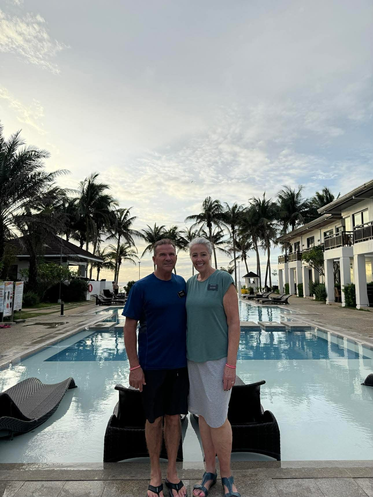
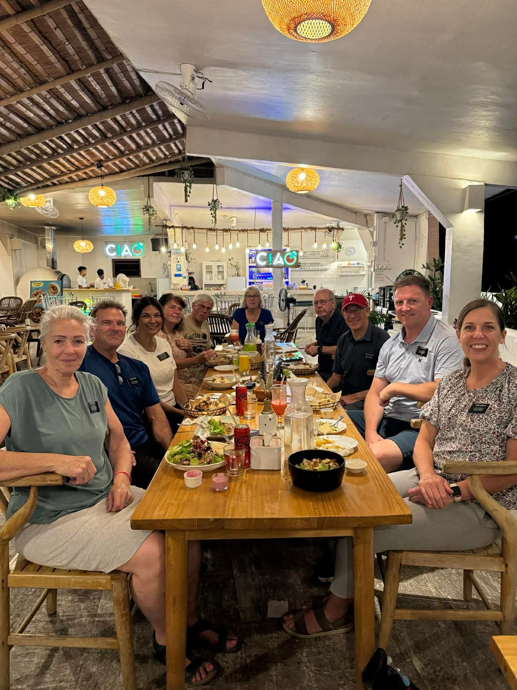
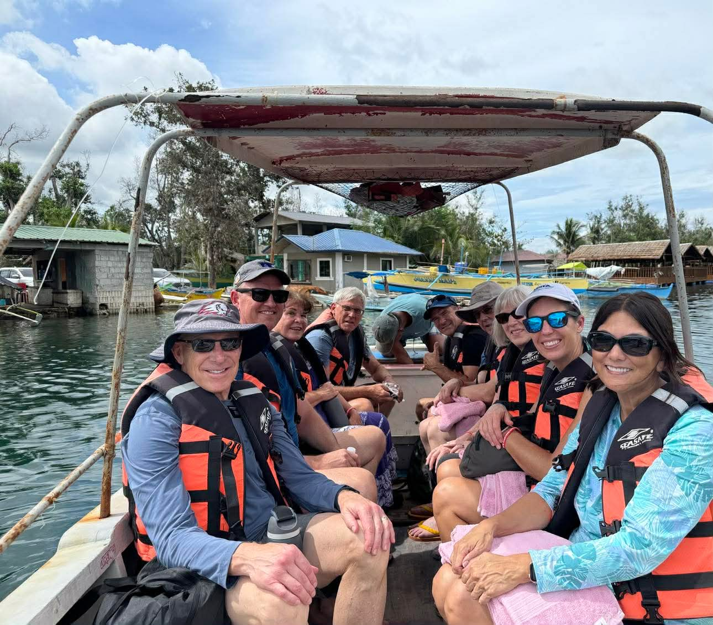
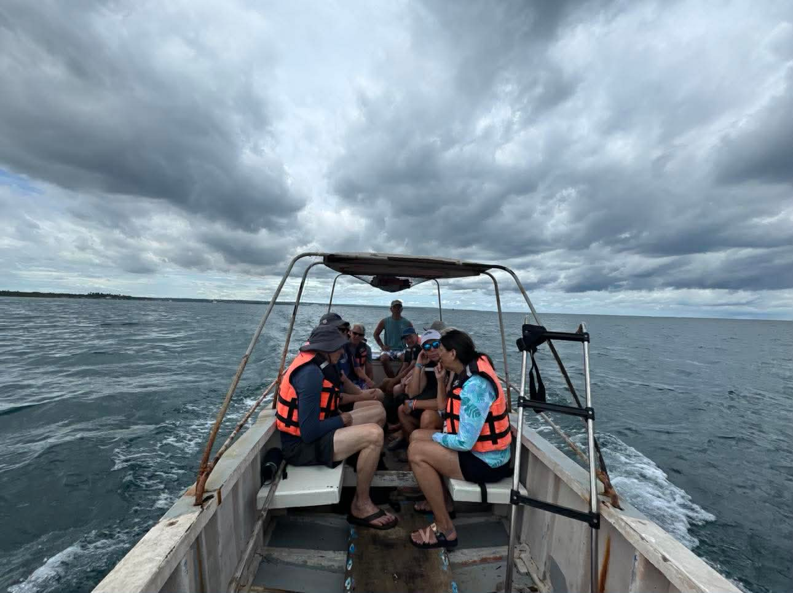
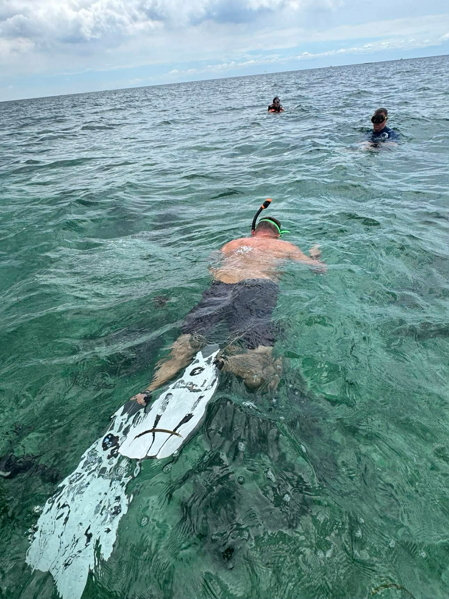
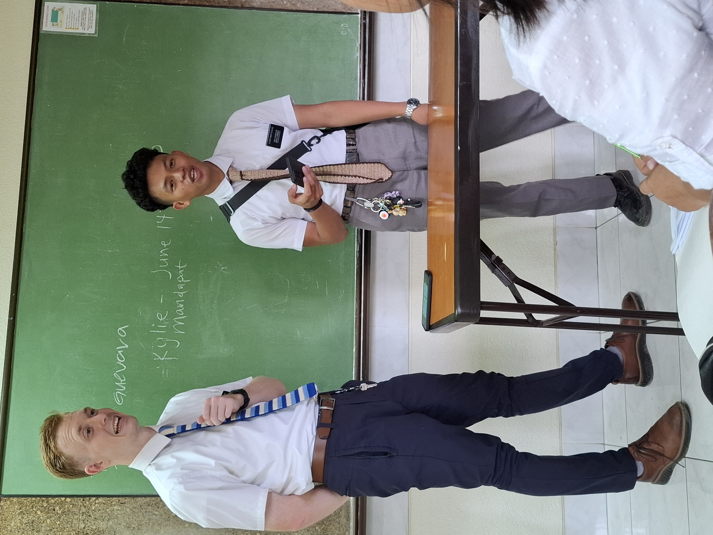

We have had a busy but also fun and relaxing week. The relaxing part was that we were able to go on a senior missionary couple retreat. The mission president invited all the senior couples to go to Bolinao for 2 nights. We stayed at a resort on the beach. The rooms were simple, but the location was great. It was on the beach of the South China Sea.

## Bolinao Retreat

Getting there was a bit of a thing.

The agenda for the retreat included a devotional and teaching meeting at the beginning. Each couple was given 15 minutes and a topic to teach on. President Foster sent a text saying it would begin at 7 PM, but the agenda had it starting at 4:30 PM on Tuesday.

It is a 3.5 hour drive there, so we thought we could leave around 1 PM and get there with time to spare. Tuesday morning we were doing the usual mission housing work, trying to help organize a move of apartment items to the new mission, inventorying those items, and planning to do a few other errands.

As we were exchanging dollars for pesos, Scott reread the message threads about the time frame for the meeting and realized that we were actually supposed to be teaching at 4:30. It was noon, and we still had the whole drive ahead of us. As soon as we had the pesos, we decided to alter our errand route.

We had planned to go to a store 60 minutes away to pick up items for an apartment, but now we did not have time for that. So we took off. Luckily, we had packed our cooler with food. Yup, the trusted PB&J. We also had chips, sweets, and lots of Coke Zero.

About 2.5 hours into the trip, we came to a backup, and it was pouring buckets of rain. The roads are all 2 lane, and there was construction plus an accident, so it took an extra hour to get through it.

We spent the time wisely. Since we had not prepared our 15 minute teaching lesson yet, we worked on it while stopped in the road. It was a good thing we did because as soon as we arrived and dropped our bags in our room, we all gathered to start the meeting.

Our topic was, "How can senior missionaries support junior missionaries in fulfilling their purpose?" It was a good discussion and a good reminder of why we are here.

## Dinner and Giant Clams

That night, we all went to dinner at a restaurant in town. Delene got pizza. It was not perfect, but it was pizza. Scott ate pancit. Usually it is really good, but this one was just okay.

The next day, most of the group went on a tiny boat to snorkel with the famous giant clams. Delene did not bring her motion sickness patch, so she decided not to go. It was disappointing, but in the end it was a good choice. The boat was tiny, narrow, rocking, and had a very loud motor.

We were in about 6 feet of water, and the clams were huge, some up to 3 feet across. After a long, slow boat ride, the crew handed out masks. There were no snorkels and no fins. Luckily, Scott had his own gear and jumped in with fins and a snorkel. He thoroughly enjoyed it.

## First Filipino Haircut

Scott also experienced his first Filipino haircut. The young barber took his time with the clippers on the sides and back, then barely touched the top. Scott asked him to do a little more, then finally gave up and paid 200 pesos, which is about $3.33.

Usually the difference between a good haircut and a bad haircut is about 2 weeks. This one might take a little longer.

## Transfer Week

Monday was the start of transfer week, and our first cycle was coming to a close. All of the missionaries who had finished their missions and were going home needed to be transported to the mission office. We picked up Elder Monticalvo, Sister Sasing, and Elder Reese. It was a great day.

We left the apartment and stopped at the new Urdaneta 3A sisters' apartment that we are setting up. We had to drop off the big propane tank so Bishop Oaing could get it hooked up. He came and installed the mini split air conditioner for the sisters, and he also hooked up the washing machine.

We planned to go back the next day to do a little cleaning and get everything set up and ready for their arrival on Wednesday morning.

## Baptisms and Apartment Work

On Saturday we went to a baptism at the Calasiao Stake Center. It was for Sister Rice and Sister Verano's investigators. Two of them were baptized. Delene made cookies Friday night to take to the baptism because there was a scheduled power outage for Saturday, and she knew she would not be able to bake.

The power outage started at 5 AM, and when we left the house at 2:30 PM to head to Calasiao, the power was still off.

Earlier that morning, we took President Foster's truck, loaded up the washing machine and refrigerator from Mannix 14, and hauled them to the new Urdaneta 3A sisters' apartment. When we took the truck back to the mission office, Sister Foster was there and wanted to go see another apartment we had just rented for a senior sister who will arrive in the mission in July.

Delene has been reading at least 20 pages in the Book of Mormon every day so she can finish by Wednesday. She will have read the whole thing during the first cycle. President Foster challenged all of the new missionaries to do that.

## Sunday in Santa Barbara

Yesterday was Sunday. After church we drove to our new house that we will be renting in Santa Barbara. We decided to bring our food and have lunch there rather than return to Mannix 20. There was a baptism in Santa Barbara at 4 PM, and we were going to attend, so it made sense to stay in Santa Barbara.

The person who was baptized was Sister Ruth. Ruth is her first name. She was taught by Elder Corpuz and Elder Tabon, who are in our district. The baptism was great. Once again, Delene made cookies, and everyone loved them.

After the baptism, the Sabaten family invited us for dinner. It was so good. We started eating at their outside table, and before we could take a bite, it started pouring rain. So we carried everything inside. They live right behind the house we will move into in Santa Barbara.

## A Roadside Miracle

As we were driving to their house, Scott suddenly pulled over to the side of the road. Delene was asking him what he was doing, and then she saw Elder Porter and Elder Monticalvo at a bus stop. It was surprising because it was not in their area and was not a place we expected to see them.

We asked if they wanted a ride, and they hopped into our truck and told us their story. Elder Monticalvo had an interview with President Foster, so they had gone to the mission office. They were in a jeepney on their way home when it stopped at that bus stop, and they had to get out because the jeepney did not go any farther.

So they waited for another jeepney. No jeepney came. A bus came by, and they tried to wave it down, but it would not stop. They tried to get a trike to pick them up, but no one stopped. After a while, they decided to say a prayer that they would be able to find a way home.

And 45 seconds later, we pulled up on the side of the road.

Miracle.

## Moving Week

We will be moving to Santa Barbara sometime this week. Tomorrow we have to get apartment 340 completely put together because transfers happen the next day, and 2 sisters will be arriving there to live.

On Wednesday night, we will have a bunch of extra missionaries staying at Mannix 29, and some might even stay at our place. It is all of the trainers. They arrive on Wednesday, spend the night near the mission home, and the next day, when all of the greenies arrive, they go to the mission office, meet the person they will be training, have lunch, and then head off to their apartment.

We are feeding all of the trainers who stay at Mannix breakfast on Thursday morning, so that will be fun.

There is never a dull moment here. This weekend and next week we will be looking for a bunch of new apartments, delivering items to the Asingan sisters, getting Mannix 35 and Mannix 14 cleaned, and moving to our place in Santa Barbara. Scott is starting his conducting class at the church Thursday night, so that will be fun too.

And the roads still surprise us.

## The Best Mission

The Philippines Urdaneta Mission is the best mission. President and Sister Foster love these missionaries and take great care of them. They are such an example of what it looks like to bring others unto Christ.

There is a pretty high bar in this mission, and the example set by President and Sister Foster is phenomenal. We both feel so blessed to be serving here.

Elder and Sister Ostler
