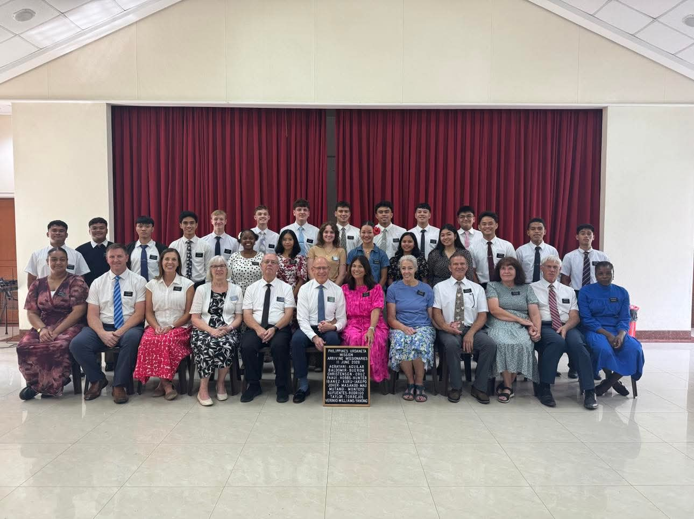
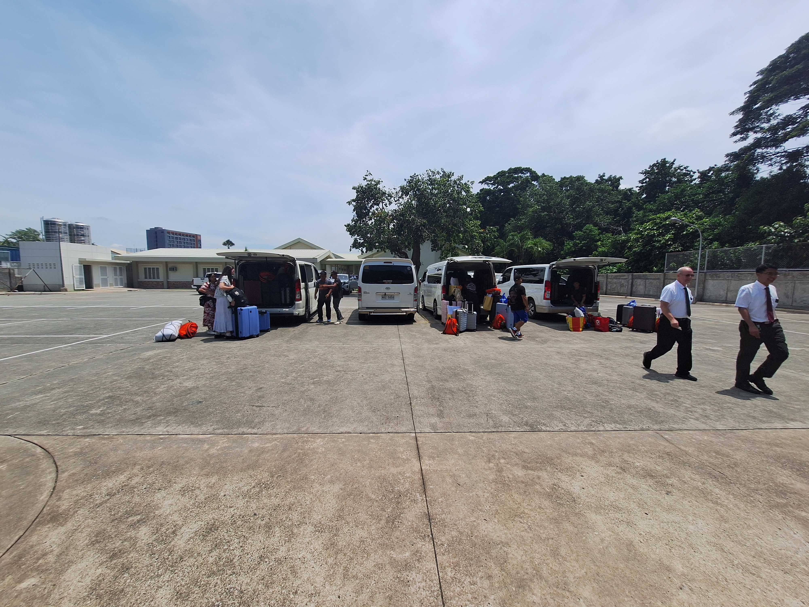
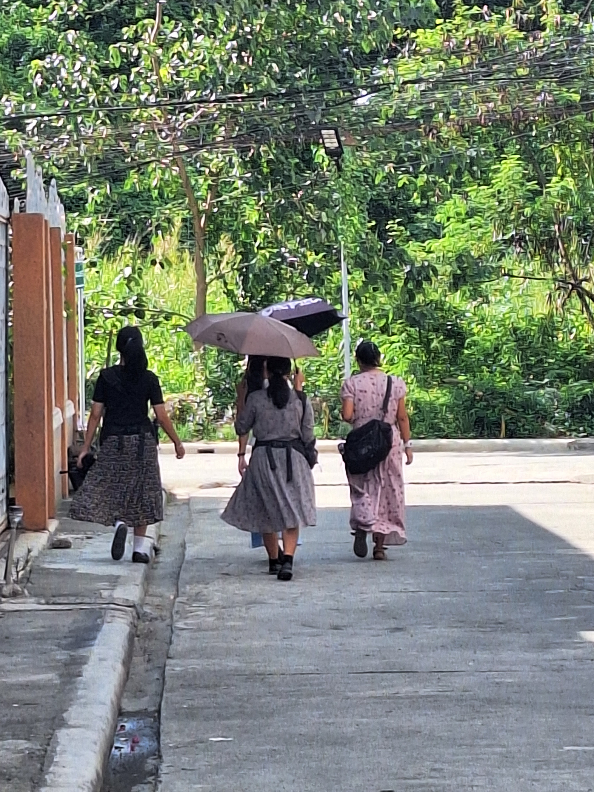
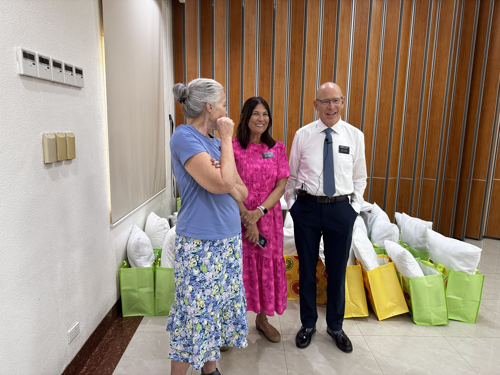
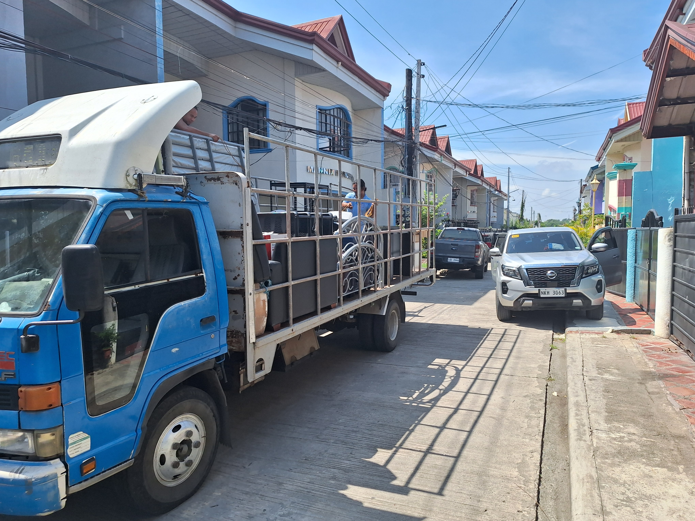
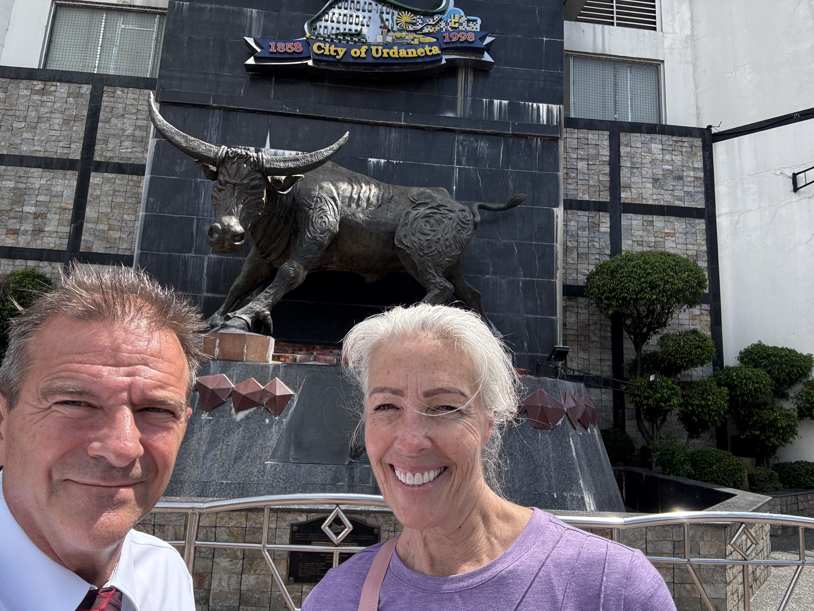
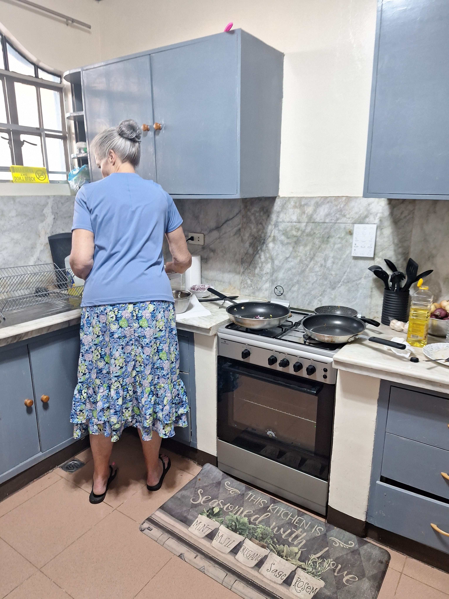
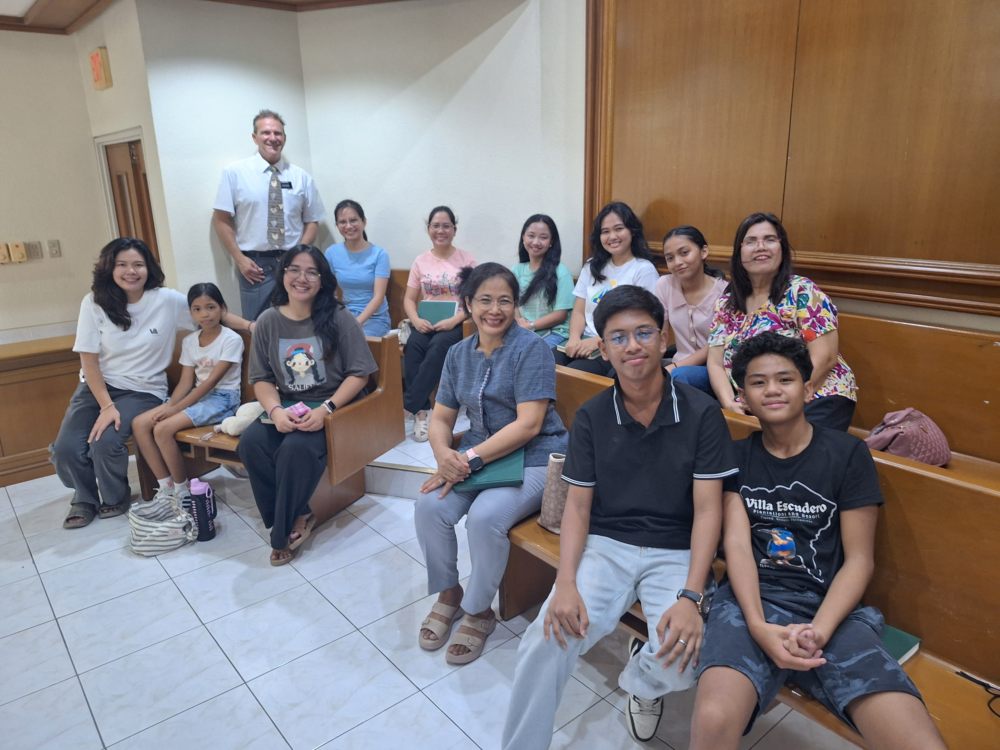

Hello Everyone:

Thanks for the videos, photos, emails. We love hearing from y'all.

Jackson - your chickens will definitely be laying scrambled eggs. And Leo - your dad is crazy, doesn't he know the difference between a bunny and a deer? Maybe get some pictures out and show him the difference. Benson & Bri - MOVING! Have fun with that. We loved your video. And we really can hardly believe that Beckham has grown that much. He and Brynn are darling.

We love our mission. We will say it again - We love our mission. We just finished our first transfer so we aren't newbies anymore! (except training usually takes 2 transfers so......you know......grandpa is still in training)

## Transfer Week

Transfer week was last week. The mission is splitting and everyone found out what mission they will be in on July 1 - Urdaneta or Lingayen. Twenty-four new missionaries showed up on Thursday - that was a fun day. The most funny thing heard that day......We got the privilege of taking a greenie from Montana and his trainer from the mission home down the street to their apartment. It was about 4 city blocks away - a very busy city road that is 2 lane with dirt shoulders and cars, trikes and motorcycles parking anywhere, traffic squeezing by going both ways, lots of honking, people walking, selling everything - just typical crazy. We park on the side heading into traffic but do it anyway - double park behind cars in a small driveway, hop out, open the tailgate, grab the greenie's luggage. And I hear spoken to no one in particular from the greenie, "This isn't Montana!!" "I'm in SouthEast Asia!!" Spoken with overwhelm, excitement, and exhaustion. Way too funny and poignant.

## Moving Day

On June 12 we moved. We started packing and getting ready at about 6:30AM. Maramba Transport showed up at 9AM and we were ready to go. They loaded the big stuff on their truck and we loaded our smaller things and the food into our truck and off we went. Maramba set up the queen bed frame when we got here so that was nice. And Mayca gave us MANGOS!!!! We seriously cannot get enough. They are soooo good.

As soon as our stuff was in the house we left and headed to Magic Mall to buy a microwave. We had other supplies to buy too, but the San Manuel Elders microwave wasn't working so well. After that we went apartment hunting. Sister Foster wants us to find a better place for Sister Warnock that will be arriving the first part of July. Scott and I parked the truck a couple of streets over from the mission office and we started walking. We talked to several people, left messages on some numbers that we saw on signs, and we actually found an apartment that was empty and was on a pretty quiet street. It took some doing to find the owner, and we actually didn't find the owner but we found her sister. She said she would contact her sister and get the key. We said we'd call her on Monday. We looked in the windows and it looked great so we were hopeful that it would work out.

## Finding 0316

Then we went hunting for apartments. Not new apartments, we were hunting for the illusive 0316 apartment. The Binalonan ZL Elders used to live there but moved out in February. No one knew much about the apartment. Someone thought it had been closed -meaning we gave 30 days notice and were no longer paying on it. All that we knew is that we did not have a key for it and we did not know where it was but we were still paying rent every month for it. Sooooooo - we finally get to the pin on the map - we pull into a pretty nice looking place - we ask the guy that seems to be a caretaker of the apartment building, he points for us to go upstairs to #1. We did. And there was a shoe rack outside of the apartment with all kinds of shoes on it so we knew it was not the apartment we were looking for.

We went back out to the street and walked a little farther. There was a tiny lane that we went down but it deadended. We finally called Elder Carlson because he knows all of the apartments. After some back and forth with him, we discovered that the lane was correct. At the end of the lane we turned left and went through a gate that led to 4 apartments that were kind of hidden. Elder Carlson told us that he thought someone had left a key in a boot on the top shelf by the front door. There were some missionary looking shoes on the shelf, but no boot on a top shelf. So we picked up all of the shoes and BANG - we found a key in one of them and it opened the door!

WE FOUND 0316 - what a miracle. And it was in pretty good condition. We've talked to Sister Foster about it and for several reasons, we'll be closing that apartment. So now we get to give a 30 day termination notice to the landlord, arrange for Maramba Transport to come and get everything and hopefully we can coordinate this well enough that we have a new place for the Binalonan Sisters that need an apartment and Maramba can just take the stuff to that location. And then we will probably pay someone to come and clean it before we hand it back to the landlord.

## More Apartment Work

We then headed to Pozorrubio to go to an apartment that was now vacant. Missionaries had moved out a couple of days before on transfer day and no one would be living there for this cycle. They had left some food in the fridge that was going to spoil, the bathroom looked terrible, and a few other things I won't go into! So we started to clean up the important things like rotting food. We'll go back next week and get it ready for the next missionaries that move into that apartment. And of course, garbage isn't just picked up normally here. Each community is different. So we didn't know what to do with the 3 big black garbage bags we collected of food and junk. so we loaded into the bed of the truck and took off.

It's now getting pretty late, it's dark and we head to San Manuel to deliver fans, microwave and a few other supplies that they needed. This apartment is really big, it's a whole house. The elders were out working when we arrived #SFATH (Sacred Finding And Teaching Hours) so we put together the 2 fans and left all of the things by their door as the key we had did not let us into their apartment. Sheeesh - that is a bit frustrating. But we'll get the key thing figured out. What mom didn't say was that we stood by the truck in the dark in front of their house and put together the 2 fans. Then we headed to Asingan sisters to deliver them their extra key. After that, we went back to our old house to get rid of the garbage - because we know what to do with it there and since the church is still renting 6 apartments in that complex of streets we felt we still could use their garbage barrels.

We were exhausted and we headed home. Our first night in our new apartment in Santa Barbara.

## Water Pumps

Earlier that evening we received a message from Dagupan 1 & 2 Elders that they have no water. We called the landlord and she said she'd have her caretaker go in the morning to fix it. Dang - no water and nothing we can do about it.

So Saturday morning the landlord informs us that their pump is out and we need to buy a new one. WHAT? We need to buy a new one? Isn't that a landlord expense? Welp - I guess in the Philippines if you live at a rental and something breaks, if you want it fixed, you buy it or fix it. So we headed to Dagupan to go to their apartment so we could see exactly what kind of pump we needed. We took a photo and then we headed to the Calasiao Elders apartment because they don't have water either. Long Story. But they haven't had water pressure for awhile. Sometimes they do, but most of the time they have very little water pressure. We met Brother Oaing there and he diagnosed the problem. The guy is a genius and can fix absolutely anything. And I mean anything. He fixes every plumbing issue you can think of. He tears out walls and puts them back together. He fixes drains that don't work. He removes mini split air conditioners and installs them in the next apartment. He welds cages for window air con units. He fixes washing machines, stoves, and refrigerators. He travels all over the mission on his trike (motorcycle with a sidecar) and repairs or installs anything we need. He told us he could fix the problem but it might take awhile. We were ecstatic and so were the elders.

We left to go and buy a pump and we ended up buying one at Ace Hardware in the SM Mall in Dagupan. Then we had to deliver it back to the apartment, tell the landlord so she could get her caretaker to go install it. She said he'd be there at 4PM so we asked the missionaries if they would be home at 4PM. Since one of the Elders is training a greenie, they had language study from 3 to 4 so they said they'd meet the guy. Thankfully it all went well and the Elders had water again!

## A Back Road

We went by Elder and Sister Carlson's house to drop off some paperwork and then we headed to Robinsons to do some grocery shopping. We took a back road. And oh my oh my, what a road it was. There was so much going on in every village that we went through. It was a glimpse into what life in the Philippines is like. They are such a calm, accepting, happy people. They are so trusting. They have an unspoken system/language that allows their travels to stay non violent! There are no road signs, no white lines in the roads, and you can do whatever you want -

*make a u turn and stop traffic in both directions - no one honks or gets angry - they just wait until you've turned around.

*at intersections there are no lights or stop signs, you just go, they take turns, no one honks or gets angry, they let people go in front of them without trying to cut them off

*roads are so narrow and there are kids walking right in the road or along side of it. They aren't even really watching out for cars, they just know that the traffic will not hit them. Cars and trikes and jeepneys move over so the people can continue what they're doing. There's people selling things in their little roadside stands, there's all kinds of vegetables and fruit and food for sael. Kids are playing with sticks or just walking along with their friends. Little kids, like small kids, are walking with other kids - no parents. People have fires built and they are burning the leaves or coconut husks or garbage right by the road. Goats are everywhere. People are out working in the rice fields. Trikes whiz in and out of traffic taking people where they want to go. Other trikes are loaded unbelievably high with everything from baskets to vegetables to chickens to rebar. Trikes carry EVERYTHING. I'm so glad we took that road - it was a drive I'll never forget. No one had a phone in their hand, no one was glued to an electronic device, they were all doing something or talking to someone. It was beautiful.

We went to the Robinsons store in Calasiao and bought some groceries and then headed home. We cleaned for a bit and got some of our things put away. Our second night in our home in Santa Barbara.

## Getting Settled

We also had to get some PVC pipe, glue and a spigot to jerry rig up our new washer to the connection the landlord left. Nothing here is standard or an easy fix. But I finally got the washer hooked up to the water supply, let the glue dry and we have a washer. We used it non-stop for a few hours to catch up. One thing......the outlet drain for most washers just goes right down the front walk into the street or onto the back porch or sometimes down the side of a building. Most washers are outside as well. Ours is right outside our front door and drains down our walk.

Today we did alot of running around in the mission - just helping out where we could. We had some deliveries and got to go to the mission office where we had a quick chat the AP's - they are such hard working awesome young men. They don't really get a Pday. We went to Urdaneta just in time for an absolute downpour. We had to go back to our old house at Mannix 20 to do a few things. And even though we had a fabulous umbrella (thanks for the tip Amy) we were soaked within seconds. We can't really describe the rain. It's more like a waterfall. And the thunder was spectacular. We're back at our house in Santa Barbara now. Elder Ostler made Japanese curry for dinner and it was scrumptious. We also had . . . . . . . you guessed it . . . . . . Mangos!

## Things You Will Not See In The States

Some things you WILL NOT see in the states.

1. Buying a microwave. They take anything electrical that you purchase out of the box and plug it in to make sure it works.
2. Electrical line nightmare. Which ones are live? No one knows.
3. Read the back of the bus!
4. Trikes for days
5. Girls on their way to school

And some others photos from our week

OK, a lot of adventure here for sure. We are tired a lot but keep going. It has been cooler here and we don't sweat a ton - either we are used to it or it really is getting cooler. Love you all.

Elder and Sister Ostler

Mom and Dad

Granny and Grandpa
