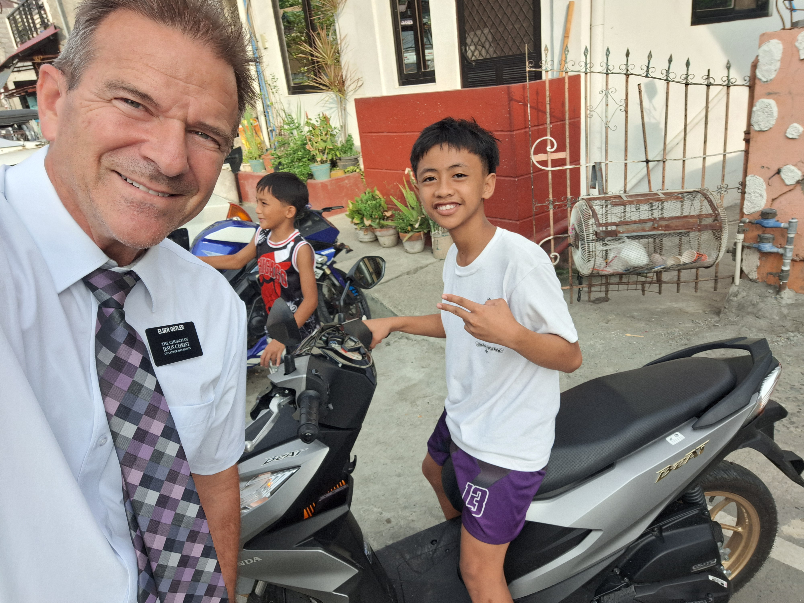
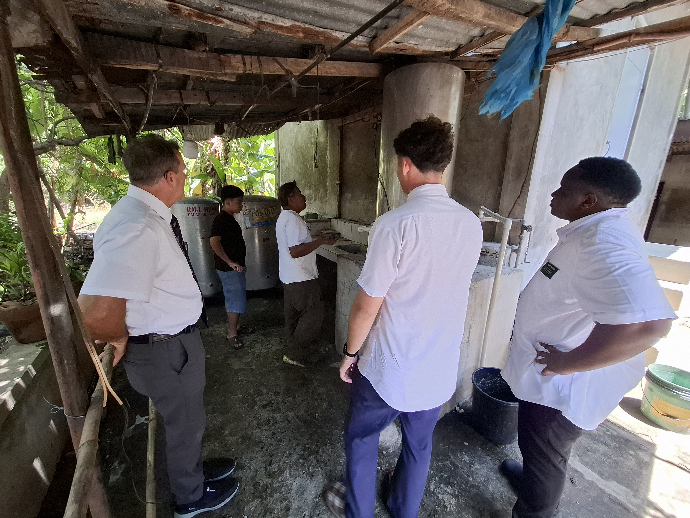
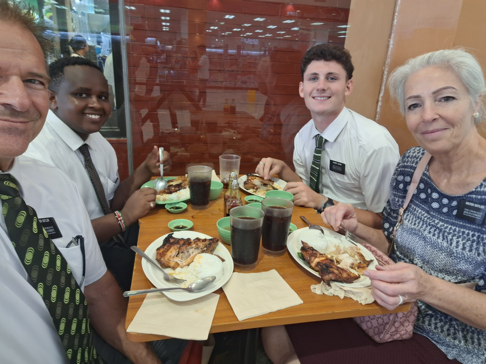
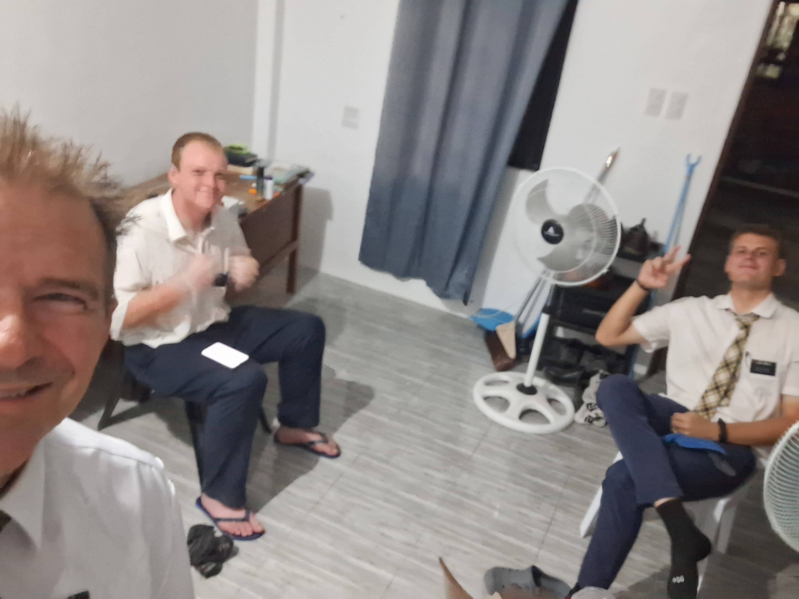
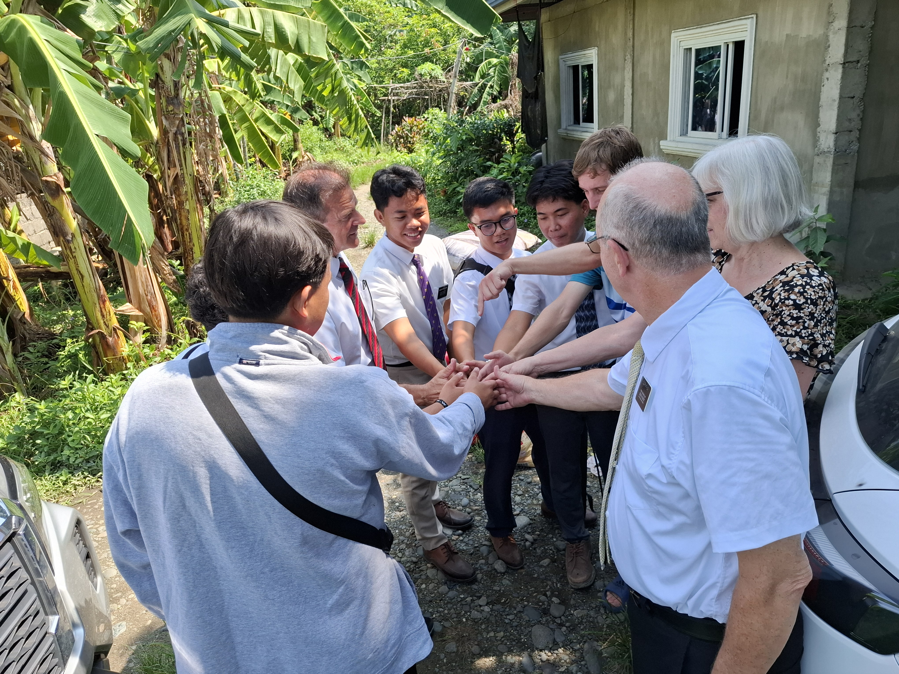
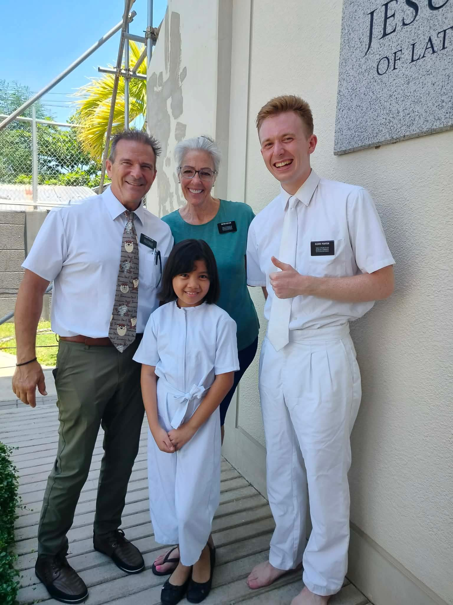

Hello Family:

Thank you Jackson for the video email. Leo and Indy - what did the chickens do when the sprinklers soaked them? Thank you Harrison and Jerika for the emails and photos. Peter, Levi, Myla and Lydia - keep playing in the mud and we hope you find lots more bugs and praying mantis!

Hummmmm, that's 2 of our children that wrote/talked to us this week. I have some thoughts about that - but I'll keep them to myself. You know we would love to hear about your week. Even if it's just a paragraph or a short video.

This week was . . . . . it was . . . . . . . lets see . . . . . . . . it was awesome, extremely busy, never a dull moment, a different adventure everyday, and of course we get to have all of this fun with each other because we never get transferred!!!

## Tuesday

Tuesday - We had to sleep in a bit after our crazy emergency transfer day we told you about last week. We were tuckered out....but not for too long. We were back on the streets and in the neighborhoods looking for an apartment for the Calasiao sisters. It is so cool. We drive slowly through the main street of a neighborhood and since the roads are barely big enough for 2 cars to fit down and trikes and motorcycles and people selling stuff are right there spilling into the street it's not a straight drive down the road - and we have a big mission truck and our white faces stick out. So when we go back up the street and stop, people are already well aware of our presence. We start asking anyone if they know of an apartment for rent and pretty soon we have a following and people are telling us to go here and there. And we always find a place that way. It took us our 3rd neighborhood of doing this until we finally found an apartment that we think will work. I even played a little basketball with a young kid. So much fun.

## Wednesday

And then Wednesday happened -- and WOW - what a day. I just don't really feel that I can put into words what our days are really like. A description of what we do doesn't really cover the whole magnitude of what we experience. But I'll try to get it across!

We left our cute little home in Santa Barbara this morning and headed to Dagupan to secure a new apartment for the Dagupan 7B Sisters. They do not currently live in their teaching area. We got about 7 minutes down the road and I realized I had left the cooler sitting inside our front door. Since it had our lunch in it (PBJ & junk food) we turned around and went to get it. The biggest problem with that is that we had to cross the 4 gnarly speed bumps in our neighborhood to get to our house, and then cross them again to leave again. I hate those things.

We arrived at the new apartment in Dagupan. They are still building the little 4 unit apartment building. But the one we wanted was almost finished - at least they said it was almost finished. The best part about it - it's new. So it's clean and nothing is broken. We walked through it, loved it, paid 5,000 PHP to hold it, gave the caretaker our contract and vendor form and left. It's such a strange thing here in the Philippines. We, the tenant, have the owner sign our contract. We set the terms. Imagine that in the states. I own property that I rent to people to live in. When the tenant wants to rent my property they bring their contract to me with their terms. That would NEVER fly in the USA. But here in the Philippines, that is the way it's done. And it's actually a pretty sweet deal for the owner because the mission pays 3 months of rent at a time. So who wouldn't want to rent their apartment to us???

We left that apartment and decided to head up to San Fabian and look for an apartment for the elders that are in a kabahay (4 Elders in 1 apartment). So what that means is that one companionship lives in their teaching area but the other companionship does not. And so they have to travel to their teaching area at least twice a day by jeepney or trike or walk. We drove all over their area but were not finding any apartments. We eventually saw what we thought was a small 3 apartment building so Scott got out of the truck to investigate. Here in Pangasinan, some people list their apartments for rent on various facebook pages but it is very difficult to find apartments to rent. They don't build 50 unit apartment buildings here. They are usually small buildings with 3 to 8 units. They don't have an apartment name posted on them, there are no addresses and so we literally go "hunting" for apartments.

Anyway, Scott got out to investigate, he walked around the building but saw nobody and so he was headed back to the truck when a bunch of people down the street, about 30 yards away started hollering at him "Apartment For Rent, Apartment For Rent, Apartment For Rent." He opened the door and told me to come with him. We walked down to the group of people, mostly older people and some kids. We asked if there was an apartment nearby for rent and a girl said YES and we walked over to the building and she took us in.

Here's the thing - we did not talk to these people or even notice them when we drove by them. So how in the world did they know we were looking for an apartment? Why did they start hollering "Apartment For Rent" rent when they saw Scott? It's little miracles like this that remind us everyday that we are not in charge. We are reminded that we just need to listen to the still small voice, walk and drive the streets that we feel prompted to go down, and He will take care of the rest because He knows where places are located that His missionaries can live.

This place was dirty. The girl told us that if we decided to rent it, they would have it cleaned, everything repaired that needed it and they would paint some of the walls for us. I hope it works out but I'm not sure it will. The gray water/sewer runs down the sides of the road and it's just beyond yuck. The missionaries don't care. It's the area they work in. They are used to this kind of condition. But I'm not, so we'll see how this one turns out.

We got the girl's contact information and then we headed to Pozorrubio 2 to clean the apartment. We went there last week because Elders don't live there for this transfer and we wanted to make sure they hadn't left any rotting food in there. The place was not clean - and we felt kind of responsible for that because we had inspected it about 4 weeks ago and we were new but we definitely should have caught some things. So we knew that it was on us for the condition of that apartment and we spent about 45 minutes scrubbing the bathroom and the floor and the kitchen. We plan on being much better inspectors after that experience!!!

Next stop was Binalonan. There used to be Binalonan 1 and Binalonan 2 sisters, but after all of the new missionaries arrived last week, there is now Binalonan 1A Sisters, Binalonan 1B Sisters and Binalonan 2 Sisters. All 4 of the Binalonan 1 Sisters live in 1 apartment. We need to find a new apartment in their teaching area for the Binalonan 1B Sisters. We looked at apartment after apartment. There are alot in this area because there are a couple of colleges. But alls we were finding was studio apartments and that won't work. We rounded a corner and guess who was standing in the street? The Binalonan 1B Sisters!! AWESOME! We had a great chat. Sister R is training Sister M. They both just got white washed into this new area. We asked them what area they'd like to live in. And Sister R was ON FIRE about the whole subject. Here is what she told us. If we get them an apartment out by Laoac then they will need to change the boundaries of their teaching area because Laoac has quite a few members living there but they don't come to church in Binalonan because it's too far. They would have to take a trike everytime they wanted to get to the church. So Sister R said that if they lived there, she hopes they could somehow form a group or something so the members could go to church on Sunday and she and her comp would work work work to build the area so they could be a branch. She is an amazing missionary and I'm so glad we got to spend 5 minutes talking to her and her companion. We'll find them a place!

By this time we are hungry. We can't head home yet because we have a meeting with Sister Foster. We still had our jar of peanut butter and some jelly but only a slice or 2 of bread left. So what do we do when we are in Binalonan??? We go to our favorite Pandesal 24/7 and buy 12 little rolls, hot and fresh out of the oven for 24 PHP - which is $0.40 cents in the USA. That would be like going to Texas Road House and buying a dozen rolls for $0.40 cents. We are not sure what we'll do when we return home because there are no Pandesal 24/7 stores available. We drove to the town square which is all lit up, we parked, opened the Peanutbutter and the Jelly and had round 1 of dinner! Just as we were about to leave my phone rings and it is Sister Foster. We chatted with her and had our meeting on the phone as we drove. She and President Foster have SO MUCH GOING ON RIGHT NOW. The mission splits in 8 days and there is just alot they have to do. Plus they are traveling to all zones in the mission to do interviews, preparing for the arrival of the new mission president for the Lingayen Mission, handling many issues that have come up in the last couple of weeks and about 20 other things. Heavenly Father is definitely supporting and holding them up as they walk through this busy, sometimes stressful, uncharted experience and it is actually a joy to watch these two humans turn to God and trust that He is in charge.

We arrived back to our little house in Santa Barbara, warmed up some leftovers for round 2 of dinner, made a very loose schedule for tomorrow and now we're off to hopefully get a good nights rest. This mission is amazing. Such a fabulous experience to be able to associate with 200 junior missionaries that have put their lives on hold for 18 months to 2 years to serve the Lord.

## One Of The Miracles

One of the miracles of the week. This last transfer President Foster pulled missionaries from Pozorrubio 2 apartment. Delene and I visited there just after that and removed all the food from the fridge and spent about 30 minutes dejunking the place - but it was nowhere close to clean. Then a few days later we had a small thought that wouldn't go away to go back and finish cleaning it (floors were atrocious, kitchen counters needed a Delene kind of cleaning and let's not mention the bathroom). So we showed up there at about 6:30pm after our other errands and started to clean. We found the power was off so we couldn't use our shop vac but we spent an hour and cleaned like crazy. It looked very nice after we got done. We took away the rusty microwave, took away a million hangers that had accumulated and dejunked the place some more. By the time we were done it was now dark and the apartment was dark as the electricity was out- and we were soaked in sweat as we couldn't plug in a fan. Well, we were told that night that due to an emergency transfer the next day that the vacant Pozorrubio apartment was going to be getting Elders the next day. We contacted the landlord and told him he HAD to get the power back on for the next day. The miracle was that we were prompted for no reason to go clean that place so the Elders could get to a clean apartment. It may seem like a little thing but those little promptings happen all the time. We find that we are just doing things during the day or in certain places that we hadn't planned on and it turns out that we were needed there by the missionaries or the mission. The next morning we went shopping for basics for that apartment, oil, PB, jelly, bread, salt, butter, eggs, rice, etc and delivered that bag of food along with a new microwave to the APs at the office to take with them when they transported the Elders to Pozorrubio.

And finding new apartments is turning out to be like that. When we get out of the truck and start walking a neighborhood, its like we are led to places. We don't necessarily feel like we are being led but looking back we can see His hand. And it is only after we start doing the physical work, walking, talking, going around the neighborhoods and asking people. Then things start to happen. I often get a feeling to stop and talk to someone, or just stop the truck and start walking. It doesn't always turn out that we find an apartment right then but I think we were told that you find apartments by asking ward members, bishops, even ask the missionaries to look for places.

We are finding blessings in just getting out on the hot streets in the sun and sweating our way down a block and we are directed to places. So fun being a missionary. It's not preaching Jesus, and Him crucified, but it is still the Lord's work that needs to be done.

## Friday

Friday - where do I begin. We received a message from Sister Foster in the morning that an Elder needed some new pants. Of the 4 pairs he brought, 3 were ripped and although she usually makes the Elders wait until P-day to go do their shopping, this was needing to be done right now because if his 4th pair ripped . . . . . we don't want the missionaries going to church without pants!

Soooooo, we packed up our little cooler with peanut butter, jelly, cheetos, snacks but no bread. We were out of bread. We headed to Calasiao. We messaged the Elders and they wanted to go at lunch time so we picked them up off the street as they were walking home, we took them to the Robinsons Mall (it's not a mall like in the USA) and headed to the clothing store! We were able to find 4 pair of pants that are much better quality than the ones he brought with him from Africa and he seemed very happy. He was very thankful and grateful. He is a greenie and such a happy guy. He said that as a youth he participated in killing among other game, giraffes and zebras with poisoned arrows for food for his family. What a life!

After we purchased the pants we headed to Mang Inasal for some lunch. It's a pretty popular place in Pangasinan. Look it up - we ordered the Chicken Inasal PM2 which is the chicken breast and rib, bone in part of the chicken. And it comes with 1 cup of rice. For extra, you can get rice with chicken oil. The food is served with a calamansi that you squeeze onto your chicken. It's a tiny fruit, about as big as a cherry. It looks like a tiny lime but the inside is orange like a mandarin orange. Pretty good food. The rice is so good. And a guy walks around the restaurant with a huge bucket of rice. If you purchased the all you can eat rice, he just keeps plopping rice onto your plate. Elder H told us that he knows of some missionaries that can go there to eat and they can eat 12 cups of rice. WHAT? How can a stomach hold 12 cups of rice? Thats bonkers. I thought it was kind of like Red Robin at home. You get bottomless fries at Red Robin and at Inasal you get bottomless rice. And all of that cost 900PHP which is about $14US - fed us and 2 missionaries

We drove the Elders back to their apartment and then we headed back to the "mall" to go to the Do It Yourself Hardware Store. Before we picked up the missionaries we had stopped at Wilcon, it's a home improvement store. Kind of. We had a list of items to buy for the Malasiqui Elders (toaster, mop, wok, rugs, rack for clothes), a few things that Pozirrubio needed (mop head, dishtowels) and we needed a hot pad and a 3M hook to hang our clock with. In the USA you could buy all of those items in one stop. But in the Philippines that's not really possible. We were able to get a couple of items but not everything, so after we dropped the missionaries off after lunch we headed to a different store. At Do It Yourself Hardware we were able to buy the wok, the mop and the rugs. We were making progress, we only needed a few more items. Hopefully the next store would have what we needed.

Here's the other part that makes every outing an adventure. The Philippines is a cash pay country. Most stores that we can find items we need only accept cash. And in the mission, we need to use our mission credit card. So we have to find stores that take a credit card and that sell what we need. Seems like that should be simple - and it is in the USA. But we aren't in Kansas anymore!

We left the mall and headed to Urdaneta to meet Sister Foster. Last week we found a possible apartment for Sister W, the senior sister who arrives in the mission in July. Sister Foster has to approve all senior housing. So we rushed back to Urdaneta (you can't really rush because our top speed was probably 20 km/h which is 12 mph). We picked up Sister Foster and went to the apartment. Elsie met us there and showed us the apartment. It needs some work. After we had looked around for a few minutes she said we should look at the apartment in the corner of the building, so we did. And that's the one we're going with. It has a big deck out back, a larger bathroom and kitchen area. I'll contact the landlord today, she lives in Manila, and see if they are willing to do a few repairs and clean up so that we can move Sister W into that apartment in a few weeks.

We dropped Sister Foster off at the office, had a short chat with President Foster, picked up the pianos that Scott has ordered for his piano class (thank you sooooo much to everyone that has contributed to this endeavor), turned in a pile of receipts to Elder V and chatted with the AP's for a bit about missionary apartments. We just really need to know the order of importance. There are quite a few missionaries that live outside of their teaching area and President Foster wants them moved into their teaching area.

While we were there Elder Ma and Elder Ku came into the office. Elder Ku is new and being trained by Elder Ma. He was having his interview with President Foster. So I was talking to Elder Ma about how they travel from Malisiqui to Urdaneta. They take a 30 minute trike ride that drops them off outside of Urdaneta. They get on a bus that gets them closer to Urdaneta. Then another trike ride to get to the office. Takes an hour and 20 minutes to go 15 km which is about 9 miles.

The interview ended and they walked out the door to go get their first trike ride on their way home. I said to Scott that we should take them home if it was okay with President Foster. They don't really want us being a shuttle service for missionaries. But I thought this was a bit different. So we quickly asked President Foster if it would be okay for us to give them a ride home. The way Scott said it was "would it be okay if we give them a ride to Malisiqui on our way to Pozorrubio?" That would be like saying would it be okay if we give them a ride to Prosser on our way to Spokane? Malisiqui is west of Urdaneta and Pozorrubio is Northeast of Urdaneta. President said that would be great if we could give them a ride. So we picked them up before they got out to the street to catch a trike and off we went.

But we had to make 2 stops before we got out of town. We stopped at the first pandasal bread trike we saw and we bought a little bag of rolls for everyone and then of course we stopped at 7-11 for drinks. The Elders were super grateful and enjoyed their treats and bread and drinks. We had a great conversation on our way to their house. One of them is from New Zealand and one is from Australia. They love being companions. We asked what they like to eat at home and they both agreed that Meat Pie is the best thing from home. They said it's just a hand held pie, it's a pastry that holds seasoned meat and cheese and a sauce/gravy. They were both drooling as they talked about meat pies.

We dropped them off and then remembered that we had not yet purchased any hardware to hang curtains with. So we went back to Santa Barbara to Wilcon, purchased the hardware and then headed up to Pozorrubio. The sun had set and we pulled over on a bridge to watch the lightning in the pink clouds. Well, we didn't actually pull over, we just stopped in the right lane of traffic, because that's what you do here. The sky was so beautiful with some intense pink and orange. And then the storm was pretty cool. It was still quite light outside and you could see the white and gray cloud and the lightning inside the cloud.

We arrived at the Pozorrubio apartment after dark, went in and hung the mirror and then installed the CO/Smoke Detector in that apartment.

Then we headed to the other side of town to Pozorrubio 1 apartment, got in our box of keys and guess what? No key to Pozorrubio 1. Ughhhhhh - are you kidding me? How many times has this happened? So there we were, 30 km from our house which is about a 45 minute drive, we hadn't had it dinner and it's 8:30PM. Do we go home and call it a night or do we wait for the elders to return home around 9PM. We messaged them and found out that they would be home close to 9 so we decided to wait. And we drove to 7-11 to buy a loaf of bread so we could make PBJ for dinner. That hit the spot. Then Elder Ostler was able to hang the curtains when the elders got home with the key. It all worked out, just like it always does!

## Saturday

Saturday we spent quite a bit of time doing contracts/terminations/landlord stuff. And in the afternoon we headed to Laoac. We were apartment hunting for the Binalonan Sisters. We drove, we walked, we looked, but weren't finding anything. I did a google search for apartments nearby, which is always a joke. One came up near us so we decided to go for a walk down some streets and see what we could see. The little street was actually quite lovely. But there was no such apartment anywhere near where google told us it would be. We were walking back to the truck on the opposite side of the road where we had parked the truck. And the power lines were lower than shoulder height!!! REALLY???? Ya gotta be careful where you walk in this part of the world! We crossed the road toward the truck and noticed a man and a lady sitting by their cooler, selling Balut - look it up - it's a delicacy here in the Philippines and I just can't even think about eating it!

We decided to go see if they could speak English and ask them if they knew of any apartments in the area. They actually started getting up from their selling stand as we were walking back to the truck. The guy understood the word apartment. He talked to his wife in Tagalog and kept pointing down the road. And he kept saying apartment. Finally, we started walking with him. We knew there were no apartments on this road so Scott said that I should go back and get the truck and follow them. We didn't know how far we'd be walking. I walked back past the lady still selling Balut, got the truck and drove toward Elder Ostler and the man that were walking walking walking. They eventually turned off the main road down a side street so I parked the truck on the main road, got out and started following them. They eventually stopped at a small green building and as I got closer I could see that it looked like an actual Philippine apartment building - 3 small apartments and one business attached. From the place where they started walking by the Balut to this building, it was about 400 meters (1/4 mile).

The man was speaking Tagalog to the neighbor and communicated that we wanted an apartment. Soon the owner was summoned, she arrived on a moped, and we had a gathering. The apartment turned out to be good (which is crazy as it is the middle of nowhere). The miracle here is that we stopped to look at an apartment that showed up on Google maps which turned out to be non-existent, we walked a ways down a dead-end road then came back to the truck and an old Filipino that was selling Balut right next to where we parked, that spoke no English, walked us 1/4 mile down a different road to an apartment he knew about. Coincidence? I think not.

We love this mission, We love the work we do, We love getting to spend time with so many different missionaries, they are short and quick interactions, but they are gold to us.

We miss all of you back home. We love hearing about what is going on in your lives. If you have time, send us an email at delene.ostler@missionary.org

Love you all

Elder & Sister Ostler

Mom & Dad

Granny & Grandpa
